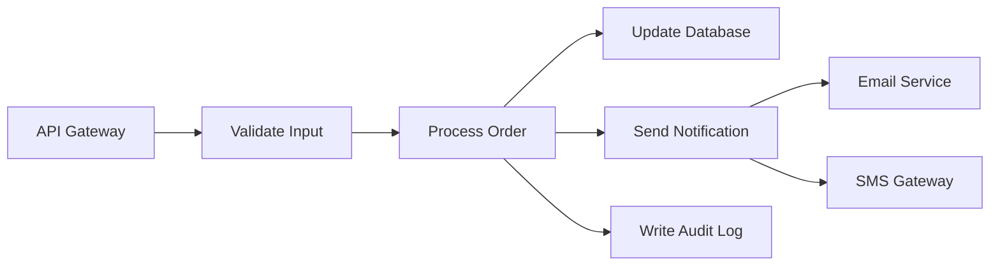

# Serverless Architecture: A Complete Guide to Building Cloud-Native Applications Without Managing Servers

The serverless revolution has fundamentally changed how teams think about building and deploying applications. Instead of provisioning servers, managing operating systems, and scaling infrastructure manually, developers can now write functions that run on demand and scale automatically. In 2026, serverless has matured from a niche paradigm into a mainstream architectural pattern used by organizations of every size — from startups running on tight budgets to enterprises processing millions of events per second.

This guide covers everything you need to know: what serverless actually means, how cloud functions work under the hood, the core services offered by major providers, common architectural patterns, performance tuning strategies, cost modeling, security best practices, and real-world migration approaches.

## Table of Contents

- [What Is Serverless Architecture?](#what-is-serverless-architecture)
- [How Cloud Functions Work](#how-cloud-functions-work)
- [Core Serverless Services Across Providers](#core-serverless-services-across-providers)
- [Common Architectural Patterns](#common-architectural-patterns)
- [Performance Considerations](#performance-considerations)
- [Cost Modeling and Optimization](#cost-modeling-and-optimization)
- [Security Best Practices](#security-best-practices)
- [Migrating to Serverless: A Step-by-Step Approach](#migrating-to-serverless-a-step-by-step-approach)
- [Real-World Use Case: Processing User Signups](#real-world-use-case-processing-user-signups)
- [Key Takeaways](#key-takeaways)
- [Frequently Asked Questions](#frequently-asked-questions)

---

## What Is Serverless Architecture?

Serverless architecture is a cloud computing execution model where the provider dynamically manages the allocation and provisioning of servers. Despite the name, servers still exist — but developers never interact with them directly. Instead of deploying long-running processes on virtual machines, you deploy individual functions or small units of code that execute in response to events.

> **Important:** Serverless does not mean "no servers." It means the server management, capacity planning, and infrastructure maintenance are abstracted away from the developer entirely. The cloud provider handles everything below the function code.

The core principles of serverless are:

- **No server management:** The provider handles provisioning, patching, and scaling.
- **Pay-per-execution:** You are charged only for the compute time your code actually uses, not for idle capacity.
- **Auto-scaling:** Functions scale from zero to thousands of concurrent instances automatically.
- **Event-driven:** Code runs in response to HTTP requests, database changes, queue messages, file uploads, and more.
- **Stateless by design:** Each invocation is isolated, with no persistent connection to the underlying host.

### Serverless vs. Traditional Infrastructure

| Aspect | Traditional Infrastructure | Serverless |
|---|---|---|
| Server management | Full responsibility | Provider manages |
| Scaling | Manual or auto-scaling groups | Automatic per-invocation |
| Cost model | Pay for provisioned capacity | Pay per execution |
| Deployment unit | VMs or containers | Functions or small services |
| Cold starts | None (always running) | Possible latency on first invocation |
| Maximum execution time | Unlimited | Typically 15 minutes |

---

## How Cloud Functions Work

Understanding the lifecycle of a serverless function helps you design better architectures and avoid common pitfalls. When a request arrives at a cloud function, several things happen in sequence:

1. **Event receipt:** The cloud provider receives an event (HTTP request, S3 upload, SQS message, etc.).
2. **Function resolution:** The provider identifies which function should handle the event and locates an available execution environment.
3. **Cold start (if applicable):** If no warm environment is available, the provider creates a new container, loads your runtime, and initializes your code. This is the "cold start" latency.
4. **Handler invocation:** Your function code executes, processing the event and producing a response or side effects.
5. **Response or callback:** The function returns a response (for synchronous invocations) or completes asynchronously.

### The Cold Start Problem

Cold starts occur when a function is invoked after a period of inactivity or when demand exceeds the number of warm environments. During a cold start, the provider must:

- Spin up a micro-VM or container
- Load the runtime (Node.js, Python, Java, Go, etc.)
- Initialize any global or static resources
- Execute your handler

The severity of cold starts depends on the runtime, package size, and provider. Here is a comparison of typical cold start latencies:

| Runtime | Typical Cold Start | Warm Invocation |
|---|---|---|
| Python (lightweight) | 100–300 ms | 5–20 ms |
| Node.js (lightweight) | 150–400 ms | 5–25 ms |
| Java (with framework) | 500–3000 ms | 10–50 ms |
| Go (compiled binary) | 50–150 ms | 3–15 ms |
| Rust (compiled binary) | 40–100 ms | 2–10 ms |

> **Tip:** If cold start latency is critical for your use case, use provisioned concurrency (AWS), always-ready instances (Azure), or minimum instances (GCP) to keep a pool of warm environments ready.

---

## Core Serverless Services Across Providers

The "Big Three" cloud providers each offer a suite of serverless services. Understanding the landscape helps you choose the right tools for your architecture.

### AWS Lambda and Ecosystem

AWS Lambda is the most mature serverless compute platform. Key features in 2026 include:

- **SnapStart for Java:** Dramatically reduces cold starts for Java functions by snapshotting the initialized execution environment.
- **Lambda@Edge and CloudFront Functions:** Run code at edge locations for low-latency global responses.
- **Lambda with Graviton3:** ARM-based processors offering better price-performance than x86.
- **Event Source Mappings:** Native integrations with SQS, DynamoDB Streams, Kinesis, MSK, and Kafka.
- **Response streaming:** Stream partial responses to clients without waiting for the function to complete.

### Azure Functions

Azure Functions offers a similar model with some differentiators:

- **Durable Functions:** Built-in support for orchestrating multi-step workflows, fan-out/fan-in patterns, and human interaction flows.
- **Flex Consumption Plan:** A hybrid between the traditional consumption plan and premium plan, offering more control over scaling behavior.
- **OpenTelemetry integration:** Native support for distributed tracing without additional libraries.

### Google Cloud Functions (2nd Gen)

Google's offering, built on Cloud Run, provides:

- **Traffic splitting:** Deploy new versions alongside existing ones and split traffic percentages.
- **Higher concurrency:** Up to 1000 concurrent requests per function instance (compared to 1 for AWS Lambda).
- **Longer timeouts:** Up to 60 minutes compared to Lambda's 15 minutes.

---

## Common Architectural Patterns

Several patterns have emerged as best practices for serverless architectures. Each solves specific challenges around composition, state management, and reliability.

### Function Composition

Break complex workflows into small, single-purpose functions connected by events. This improves testability, reduces blast radius, and allows independent scaling.



### The Fan-Out/Fan-In Pattern

Parallelize work across multiple function instances and aggregate results. This is ideal for processing batches, running parallel validations, or performing concurrent API calls.

```python
import boto3
import json
from concurrent.futures import ThreadPoolExecutor

lambda_client = boto3.client('lambda')

def fan_out(event):
    items = event['items']
    results = []

    with ThreadPoolExecutor(max_workers=10) as executor:
        futures = []
        for item in items:
            future = executor.submit(
                invoke_processor, item
            )
            futures.append(future)

        for future in futures:
            results.append(future.result())

    return {"processed": len(results), "results": results}

def invoke_processor(item):
    response = lambda_client.invoke(
        FunctionName='processor',
        InvocationType='RequestResponse',
        Payload=json.dumps(item)
    )
    return json.loads(response['Payload'].read())
```

### The Strangler Fig Pattern

Gradually migrate a monolith to serverless by routing specific routes or event types to new functions while the rest continues to hit the legacy system. Over time, more and more of the application is handled serverlessly until the monolith is fully replaced.

> **Caution:** Do not attempt a "big bang" migration of a monolith to serverless. Decompose the monolith incrementally, starting with the most isolated and event-driven components first.

### CQRS with Serverless

Command Query Responsibility Segregation (CQRS) pairs naturally with serverless. Write operations can trigger event-driven processing pipelines while read operations are served from optimized query stores (like DynamoDB Global Tables or ElastiCache).

---

## Performance Considerations

Optimizing serverless functions requires attention to several factors that differ from traditional server-based applications.

### Memory and CPU Allocation

In AWS Lambda, CPU allocation is proportional to the memory you configure. This means:

- A 128 MB function gets 1/8 of a vCPU
- A 1024 MB function gets a full vCPU
- A 3008 MB function gets 2 vCPUs

Increasing memory can reduce execution time enough to actually lower your total cost, even though the per-millisecond price is higher. Always benchmark different memory configurations.

```python
# Example: testing different memory configurations
import time
import json

def handler(event, context):
    start = time.time()

    # Simulate CPU-bound work
    result = sum(i * i for i in range(1_000_000))

    elapsed_ms = (time.time() - start) * 1000

    return {
        "statusCode": 200,
        "body": json.dumps({
            "result": result,
            "elapsed_ms": round(elapsed_ms, 2),
            "memory_mb": context.memory_limit_in_mb
        })
    }
```

### Connection Pooling and Database Access

Serverless functions create new connections on each cold start. For relational databases, this can exhaust connection limits quickly. Solutions include:

- **RDS Proxy:** Manages connection pooling at the database layer.
- **DynamoDB:** Serverless-native with no connection management.
- **Babelfish or PgBouncer:** Proxy layers for PostgreSQL connection pooling.

### Reducing Package Size

Smaller deployment packages mean faster cold starts. Strategies include:

- Use bundled/minified dependencies
- Exclude development files and tests
- Use Lambda Layers for shared dependencies
- Choose lightweight runtimes (Python, Node.js, Go)

---

## Cost Modeling and Optimization

Serverless pricing is usage-based, which can be both an advantage and a trap. Understanding the cost model prevents surprise bills.

### AWS Lambda Pricing Breakdown (2026)

| Component | Free Tier | Price |
|---|---|---|
| Requests | 1M per month | $0.20 per 1M requests |
| Duration (x86) | 400,000 GB-seconds | $0.0000166667 per GB-second |
| Duration (ARM/Graviton) | 400,000 GB-seconds | $0.0000133334 per GB-second |
| Provisioned Concurrency | — | $0.0000041667 per GB-second |

### Cost Optimization Strategies

1. **Right-size memory allocation:** Test different memory sizes and measure both latency and cost.
2. **Use ARM/Graviton:** 20% cheaper per GB-second with similar or better performance.
3. **Batch processing:** Process multiple items per invocation to reduce request charges.
4. **Reserved concurrency limits:** Prevent a runaway function from generating an unexpected bill.
5. **Set billing alerts:** Configure AWS Budgets or equivalent to notify you before costs escalate.

> **Warning:** A misconfigured loop or a function triggered by a flood of events can generate thousands of dollars in hours. Always set concurrency limits and billing alarms for production functions.

---

## Security Best Practices

Serverless introduces a different security model than traditional servers. The shared responsibility model shifts significantly toward the cloud provider, but developers still have critical responsibilities.

### Key Security Principles

- **Principle of least privilege:** Each function should have only the IAM permissions it strictly needs. Use per-function IAM roles, not shared roles.
- **Input validation:** Validate and sanitize all incoming data at the function boundary. Never trust event payloads.
- **Environment variable encryption:** Use the provider's encrypted environment variable store (AWS Secrets Manager, Azure Key Vault, GCP Secret Manager) for sensitive values.
- **Dependency scanning:** Use tools like `npm audit`, `pip-audit`, or Snyk to catch vulnerabilities in third-party libraries.
- **Network isolation:** Place functions inside a VPC only when necessary (e.g., accessing private databases), as VPC placement can increase cold start latency.

### OWASP Serverless Top 10

The OWASP Serverless Top 10 identifies the most common vulnerabilities in serverless applications:

1. **S01 — Broken Access Control**
2. **S02 — Broken Authentication**
3. **S03 — Insecure Serverless Deployment Configuration**
4. **S04 — Insecure Dependency**
5. **S05 — Insecure Deserialization**
6. **S06 — Insufficient Logging and Monitoring**
7. **S07 — Denial of Service**
8. **S08 — Broken Function Runtime Environment**
9. **S09 — Improper Error Handling**
10. **S10 — Malicious Insiders**

---

## Migrating to Serverless: A Step-by-Step Approach

Migrating an existing application to serverless requires careful planning. Follow this phased approach to minimize risk and maximize success.

### Phase 1: Identify Suitable Workloads

Not every workload is a good fit for serverless. Prioritize:

- **Event-driven processing:** File uploads, queue consumers, stream processors
- **API endpoints:** Especially those with variable or unpredictable traffic
- **Scheduled tasks:** Cron jobs, batch reports, data transformations
- **Webhooks and integrations:** Third-party callback handlers

### Phase 2: Build a Proof of Concept

Select one workload and implement it serverless. Measure:

- Latency (p50, p95, p99)
- Cost compared to the existing implementation
- Operational overhead reduction
- Developer experience and deployment speed

### Phase 3: Incremental Migration

Use the Strangler Fig pattern to route traffic incrementally:

1. Deploy the serverless version alongside the existing one
2. Route a small percentage of traffic to the serverless version
3. Monitor error rates, latency, and cost
4. Gradually increase traffic until 100% is serverless
5. Decommission the old implementation

### Phase 4: Optimize and Harden

Once the migration is complete:

- Tune memory and timeout settings
- Add proper monitoring with CloudWatch, Datadog, or New Relic
- Implement circuit breakers for downstream dependencies
- Set up automated testing for each function

---

## Real-World Use Case: Processing User Signups

Let's walk through a practical example: building a serverless user signup pipeline that handles email verification, profile creation, welcome emails, and analytics tracking.

### Architecture

1. **API Gateway** receives the signup POST request
2. **Validate Signup** function validates input and creates a user record in DynamoDB
3. **Generate Verification Token** function creates a unique token and stores it
4. **Send Welcome Email** function sends a verification email via Amazon SES
5. **Track Analytics Event** function publishes an event to Amazon EventBridge

### Sample Implementation

```python
# validate_signup.py
import boto3
import uuid
import hashlib
from datetime import datetime

dynamodb = boto3.resource('dynamodb')
table = dynamodb.Table('Users')

def handler(event, context):
    body = event.get('body', {})

    # Validate required fields
    required = ['email', 'name', 'password']
    for field in required:
        if field not in body:
            return {
                'statusCode': 400,
                'body': f'Missing required field: {field}'
            }

    email = body['email'].lower().strip()

    # Check for duplicate user
    existing = table.get_item(Key={'email': email})
    if 'Item' in existing:
        return {
            'statusCode': 409,
            'body': 'User already exists'
        }

    # Create user record
    user = {
        'email': email,
        'name': body['name'],
        'userId': str(uuid.uuid4()),
        'createdAt': datetime.utcnow().isoformat(),
        'verified': False
    }

    table.put_item(Item=user)

    return {
        'statusCode': 201,
        'body': user,
        'headers': {
            'X-User-Id': user['userId']
        }
    }
```

This function is focused, testable, and scales from zero to thousands of concurrent signups without any infrastructure management.

---

## Key Takeaways

- **Serverless abstracts infrastructure management** — you write functions, the provider handles everything else.
- **Cold starts are manageable** — use provisioned concurrency, lightweight runtimes, and small packages to minimize latency.
- **Cost is usage-based** — which is a powerful advantage when traffic is variable, but requires monitoring to prevent runaway bills.
- **Not everything belongs on serverless** — long-running processes, stateful applications, and ultra-low-latency workloads may still need containers or VMs.
- **Security shifts but doesn't disappear** — least privilege, input validation, and dependency scanning remain your responsibility.
- **Migrate incrementally** — use the Strangler Fig pattern, measure everything, and decommission only after confirming the serverless version is stable.

---

## Frequently Asked Questions

### Is serverless cheaper than running containers?

It depends on your traffic pattern. For variable or bursty workloads, serverless is typically cheaper because you pay only for execution time. For steady, high-throughput workloads running 24/7, containers or reserved instances may be more cost-effective. The break-even point varies, but generally serverless wins when your average utilization is below 40–50%.

### Can serverless handle real-time applications?

Yes, but with caveats. Serverless functions can power real-time APIs (via API Gateway WebSockets), process streaming data (via Kinesis or Kafka triggers), and handle WebSocket connections. However, each connection requires its own function instance or persistent connection, which can increase cost. For applications requiring thousands of persistent connections, dedicated WebSocket servers may be more practical.

### How do I handle database connections in serverless?

Traditional connection pooling does not work well with serverless because each invocation may run on a different host. Use managed proxies like RDS Proxy for relational databases, or prefer serverless-native databases like DynamoDB, PlanetScale, or CockroachDB that handle connection management internally.

### What is the maximum execution time for a serverless function?

As of 2026, the maximum execution times are: AWS Lambda — 15 minutes, Azure Functions — 10 minutes ( Consumption plan) or unlimited (Premium), Google Cloud Functions — 60 minutes. For longer-running workflows, use orchestration patterns like Step Functions (AWS), Durable Functions (Azure), or Workflows (GCP).

### How do I test serverless functions locally?

Most providers offer local emulation tools: AWS SAM CLI, Azure Functions Core Tools, and the Functions Framework for Google Cloud. You can also use tools like LocalStack or Serverless Offline to simulate the full API Gateway and function stack. For unit tests, extract your handler logic into testable modules that do not depend on the provider runtime.

---

## Related Articles

- Apache Kafka and Event-Driven Architecture — A Practical Guide to Building Event-Streaming Systems
- Platform Engineering in 2026: Building Your Internal Developer Platform from Scratch
- System Design Handbook: A Practical Guide to Scalable Architectures
