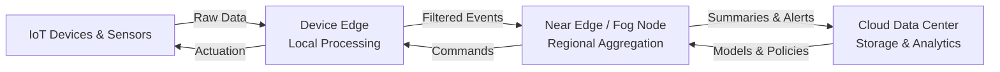
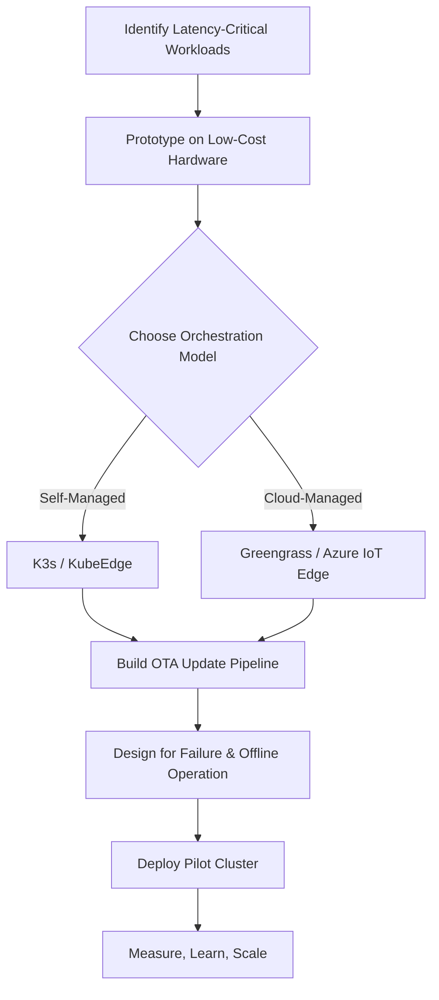

# Edge Computing Explained: A Practical Guide to Processing Data Closer to the Source

Every time your smart home device responds instantly, a self-driving car reacts to a pedestrian, or a factory robot adjusts its trajectory in real time, there is a good chance edge computing is at work behind the scenes. The traditional model of shipping every byte of data to a distant cloud data center for processing is giving way to a new paradigm: **computation at the edge**, where data is generated.

Edge computing is not merely a trend — it is a foundational shift in how distributed systems are designed. Industry forecasts project that more than 75% of enterprise-generated data will be created and processed outside a traditional centralized data center by 2027, up from less than 10% a decade ago. Whether you are building IoT systems, real-time analytics pipelines, or latency-sensitive applications, understanding edge computing is no longer optional.

## Table of Contents

- [What Is Edge Computing?](#what-is-edge-computing)
- [Why Edge Computing Matters: Latency, Bandwidth, and Sovereignty](#why-edge-computing-matters-latency-bandwidth-and-sovereignty)
- [Edge Computing vs. Cloud vs. Fog Computing](#edge-computing-vs-cloud-vs-fog-computing)
- [Core Architecture Patterns](#core-architecture-patterns)
- [Key Technologies and Platforms](#key-technologies-and-platforms)
- [Real-World Use Case: Smart Manufacturing](#real-world-use-case-smart-manufacturing)
- [Challenges and Trade-offs](#challenges-and-trade-offs)
- [How to Get Started](#how-to-get-started)
- [Key Takeaways](#key-takeaways)
- [Frequently Asked Questions](#frequently-asked-questions)
- [Related Articles](#related-articles)

## What Is Edge Computing?

Edge computing is a distributed computing paradigm that brings computation and data storage closer to the physical location where data is generated — the "edge" of the network — rather than relying on a centralized cloud data center hundreds or thousands of miles away.

In a traditional cloud architecture, devices send data over the internet to remote servers for processing. This works well for batch analytics, long-term storage, and workloads that are not time-sensitive. But for applications where **milliseconds matter**, the round-trip to the cloud introduces unacceptable latency.

Edge computing solves this by placing compute resources — whether that is a small IoT gateway, a micro data center, or an embedded processor — near the data source. The edge node processes data locally, makes decisions in real time, and optionally forwards summarized or important data to the cloud for further analysis or storage.

### The Three Tiers of Edge

It helps to think of edge computing as existing across three tiers:

| Tier | Description | Example Hardware |
|------|-------------|-----------------|
| **Device Edge** | Compute embedded directly in sensors, cameras, or machinery | NVIDIA Jetson, Raspberry Pi, ESP32 |
| **Near Edge** | Small-scale compute nodes at network access points or local facilities | Edge servers, micro data centers, fog nodes |
| **Far Edge** | Regional aggregation points with more compute power, closer to end users | Telco edge (5G MEC), CDN edge PoPs |

Each tier serves a different latency and compute requirement. A self-driving car needs device-edge processing for immediate obstacle detection, while a retail chain might use near-edge servers to run inventory analytics across dozens of stores.

## Why Edge Computing Matters: Latency, Bandwidth, and Sovereignty

Three forces are driving the adoption of edge computing at scale:

### 1. Latency

Some workloads simply cannot tolerate round-trip delays. Consider these latency budgets:

- **Autonomous vehicles**: less than 10 ms decision cycle
- **Industrial robotics**: less than 5 ms control loop
- **Augmented reality**: less than 20 ms to prevent motion sickness
- **Real-time gaming**: less than 50 ms for responsive input

A request from New York to a US-West cloud region can easily take 60-80 ms round-trip. Edge computing eliminates this entirely by processing on-site.

### 2. Bandwidth

A single HD security camera generates roughly 3-6 Mbps of continuous footage. A factory with 500 cameras produces over 2 Gbps — most of which is background noise with no meaningful content. Sending all of that to the cloud is expensive and wasteful. Edge nodes can filter, compress, and extract events locally, forwarding only the data that matters.

### 3. Data Sovereignty and Privacy

Regulations like GDPR, China's PIPL, and sector-specific health data laws increasingly restrict where data can be processed and stored. Edge computing allows organizations to keep sensitive data within geographic or jurisdictional boundaries while still running analytics.

> **Important:** Edge computing does not eliminate the need for cloud — it complements it. The cloud remains essential for long-term storage, model training, global analytics, and centralized orchestration. Edge is about **where** computation happens, not replacing the cloud entirely.

## Edge Computing vs. Cloud vs. Fog Computing

These three terms are often confused. Here is a precise breakdown:

- **Cloud Computing**: Centralized data centers (AWS, Azure, GCP) providing on-demand compute, storage, and networking. Optimized for scale and flexibility, not low latency.
- **Fog Computing**: A layer of distributed compute between the cloud and edge devices, often running on gateways or local servers. Coined by Cisco, fog computing emphasizes a hierarchy of nodes rather than a binary edge-vs-cloud split.
- **Edge Computing**: The broadest term, encompassing any computation performed at or near the data source, whether on the device itself or a nearby gateway.

In practice, fog computing is a subset of edge computing. Most modern architectures blend all three tiers into a **continuum** — processing locally where speed is critical, aggregating at a fog layer for regional coordination, and syncing with the cloud for global views.



This diagram illustrates the bidirectional flow of data and control signals. Data flows up from devices to the cloud, while insights, models, and commands flow back down.

## Core Architecture Patterns

Edge computing introduces unique architectural considerations. Below are the most common patterns used in production.

### 1. Gateway Pattern

An edge gateway sits between a cluster of IoT devices and the cloud. It handles protocol translation (MQTT to HTTP), local buffering, and data preprocessing.

**When to use:** Large fleets of heterogeneous devices that need a unified ingestion point.

```
Device A (MQTT) ──┐
Device B (MQTT) ──┼──▶ Edge Gateway ──▶ Cloud (HTTPS)
Device C (Modbus) ─┘        │
                     Local DB / Cache
```

### 2. Local-First Processing

All computation happens on the edge device or local cluster. The cloud is used only for periodic sync, firmware updates, and aggregate analytics.

**When to use:** Fully disconnected or intermittently connected environments (ships, remote oil rigs, agricultural fields).

### 3. Stream Processing at the Edge

Running lightweight stream processing engines (e.g., Apache Kafka with ksqlDB, or Apache Flink on a constrained node) directly at the edge to perform windowed aggregations, anomaly detection, or filtering before forwarding data.

**When to use:** High-throughput sensor networks where raw data volumes are prohibitive.

### 4. Edge AI Inference

Machine learning models are trained in the cloud and deployed to edge devices for real-time inference. Frameworks like TensorFlow Lite, ONNX Runtime, and NVIDIA TensorRT enable this pattern.

**When to use:** Computer vision, predictive maintenance, voice processing — any scenario where model predictions must be instantaneous.

## Key Technologies and Platforms

The edge ecosystem spans hardware, software, and orchestration layers. Here is a curated overview:

### Hardware

| Platform | Use Case | Strengths |
|----------|----------|-----------|
| NVIDIA Jetson (Orin, Nano) | Edge AI, computer vision | GPU-accelerated inference, CUDA ecosystem |
| Raspberry Pi 5 | Prototyping, light workloads | Low cost, massive community |
| Intel NUC / Edge Servers | Near-edge processing | x86 compatibility, higher compute |
| AWS Snowball Edge | Rugged edge computing | Managed service, offline capability |

### Software and Frameworks

- **KubeEdge**: Extends Kubernetes to edge nodes, enabling unified orchestration from cloud to edge.
- **AWS IoT Greengrass**: AWS's edge runtime for Lambda functions, ML inference, and device management.
- **Azure IoT Edge**: Microsoft's edge runtime with containerized module deployment.
- **Apache Kafka + ksqlDB**: Stream processing at the edge with familiar tooling.
- **Eclipse Kura**: Open-source Java/OSGi-based IoT gateway framework.
- **Fluent Bit / Fluentd**: Lightweight log forwarding from edge to cloud.

### Orchestration

Managing thousands of edge nodes is fundamentally different from managing a cluster in a single data center. Edge orchestration platforms must handle:

- **Intermittent connectivity**: Nodes may go offline for hours. The system must queue commands and reconcile state when connectivity returns.
- **Heterogeneous hardware**: Edge nodes range from ARM microcontrollers to x86 servers.
- **Geographic distribution**: Nodes may span continents.

Kubernetes-based solutions like **KubeEdge**, **K3s** (lightweight Kubernetes), and **SuperEdge** are emerging as standard choices for edge orchestration.

## Real-World Use Case: Smart Manufacturing

Consider a modern automotive factory with 2,000 sensors monitoring welding robots, CNC machines, quality inspection cameras, and environmental conditions. The data pipeline is:

1. **Sensors** generate vibration, temperature, and visual data at high frequency.
2. **Device-edge processors** (NVIDIA Jetson modules) run defect detection models on camera feeds in under 5 ms.
3. **Near-edge servers** aggregate data from 50 machine clusters, run predictive maintenance models, and maintain a local time-series database for the past 72 hours of metrics.
4. **Cloud** receives hourly summaries, retrains ML models on weeks of historical data, and pushes updated models back to edge nodes.

The result: defective welds are caught and flagged in real time (preventing downstream assembly errors), maintenance is scheduled proactively (reducing unplanned downtime by an estimated 30-40%), and the cloud is not overwhelmed by terabytes of raw sensor data.

This is the **edge-cloud continuum** in action — neither edge nor cloud alone delivers the full value.

## Challenges and Trade-offs

Edge computing is powerful, but it introduces real complexity.

### Security

Every edge node is a potential attack surface. Unlike a centralized data center with hardened perimeters, edge devices may sit in physically accessible locations. Best practices include:

- **Secure boot and attestation**: Verify firmware integrity before execution.
- **Mutual TLS (mTLS)**: Encrypt all communication between edge and cloud.
- **Zero-trust networking**: Treat every edge node as untrusted by default.
- **Over-the-air (OTA) updates**: Push security patches remotely and consistently.

### Operational Complexity

Managing a fleet of 10,000 edge nodes across 30 countries is orders of magnitude harder than managing a single Kubernetes cluster. Organizations need robust:

- **Observability**: Distributed tracing and log aggregation across edge and cloud.
- **Configuration drift management**: Ensuring all nodes run consistent versions of software.
- **Remote debugging**: Ability to diagnose and remediate issues without physical access.

### Data Consistency

When edge nodes operate independently and sync periodically, maintaining data consistency becomes a challenge. Common approaches include:

- **Eventual consistency**: Accept that edge data may lag behind the cloud and design systems accordingly.
- **Conflict resolution**: Use last-writer-wins, vector clocks, or CRDTs for concurrent updates.
- **Local transactions with deferred sync**: Complete transactions locally and replicate when connected.

> **Caution:** Do not underestimate the operational burden of edge deployments. Start with a small pilot (10-20 nodes), establish robust monitoring and OTA pipelines, and scale only after you have confidence in your tooling and processes.

## How to Get Started

If you are considering edge computing for your organization, here is a pragmatic roadmap:

1. **Identify latency-critical workloads.** Audit your current applications for tasks where cloud round-trip delay is a bottleneck. These are your edge candidates.
2. **Prototype on low-cost hardware.** Start with a Raspberry Pi or NVIDIA Jetson Nano to validate your processing logic. Avoid large capital expenditure during the exploration phase.
3. **Choose an orchestration model.** Decide between a lightweight Kubernetes distribution (K3s, KubeEdge) or a cloud-managed edge service (Greengrass, Azure IoT Edge) based on your team's expertise and vendor lock-in tolerance.
4. **Build an OTA update pipeline.** Before deploying to production, ensure you can push updates, roll back failed deployments, and monitor node health remotely.
5. **Design for failure.** Assume every edge node will lose connectivity at some point. Build local buffering, retry logic, and graceful degradation into every component.
6. **Measure and iterate.** Track latency reduction, bandwidth savings, and incident rates. Use these metrics to justify expansion and refine your architecture.



## Key Takeaways

- **Edge computing moves computation to where data is generated**, reducing latency from hundreds of milliseconds to single-digit milliseconds for critical workloads.
- **Three drivers matter most**: latency requirements, bandwidth costs, and data sovereignty regulations — if one or more of these is a concern, edge is worth evaluating.
- **Edge complements cloud, it does not replace it.** The most effective architectures use a continuum: device edge for immediate processing, near edge for aggregation, and cloud for long-term storage and model training.
- **Start small and build operational muscle first.** OTA updates, remote monitoring, and failure handling are non-negotiable before scaling to hundreds or thousands of nodes.
- **The ecosystem is maturing rapidly.** Kubernetes-based edge orchestration (K3s, KubeEdge) and managed services (Greengrass, Azure IoT Edge) lower the barrier to entry significantly compared to even two years ago.
- **Security must be designed in from day one**, not bolted on. Edge nodes in physically accessible locations require secure boot, mTLS, zero-trust networking, and continuous OTA patching.

## Frequently Asked Questions

### Is edge computing the same as cloud computing?

No. Cloud computing centralizes compute in large data centers operated by providers like AWS, Azure, or GCP. Edge computing distributes compute to locations near where data is generated — on devices, in local gateways, or at nearby micro data centers. The two are complementary: edge handles real-time, latency-sensitive processing while cloud handles storage, analytics, and global coordination.

### What hardware do I need for edge computing?

It depends on your workload. For prototyping, a Raspberry Pi 5 ($80) or NVIDIA Jetson Nano ($150) is sufficient. For production deployments, consider industrial-grade edge servers from vendors like Dell, HPE, or Lenovo, or managed services like AWS Snowball Edge for rugged, offline-capable environments.

### How does edge computing affect my cloud costs?

Edge computing typically **reduces** cloud costs by filtering and aggregating data locally before sending it upstream. Instead of streaming raw sensor data to the cloud (paying for bandwidth and storage), you transmit only meaningful events and summaries. Many organizations report 40-70% reductions in data transfer costs after adopting an edge strategy.

### Can I use Kubernetes for edge orchestration?

Yes. Lightweight Kubernetes distributions like K3s (under 100 MB binary) and purpose-built edge platforms like KubeEdge and SuperEdge extend Kubernetes to edge nodes. They handle the unique challenges of edge — intermittent connectivity, heterogeneous hardware, and geographic distribution — while providing a familiar API surface for DevOps teams.

### What is the relationship between 5G and edge computing?

5G and edge computing are complementary technologies. 5G provides low-latency, high-bandwidth wireless connectivity, while edge computing provides the local compute infrastructure to process data close to the source. The combination — often called Multi-access Edge Computing (MEC) — enables new use cases like real-time AR, autonomous vehicles, and smart city applications that neither technology could fully deliver alone.

## Related Articles

- [Serverless Architecture: A Complete Guide to Building Cloud-Native Applications Without Managing Servers](/serverless-architecture-complete-guide)
- [System Design Handbook: A Practical Guide to Scalable Architectures](/system-design-handbook-practical-guide)
- [How Docker Works Internally: Layers, Namespaces, and Networking Explained](/docker-works-internally-layers-namespaces-networking)
- [Mastering Observability with Prometheus and Grafana: From Metrics to Actionable Insights](/mastering-observability-prometheus-grafana)
- [HTTP/3 and QUIC Explained: The Next-Generation Web Transport Protocol](/http3-quic-explained-next-generation-web-transport)
