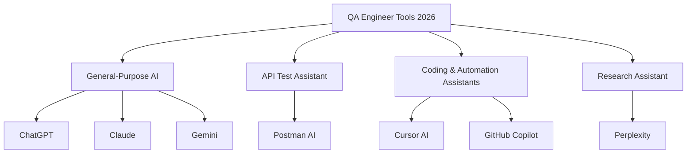
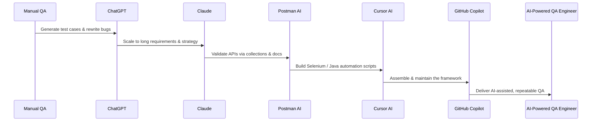

# 4 AI Tools Every Manual and Automation Tester Should Learn in 2026

Artificial intelligence has moved from an experiment to an everyday necessity in software quality. In 2026, testing is no longer just about finding defects — it is about working smarter with tooling that understands requirements, generates scenarios, automates scripts, and accelerates root-cause analysis. This article breaks down the essential AI tools every manual and automation tester should learn, what each tool is best at, and which QA persona benefits most from each one, based directly on a curated 2026 field guide for testers.


*Image credit: [Wikimedia Commons](https://commons.wikimedia.org/wiki/File:Human_brain_blue_circuit_white_background_artificial_intelligence_icon_%28Topaz_Bloom%29.jpeg)*

## Table of Contents

- [Why AI Is Becoming Core to Testing](#why-ai-is-becoming-core-to-testing)
- [The 4 AI Tool Categories](#the-4-ai-tool-categories)
- [Diagnostics and Design Aids: ChatGPT, Claude, and Gemini](#diagnostics-and-design-aids-chatgpt-claude-and-gemini)
- [Specialized Testing Tools: Postman AI, Cursor AI, and GitHub Copilot](#specialized-testing-tools-postman-ai-cursor-ai-and-github-copilot)
- [Research Assistant: Perplexity](#research-assistant-perplexity)
- [Tool-to-Persona Quick Reference](#tool-to-persona-quick-reference)
- [A Recommended Learning Path](#a-recommended-learning-path)
- [Key Takeaways](#key-takeaways)
- [Frequently Asked Questions](#frequently-asked-questions)
- [Related Articles](#related-articles)

## Why AI Is Becoming Core to Testing

The role of the tester is expanding. Today, quality engineers are expected to handle test case generation, bug analysis, SQL queries, API test scenarios, and requirement understanding — often all within a single sprint. The source document emphasizes a practical reality: each AI tool serves a distinct purpose, and learning the *right* tool for the *right* task compounds your effectiveness.

Rather than a single "silver bullet" assistant, the 2026 approach is a portfolio of specialized tools. Some are general-purpose reasoning engines useful for requirement analysis and strategy. Others are built specifically for API testing or coding assistance inside an automation framework. Recognizing this difference is the first step toward building an AI-powered QA workflow.

> **Caution:** AI tools generate suggestions based on the context you provide. Always validate generated test scenarios, SQL queries, and automation scripts against your actual requirements, environment, and test data before treating them as final. AI accelerates your work; it does not replace review and judgment.

## The 4 AI Tool Categories

A common way to think about these tools is to group them by the job they perform. Based on the source, four practical categories emerge:

1. **General-purpose assistants** — ChatGPT, Claude, and Gemini, used for requirement understanding, test strategy, and analysis.
2. **API-focused assistant** — Postman AI, specialized in API testing and documentation.
3. **Coding and automation assistants** — Cursor AI and GitHub Copilot, which help generate Selenium code and automation framework logic.
4. **Research assistant** — Perplexity, used for quick technical research and learning.



The following sections walk through each tool, what it is best at, and the tester profile it fits best.

## Diagnostics and Design Aids: ChatGPT, Claude, and Gemini

These three large-context assistants are the workhorses of AI-assisted test design and analysis. Each has slightly different strengths, so many testers use them in combination.

### ChatGPT

ChatGPT is positioned in the source as the most versatile, everyday assistant for testers. Its strengths include:

- **Test case generation** — draft detailed, requirement-based test cases quickly.
- **Bug analysis** — interpret defect reports and suggest probable causes.
- **SQL query writing** — generate and refine SQL queries, valuable for backend and data validation.
- **API test scenarios** — propose edge-case and error-path API scenarios.
- **Requirement understanding** — help beginners parse and clarify ambiguous requirements.

It is listed as *best for manual testers* as well as *beginners* who need help with requirement understanding. If you are early in your QA journey, ChatGPT is your starting point.

### Claude

Claude shines when the material is long and complex. According to the source, its strengths are:

- **Long requirement analysis** — process lengthy requirement documents and extract the testing-relevant points.
- **Test strategy creation** — propose a structured, high-level approach before diving into individual cases.
- **Root cause analysis** — dig into why a defect happened, not just what happened.
- **Documentation** — produce clear, well-structured documentation for senior QA and engineers.
- **Complex test scenarios** — reason through intricate, multi-step scenarios.

Claude is described as *best for senior QA* and *documentation engineers*, who already understand the domain and need depth rather than basic hand-holding.

### Gemini

Gemini adds another angle to the general-purpose set:

- **Competitive analysis** — compare how similar products or features behave.
- **Large context understanding** — handle very large inputs and keep track of many details at once.
- **AI testing ideas** — suggest creative testing angles you might not have considered.

> **Note:** The source covers how these three tools are useful to testers, but it does not go into the pricing, subscription tiers, or exact model versions. For specifics like cost or free-tier limits, refer to the official provider documentation, which is not covered in the source.

## Specialized Testing Tools: Postman AI, Cursor AI, and GitHub Copilot

Where the general assistants help you think, the specialized tools help you *build and verify*.

### Postman AI

Postman AI is tailored to API testing. Its listed capabilities include:

- **API testing** — structure and execute API-level validation.
- **API documentation** — generate and maintain readable API docs.
- **Collection generation** — create API test collections from endpoints or specs.
- **Request validation** — verify that requests are formed correctly.

It is marked as *best for API testers*, making it the dedicated choice when your work centers on integrations, services, and endpoints.

### Cursor AI

Cursor AI is an AI-assisted development environment, and it is highly relevant to automation testers:

- **Selenium code generation** — produce Selenium scripts quickly.
- **Java automation scripts** — generate and edit Java-based automation code.
- **Framework development** — scaffold and extend test automation frameworks.
- **Debugging support** — help trace failures in your automation code.

### GitHub Copilot

GitHub Copilot focuses on in-IDE coding assistance for QA engineers:

- **Coding assistance** — inline suggestions while writing test code.
- **Test script suggestions** — propose test scripts as you type.
- **Automation framework restoration support** — help rebuild or repair automation frameworks, marked clearly for QA use.

Both Cursor AI and GitHub Copilot overlap on coding help, but the source positions Cursor AI around framework and Selenium work while Copilot is described as a general coding assistant with test-script suggestions.

| Tool | Primary Focus | Best For |
|------|---------------|----------|
| ChatGPT | Test cases, bug analysis, SQL, API scenarios | Manual testers, beginners |
| Claude | Long requirements, test strategy, root cause | Senior QA, documentation engineers |
| Gemini | Competitive analysis, large context, test ideas | Analysts and idea generation |
| Postman AI | API testing, docs, collections | API testers |
| Cursor AI | Selenium code, Java scripts, frameworks | Automation framework developers |
| GitHub Copilot | Coding assistance, test scripts | Automation QA engineers |
| Perplexity | Technical research, learning | Continuous learners |

## Research Assistant: Perplexity

Perplexity fills a different niche — fast, reliable research. Its listed strengths are:

- **Quick technical research** — find current answers on testing topics.
- **QA learning** — support ongoing professional development.
- **Tool comparison** — compare tools and approaches side by side.
- **Testing concepts** — clarify definitions and best practices.

The source identifies Perplexity as *best for QA learning*, making it a strong companion for testers who want to stay current without losing time to scattered searching.

## Tool-to-Persona Quick Reference

To make the guidance actionable, here is the mapping of tools to roles exactly as the source presents it:

- **Manual Testers** → ChatGPT (test case generation, bug analysis, SQL queries, API scenarios).
- **Beginners** → ChatGPT (requirement understanding) as the entry assistant.
- **Senior QA** → Claude (long requirement analysis, test strategy, root cause analysis).
- **Documentation Engineers** → Claude (documentation) for clear, structured output.
- **API Testers** → Postman AI (API testing, documentation, collections, request validation).
- **Automation QA** → Cursor AI and GitHub Copilot (Selenium, Java scripts, framework support).
- **Continuous Learners** → Perplexity (research, tool comparison, concepts).

## A Recommended Learning Path

The source proposes a clear, sequential learning path for testers who want to go from manual QA to an AI-powered QA engineer:

```
Manual QA → ChatGPT → Claude → Postman AI → Cursor AI → GitHub Copilot → AI-Powered QA Engineer
```

This order makes sense pedagogically:

1. **Start with your manual foundation** — solid manual QA instincts remain the base.
2. **Adopt ChatGPT first** — it is the most accessible and covers the broadest set of everyday tasks.
3. **Add Claude next** — as you tackle longer requirements and deeper analysis.
4. **Bring in Postman AI** — when API work becomes part of your scope.
5. **Move into Cursor AI and GitHub Copilot** — for automation scripts and framework-building.
6. **Evolve into an AI-powered QA engineer** — integrating all of these into your daily workflow.



> **Caution:** The learning path is a progression, but it is not a rigid gate. You do not need to master one tool before touching the next. Pick up a tool as soon as your tasks call for it, and reinforce the foundation with manual testing judgment throughout.

## Key Takeaways

- In 2026, AI tools are organized by specialty: general reasoning (ChatGPT, Claude, Gemini), API work (Postman AI), coding (Cursor AI, GitHub Copilot), and research (Perplexity).
- ChatGPT is the recommended entry point for manual testers and beginners, covering test case generation, bug analysis, SQL, and API scenarios.
- Claude is best for senior QA and documentation engineers handling long requirements, test strategy, and root-cause analysis.
- Postman AI, Cursor AI, and GitHub Copilot focus on hands-on building: API collections, Selenium/Java scripts, and framework support.
- Use Perplexity for quick research, tool comparisons, and continuous QA learning.
- A practical progression is Manual QA → ChatGPT → Claude → Postman AI → Cursor AI → GitHub Copilot → AI-Powered QA Engineer.
- Always validate AI-generated output against your real requirements and environment before applying it.

## Frequently Asked Questions

**Which AI tool should a manual tester start with?**
According to the source, ChatGPT is the recommended starting assistant for manual testers, especially for test case generation, bug analysis, SQL queries, and requirement understanding.

**What is Claude best used for in QA?**
Claude is best for senior QA and documentation engineers, particularly for long requirement analysis, test strategy creation, root-cause analysis, and complex test scenarios.

**Which tool is meant for API testing?**
Postman AI. The source lists it for API testing, API documentation, collection generation, and request validation, and marks it as best for API testers.

**How do Cursor AI and GitHub Copilot differ for automation testers?**
Cursor AI is highlighted for Selenium code generation, Java automation scripts, and framework development, while GitHub Copilot is described as a coding assistant with test-script suggestions and automation framework restoration support.

**What is the recommended path to becoming an AI-powered QA engineer?**
The source recommends: Manual QA → ChatGPT → Claude → Postman AI → Cursor AI → GitHub Copilot, leading to the role of an AI-powered QA engineer.

## Related Articles

- AI-Assisted Test Case Generation Best Practices
- Building a Selenium Automation Framework with AI
- Getting Started with API Test Automation Using Postman
