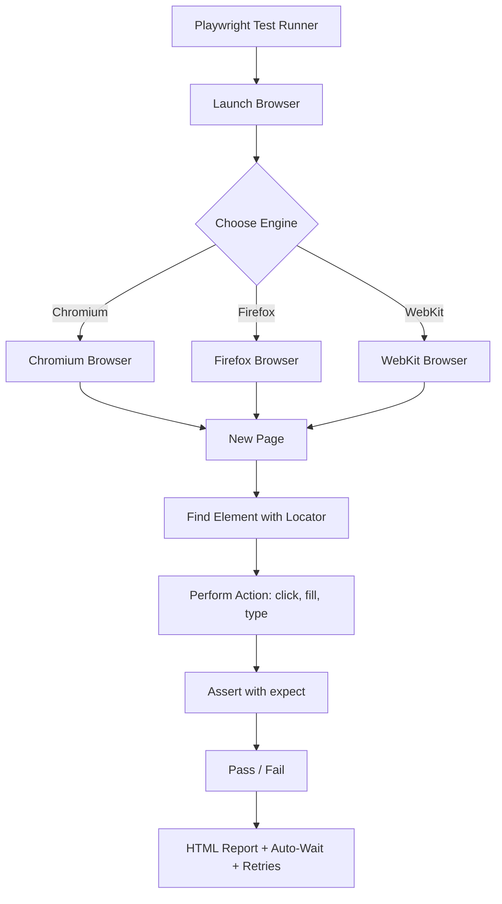

# Playwright Core Methods & Commands: A Complete Test Automation Cheat Sheet

Playwright has become one of the most popular browser automation and testing libraries in the modern web development ecosystem. Developed by Microsoft, it gives developers and QA engineers a single, reliable way to automate real browsers for end-to-end testing. Whether you are new to browser automation or looking to sharpen your existing skills, understanding the core methods and commands is the difference between a flaky test suite and a rock-solid one.

This article breaks down the essential Playwright methods and commands into a practical cheat sheet: what Playwright is, how to launch a browser, how to find elements with modern locators, which actions and assertions you will use every day, how to run and debug tests, and the project structure and best practices that keep your suite maintainable.

> **Note:** Everything covered here is based on a study summary of Playwright's major methods and commands. For complete API details and version-specific behavior, always refer to the official Playwright documentation, as the source document does not include them.

## Table of Contents

- [What is Playwright?](#what-is-playwright)
- [A Basic Launch Script](#a-basic-launch-script)
- [Page Locators: Ways to Find Elements](#page-locators-ways-to-find-elements)
- [Core Browser and Page Actions](#core-browser-and-page-actions)
- [Assertions with expect](#assertions-with-expect)
- [Running Your Tests](#running-your-tests)
- [Debugging Made Easy](#debugging-made-easy)
- [Project Structure and Best Practices](#project-structure-and-best-practices)
- [A Real World Example](#a-real-world-example)
- [Key Takeaways](#key-takeaways)
- [Frequently Asked Questions](#frequently-asked-questions)
- [Related Articles](#related-articles)

## What is Playwright?

Playwright is a Node.js library used to automate browsers. It was developed by Microsoft and has quickly become a standard tool for end-to-end testing and web scraping. The library is designed around a simple idea: give developers full control over real browsers so tests reflect actual user behavior rather than simulated environments.

### Cross-Browser Support

One of Playwright's strongest selling points is its support for the three major browser engines. A single test script can run against all of them without changing your locators or assertions:

- **Chromium** — the open-source project behind Google Chrome and Microsoft Edge.
- **Firefox** — Mozilla's browser engine.
- **WebKit** — the engine that powers Safari.

Testing across all three engines from the same codebase dramatically reduces the risk of browser-specific bugs slipping into production.

### Core Strengths

The source document highlights four key strengths of Playwright:

- **Cross-platform** — runs on Windows, macOS, and Linux, and works in CI pipelines.
- **Fast** — efficient parallel execution keeps suite runtimes down.
- **Reliable** — built-in retry logic and auto-wait reduce flaky tests.
- **Feature-rich** — includes auto-wait, network interception, and parallel execution out of the box.

### The Playwright Ecosystem

The following diagram shows how the pieces fit together during a typical test run:



## A Basic Launch Script

The quickest way to understand Playwright is to see a minimal script. The source document shows the fundamental launch pattern using the `chromium` engine:

```javascript
const { chromium } = require("playwright");

(async () => {
  const browser = await chromium.launch();
  const page = await browser.newPage();
  await page.goto("https://example.com");
  await browser.close();
})();
```

Let's walk through what each line does:

1. **Import the browser**: `const { chromium } = require("playwright")` pulls in the Chromium browser type from the Playwright library.
2. **Launch the browser**: `await chromium.launch()` starts a real browser instance.
3. **Open a new page**: `await browser.newPage()` creates a new tab or page within that browser.
4. **Navigate**: `await page.goto("https://example.com")` loads the target URL.
5. **Close the browser**: `await browser.close()` shuts everything down cleanly so the test does not leave orphan processes behind.

> **Caution:** Always close the browser when you are done. Forgetting `browser.close()` in a script can leave background processes running and interfere with CI environments or local resources.

## Page Locators: Ways to Find Elements

Locators are Playwright's modern way of finding elements on a page. They are the foundation of every meaningful test, because you cannot click, fill, or assert on an element you cannot find. The source document lists several locator strategies, each suited to a different situation.

### Locator Strategies Compared

| Locator | Example | Description |
| --- | --- | --- |
| CSS Selector | `page.locator("css=div")` | Selects elements using CSS syntax, like `button.submit`. |
| XPath | `page.locator("xpath=//button[text()='Login']")` | Selects elements using an XPath expression. |
| Visible text | `page.getByText("Sign In")` | Finds an element by its visible text. |
| ARIA role | `page.getByRole("button", { name: "Submit" })` | Finds elements by their ARIA role and accessible name. |
| Placeholder | `page.getByPlaceholder("Email")` | Finds an input by its `placeholder` attribute. |
| Test ID | `page.getByTestId("user-id")` | Finds an element by a dedicated `data-testid` attribute. |

### Why Prefer the High-Level GetBy Locators?

The source document's tips section is clear: **use locators over raw CSS or XPath**, and prefer `getByRole()` and `getByText()` in particular. Here is why:

- **User-centric**: `getByRole()` and `getByText()` locate elements the way a real user perceives them, so tests are less likely to break when classes or markup change.
- **Readable**: `page.getByRole("button", { name: "Submit" })` is self-documenting; a plain CSS selector often is not.
- **Less brittle**: Styles change constantly, but a button's accessible name rarely does.

CSS and XPath still have their place for edge cases, but the modern Playwright recommendation is to reach for the getBy family first.

## Core Browser and Page Actions

Actions are what make a test actually *do* something. The source document groups the most common ones into a handy reference. All of these are awaited because they are asynchronous.

### Navigation Actions

| Action | Example | Purpose |
| --- | --- | --- |
| Navigate to a URL | `await page.goto("https://google.com")` | Loads a page from a URL. |
| Go back | `await page.goBack()` | Navigates to the previous page in history. |
| Go forward | `await page.goForward()` | Navigates to the next page in history. |

Navigation is usually the first step of any test: load the app, then verify or interact with it.

### Interaction Actions

| Action | Example | Purpose |
| --- | --- | --- |
| Click | `await page.click("text=Login")` | Clicks on an element. |
| Fill input | `await page.fill("#email", "test@mail.com")` | Fills an input field with a value. |
| Type text | `await page.type("#name", "John")` | Types text into an element like a user typing. |

The distinction between `fill` and `type` matters. `fill` sets the value directly and instantly, which is ideal for text inputs. `type` simulates keystrokes character by character, which is closer to real user behavior and can matter when the page listens for key events.

### Reading Page Content

| Action | Example | Purpose |
| --- | --- | --- |
| Get text content | `await page.textContent("#hi")` | Retrieves the text content of an element. |
| Get visible text | `await page.innerText("p")` | Retrieves the visible inner text of an element. |
| Check visibility | `await page.isVisible("#box")` | Returns whether an element is visible. |
| Wait for element | `await page.waitForSelector(".loader")` | Waits until a selector appears in the DOM. |
| Take a screenshot | `await page.screenshot({ path: "shot.png" })` | Captures a screenshot to a file. |

Screenshots are especially valuable for debugging and for visual evidence in test reports, while `waitForSelector` helps you handle elements that load asynchronously.

## Assertions with expect

Finding elements and performing actions is only half the story. A test must verify that the page behaves as expected, and that is what assertions are for. Playwright exposes assertions through the `expect` API.

### Common Assertions

The source document highlights these four commonly used assertions:

```javascript
// Element is visible
await expect(locator).toBeVisible();

// Element has specific text
await expect(locator).toHaveText("Welcome");

// Input has a specific value
await expect(locator).toHaveValue("John");

// Page title matches
await expect(page).toHaveTitle("Home Page");
```

| Assertion | Description |
| --- | --- |
| `expect(locator).toBeVisible()` | Checks that the element is visible on the page. |
| `expect(locator).toHaveText("Welcome")` | Checks that the element's text matches the given value. |
| `expect(locator).toHaveValue("John")` | Checks that an input field holds the given value. |
| `expect(page).toHaveTitle("Home Page")` | Checks the page title. |

### Why Assertions Are Non-Negotiable

A test that clicks around without assertions proves nothing. Assertions are the difference between "the test ran" and "the test passed." The source document's tips make this explicit: **use assertions for validation**. Every meaningful step of a user journey should end with an assertion confirming the outcome — a welcome message appeared, a form field was populated, the page title changed.

## Running Your Tests

Once your tests are written, Playwright's test runner takes over. The source document lists the core behaviors of a test run:

- **Runs all tests** — a single command executes your entire test suite.
- **Parallel execution** — tests run concurrently to make the suite fast, which is one of Playwright's headline strengths.
- **HTML report generated** — after a run, a human-readable HTML report is produced so you can review results and failures.
- **Auto-wait** — Playwright automatically waits for elements to be actionable before interacting with them, removing most manual waiting from your code.
- **Retry logic** — failed tests can be automatically retried to reduce flakiness from transient conditions.

The standard command is:

```bash
npx playwright test
```

Combined, auto-wait and retry logic are the main reasons Playwright tests are considered reliable. You write the test as if the app is ready, and Playwright handles the waiting for you.

## Debugging Made Easy

Even the best-written tests fail sometimes, and Playwright includes dedicated tooling to make debugging fast. The source document highlights three built-in debugging features.

### Debugging Commands

| Command | What It Does |
| --- | --- |
| `npx playwright test --debug` | Runs tests in debug mode, pausing execution so you can step through. |
| `npx playwright codegen` | Auto-generates a test script by recording your interactions in a browser. |
| `npx playwright test --ui` | Runs tests with a UI mode for inspecting and stepping through them visually. |

### How Each Tool Helps

- **Debug mode (`--debug`)** pauses your test at each step so you can inspect the page state, element states, and console output line by line.
- **Codegen** is a fantastic way to *start* a test: you click through the app in a real browser and Playwright writes the equivalent script, including the locators it chose.
- **UI mode (`--ui`)** gives you a visual interface to watch tests run, inspect locators, and drill into failures.

The source document sums it up nicely: debugging is "made easy" — you do not need to sprinkle `console.log` everywhere when Playwright gives you these built-in tools.

## Project Structure and Best Practices

A default Playwright project follows a simple, predictable folder structure. The source document shows the layout as follows:

```
playwright-project/
├── tests/
├── playwright.config.js
└── package.json
```

### The Default Layout

- `tests/` — where your test files live.
- `playwright.config.js` — the configuration file where you define browsers, retries, base URLs, and other runner options.
- `package.json` — the standard Node.js manifest with your dependencies and scripts.

Keeping tests in a dedicated `tests/` folder and configuration in `playwright.config.js` makes the project easy to understand for any developer who joins later.

### Best Practices from the Source

The source document closes with a set of practical tips for writing maintainable, reliable tests:

- **Use locators over CSS/XPath** — prefer the modern locator API for smarter, more stable selectors.
- **Prefer `getByRole()` and `getByText()`** — these user-centric locators resist styling changes.
- **Keep tests independent** — each test should be able to run on its own, without relying on other tests running first or on shared state.
- **Use assertions for validation** — verify expected outcomes rather than assuming success.

The overarching theme is "automate smarter, not harder": spend your effort on stable locators and clear assertions, and let Playwright's auto-wait, parallel execution, and retry logic handle the rest.

## A Real World Example

Let's bring everything together with a realistic scenario. Imagine you need to test a login form: navigate to the app, sign in, and verify that a welcome message appears. This example uses the locators, actions, assertions, and flow covered in this guide.

```javascript
const { test, expect } = require("@playwright/test");

test("user can log in successfully", async ({ page }) => {
  // 1. Navigate
  await page.goto("https://example.com");

  // 2. Find elements with modern locators
  const emailInput = page.getByPlaceholder("Email");
  const passwordInput = page.getByPlaceholder("Password");
  const loginButton = page.getByRole("button", { name: "Login" });

  // 3. Act
  await emailInput.fill("test@mail.com");
  await passwordInput.fill("supersecret");
  await loginButton.click();

  // 4. Assert
  await expect(page.getByText("Welcome")).toBeVisible();
});
```

This single test demonstrates the full lifecycle:

1. **Navigate** to the application URL with `page.goto()`.
2. **Locate** elements using `getByPlaceholder()` and `getByRole()` — the recommended, user-centric locators.
3. **Act** by filling inputs and clicking the login button.
4. **Assert** that the welcome text is visible, confirming the login worked.

Because the source document does not include a full end-to-end sample or configuration details like retry counts or test timeouts, those specifics are not covered here. The pattern above, however, mirrors exactly the methods, locators, and assertions described in the source.

## Key Takeaways

- Playwright is a cross-platform, fast, and reliable Node.js browser automation library developed by Microsoft, supporting Chromium, Firefox, and WebKit.
- The basic flow is always the same: launch a browser, open a new page, navigate to a URL, perform actions, and close the browser.
- Prefer modern locators — especially `getByRole()` and `getByText()` — over raw CSS selectors and XPath for smarter, less brittle tests.
- Use actions like `goto`, `click`, `fill`, and `type` to drive the page, and read state with `textContent`, `innerText`, `isVisible`, and `screenshot`.
- Validate every important step with `expect` assertions such as `toBeVisible()`, `toHaveText()`, `toHaveValue()`, and `toHaveTitle()`.
- Run tests with `npx playwright test` and take advantage of auto-wait, retry logic, parallel execution, and the generated HTML report; debug with `--debug`, `codegen`, and `--ui`.

## Frequently Asked Questions

### What browsers does Playwright support?

Playwright supports the three major browser engines: Chromium, Firefox, and WebKit (the engine behind Safari). You can run the same tests across all of them, which is one of the library's biggest advantages.

### What is the difference between `fill` and `type` in Playwright?

`fill()` sets an input's value instantly, while `type()` types characters one by one like a real user. The source document lists both under page actions, so the choice depends on whether you need realistic keystroke simulation.

### Why should I prefer `getByRole()` and `getByText()` over CSS selectors?

These locators find elements the way users perceive them and are far more resilient to markup and style changes. The source document's tips explicitly recommend using locators over CSS/XPath and preferring these getBy methods.

### How do I run all tests and get a report?

Running `npx playwright test` executes the entire suite with parallel execution, auto-wait, and retry logic, then generates an HTML report you can review after the run.

### What debugging tools come with Playwright?

Playwright includes three built-in debugging tools: `npx playwright test --debug` for stepping through tests, `npx playwright codegen` for auto-generating test scripts from recorded interactions, and `npx playwright test --ui` for running tests in a visual UI mode.

## Related Articles

- Getting Started with Web Automation Testing
- Writing Maintainable End-to-End Tests
- Debugging Frontend Tests Efficiently
- Automating Your Test Suite in CI
