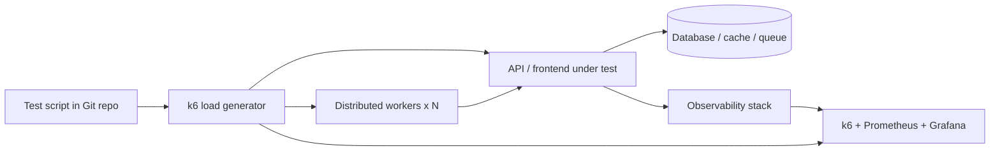

# Performance Testing Masterclass — Load, Stress, and Scalability with k6

Speed is a feature. In 2026, users abandon pages that take more than three seconds to load, and a slowdown of just 100 milliseconds can measurably reduce conversion. Yet many teams ship to production without ever asking the most important question: **what happens to this system when a thousand users click at the same time?**

Performance testing answers that question. It is the practice of measuring how a system behaves under load — its speed, stability, and resource consumption — so you can catch bottlenecks before your customers do. This guide is a complete, hands-on introduction for testers: it covers the theory, the metrics that matter, and a practical scripting workflow using **k6**, the open-source load-testing tool that has become the de facto standard for developer-friendly performance validation.


## Table of Contents

- [What Is Performance Testing and Why It Matters](#what-is-performance-testing-and-why-it-matters)
- [The Different Types of Performance Testing](#the-different-types-of-performance-testing)
- [The Core Metrics That Matter](#the-core-metrics-that-matter)
- [Building a Load Test with k6](#building-a-load-test-with-k6)
- [Scenarios and Executors: Shaping Realistic Load](#scenarios-and-executors-shaping-realistic-load)
- [Distributed and Cloud Load Testing](#distributed-and-cloud-load-testing)
- [Integrating Performance Tests into CI/CD](#integrating-performance-tests-into-cicd)
- [Real-World Example: A Peak-Season Checkout Test](#real-world-example-a-peak-season-checkout-test)
- [Common Pitfalls and How to Avoid Them](#common-pitfalls-and-how-to-avoid-them)
- [Key Takeaways](#key-takeaways)
- [Frequently Asked Questions](#frequently-asked-questions)
- [Related Articles](#related-articles)

## What Is Performance Testing and Why It Matters

Performance testing measures a system's **responsiveness, throughput, stability, and scalability** under a defined workload. It is not the same as functional testing: functional tests ask *is it correct?*, while performance tests ask *is it fast enough, for enough users, for long enough?*

Why does it matter?

- **Revenue protection.** Slow checkouts and login pages lose sales directly. Studies consistently show that the majority of users expect pages to load in under three seconds.
- **Brand trust.** Performance problems are public. A crashing sale page during a launch weekend becomes a news story, not a P1 ticket.
- **Cost control.** Catching a memory leak before release is measured in hours of effort; catching it in production means emergency hotfixes, rollbacks, and exhausted on-call engineers.
- **Capacity planning.** Knowing your real ceiling lets you size infrastructure, plan budgets, and decide when to scale horizontally.
- **Regulatory and SLA compliance.** Many enterprise contracts, and some industries, carry hard uptime and latency commitments.

Performance testing is a **shift-left, continuous activity**. The old model — a manual load test a week before release — is dead. Modern teams embed lightweight performance checks in every pipeline and run full-load tests nightly and before major releases.

## The Different Types of Performance Testing

People often use "load testing" as a catch-all, but performance testing is a family of disciplines. Each answers a different question:

| Type | Question it answers | Typical workload |
| --- | --- | --- |
| Load testing | How does the system behave under expected usage? | Normal-to-peak concurrent users |
| Stress testing | What happens beyond the breaking point? | Extreme load pushed until failure |
| Soak (endurance) testing | Are there leaks or degradation over time? | Moderate load for hours or days |
| Spike testing | Does it survive sudden surges? | Ramp to high load in seconds |
| Scalability testing | How does performance change as resources grow? | Increasing load + increasing nodes |
| Volume testing | Does it handle large amounts of data? | Huge datasets or payloads |
| Isolation testing | Where exactly is the bottleneck? | Targeted load on one component |

> **Note:** There is a common misconception that peak load equals the number of active users. It doesn't. Load is better expressed in *concurrent requests in flight* or *requests per second*. Ten thousand registered users might generate only two hundred truly concurrent requests — engineer your test around the real throughput, not the marketing number.

## The Core Metrics That Matter

If you only track a few numbers, track these. Everything else is a refinement.

1. **Latency (response time).** Time from request to response. Always report in percentiles, never averages.
2. **Throughput.** Completed requests per second (RPS) or transactions per second.
3. **Error rate.** Percentage of requests that fail. Watch it like a hawk — rising errors during a load test are a red flag that the system is failing over, not degrading gracefully.
4. **Saturation.** CPU, memory, disk I/O, and network usage of the servers you are testing. If latency rises but the host is idle, the bottleneck is elsewhere (database locking, external APIs, thread pools).
5. **Percentiles.** The 95th and 99th percentile tell you about the *worst* normal experience, which is what your users actually feel. An average of 200ms can hide a storm of 4-second requests.

```
users = {
  "p50":  "Median user experience",
  "p90":  "Worst 10% experience",
  "p95":  "Common SLA target",
  "p99":  "Tail latency — the power users",
}
```

Never optimize for the average. Three users seeing 10 seconds is invisible inside an average of 200ms — but those three users are the ones tweeting about you.

## Building a Load Test with k6

[k6](https://k6.io) is an open-source load-testing tool that models load as **JavaScript code**, with results streamed in real time over an HTTP/2 API. It is scriptable, CI-friendly, and cloud-scalable, which is why it dominates modern testing stacks.

### Why k6?

- **Code over config.** Tests live in your repo, get reviewed, and versioned like any other code.
- **Low resource footprint.** k6 is a high-performance Go binary that can generate tens of thousands of requests per second from one machine.
- **Native HTTP/2, WebSockets, and gRPC support** out of the box.
- **Chai-like assertion syntax** through checks, plus threshold gates ideal for CI.
- **Built-in HTML and browser test modules** expand it into a full tool.

### Installing k6

On Linux or macOS:

```bash
# Homebrew (macOS)
brew install k6

# or download the binary from GitHub releases
curl -L https://github.com/grafana/k6/releases/latest/download/k6_linux_amd64.tar.gz | tar xz
sudo cp k6 /usr/local/bin
```

Verify with `k6 version`.

### Your first script

A minimal script exercises an endpoint with a handful of virtual users:

```javascript
import http from 'k6/http';
import { check, sleep } from 'k6';

export const options = {
  vus: 10,                 // 10 virtual users
  duration: '1m',          // running for one minute
};

export default function () {
  const res = http.get('https://test-api.example.com/products');
  check(res, {
    'status is 200': (r) => r.status === 200,
    'response under 300ms': (r) => r.timings.duration < 300,
  });
  sleep(1);
}
```

Run it with:

```bash
k6 run script.js
```

Each iteration of the default function is one virtual user doing one unit of work. The `sleep(1)` simulates realistic user think time so you model behavior, not raw request-blasting.

> **Caution:** Scripting is the easy 20%. The hard 80% of performance testing is *data* and *realism*: using realistic payloads, realistic user flows, and test data your environment can handle. A benchmark that only reads an empty database burns hours and teaches you nothing.

### Checks and thresholds

**Checks** evaluate pass/fail inside each iteration (like assertions). **Thresholds** evaluate the aggregate result of the whole run and can force a CI build to fail. This is what makes performance tests automatable:

```javascript
import http from 'k6/http';
import { check } from 'k6';
import { Rate } from 'k6/metrics';

const errorRate = new Rate('http_errors');

export const options = {
  vus: 50,
  duration: '3m',
  thresholds: {
    http_req_duration: ['p(95)<500', 'p(99)<1000'],  // tail latency budget
    http_req_failed: ['rate<0.01'],                  // under 1% errors
    'http_errors': ['rate<0.05'],
  },
};
```

If any threshold is crossed, k6 exits with a non-zero code — which your CI pipeline can use to block a deploy.

## Scenarios and Executors: Shaping Realistic Load

Real traffic is rarely a flat line. Users trickle in during the morning, spike at lunch, and flood in after an email campaign. k6 models this with **scenarios**, each using an **executor** that defines the load shape:

| Executor | Behavior | Best fit |
| --- | --- | --- |
| `shared-iterations` | Fixed number of VUs share a fixed count of iterations | Quick smoke tests |
| `per-vus-iterations` | Each VU runs a fixed number of iterations | Small steady checks |
| `constant-vus` | Fixed VUs for a fixed duration | Baseline load |
| `ramping-vus` | VUs ramp up/down in stages | Matching real usage curves |
| `constant-arrival-rate` | Fix the *request rate*, VUs auto-scale | Throughput-oriented tests |
| `ramping-arrival-rate` | Request rate changes over time (the classic soak/spike tool) | Spike and soak tests |

A realistic staged test:

```javascript
export const options = {
  scenarios: {
    smoke: {
      executor: 'shared-iterations',
      vus: 5,
      iterations: 100,
    },
    ramp: {
      executor: 'ramping-vus',
      startVUs: 0,
      stages: [
        { duration: '2m', target: 100 },  // normal morning load
        { duration: '5m', target: 100 },
        { duration: '1m', target: 500 },  // sale spike
        { duration: '3m', target: 500 },
        { duration: '2m', target: 0 },    // cool down
      ],
    },
  },
};
```

Run `smoke` first as a sanity check (does the endpoint work at all under minimal load?), then run the full `ramp` profile.

## Distributed and Cloud Load Testing

Single-machine load has a ceiling — network bandwidth, file descriptors, CPU. When you need tens of thousands of concurrent requests, you distribute the load across worker instances. This is where the same script with **k6 Cloud** or self-hosted k6 workers shines: one load generator coordinating many sub-workers, all reporting against a single timeline.



The load generators (blue boxes) push against your environment, and both the system-under-test and the generators stream metrics into your observability stack so you correlate load with host-level saturation.

## Integrating Performance Tests into CI/CD

Performance validation belongs in the pipeline, ideally in three tiers:

1. **Per-PR smoke (minutes).** A tiny `smoke` scenario runs on every pull request to catch catastrophic regressions — no framework in the world needs 30 seconds of tuning inside a PR.
2. **Nightly baseline (tens of minutes).** The full staged load profile against a staging environment, with thresholds enforcing the latency/error budget.
3. **Pre-release full soak.** Hours-long endurance and spike tests ahead of major launches.

A minimal GitHub Actions job:

```yaml
name: performance
on:
  pull_request:
  schedule:
    - cron: "0 2 * * *"     # nightly baseline
jobs:
  load-test:
    runs-on: ubuntu-latest
    steps:
      - uses: actions/checkout@v4
      - run: curl -sL https://github.com/grafana/k6/releases/latest/download/k6_linux_amd64.tar.gz | tar xz
      - run: ./k6 run --summary-export=summary.json scripts/load-test.js
      - name: Upload metrics to Grafana
        uses: grafana/k6-action@v0.2.0
        with:
          filename: scripts/load-test.js
```

Pair the run with the metrics pipeline described in [Mastering Observability with Prometheus and Grafana](/blog/mastering-observability-prometheus-grafana) so the output of every load test lands on team dashboards next to real production traffic.

## Real-World Example: A Peak-Season Checkout Test

Consider an e-commerce platform preparing for a Black Friday weekend. The capacity assumption: **500 concurrent users during peak, with worst-case 1,000 concurrent during the first 10 minutes of a sale.**

1. **Model the flow.** The critical journey is *search → product page → cart → checkout*, with some fraction of users abandoning at each step. A single GET against a static endpoint tells you nothing.
2. **Script the journey.** Each virtual user walks the real path:

```javascript
import http from 'k6/http';
import { check } from 'k6';

const BASE_URL = 'https://shop.example.com';

export const options = {
  scenarios: {
    blackfriday: {
      executor: 'ramping-vus',
      startVUs: 0,
      stages: [
        { duration: '2m', target: 200 },
        { duration: '4m', target: 1000 },
        { duration: '10m', target: 1000 },
        { duration: '2m', target: 0 },
      ],
      thresholds: {
        http_req_duration: ['p(95)<800'],
        http_req_failed: ['rate<0.005'],
      },
    },
  },
};
```

3. **Run against staging.** Time the test to avoid conflicts with other test suites, and monitor the app's own logs for SQL timeouts or queue backups.
4. **Analyze the tail.** Here is where the real work happens:

- Latency rises gracefully, error rate stays low → the system degrades acceptably; note the headroom.
- Latency is flat but errors spike → a pool (connection pool, worker pool, database pool) is exhausted; look at saturation.
- P99 explodes while P50 stays flat → a hot spot, often a single query, a lock, or a cache miss storm.
- CPU/memory climb linearly over a soak → memory leak; this is exactly why endurance tests exist.

5. **Report and gate.** Write up the observed capacity (e.g. "handles 800 concurrent users under 800ms P95; load balancer becomes the bottleneck beyond that"), and turn earlier failures into threshold changes so the next sale is pre-blessed.

## Common Pitfalls and How to Avoid Them

Even experienced teams fall into these traps. Learn the shape of each and you will save weeks:

- **Testing the cache, not the system.** If your test hits 100% cache hits, you are testing a warm CDN, not your app. Mix cache-miss load in.
- **Averages-only dashboards.** Report P95/P99 or ship nothing.
- **Generator saturation.** If your own k6 machine pegs at 100% CPU, your "results" reflect your generator, not your application.
- **Ignoring think time.** Without `sleep()`, users become robots; robots find bottlenecks humans would never hit and miss ones they would.
- **Test environment ≠ production.** Different data volume, different replicas, different config. State the differences in every report, or the numbers mislead.
- **No baseline.** Without a before picture, you cannot say whether this release made things faster or slower.

## Key Takeaways

- Performance testing measures responsiveness, throughput, stability, and scalability — it is a continuous, shift-left discipline, not a release-week ritual.
- Choose the right test type: load, stress, soak, spike, scalability, volume, or isolation each answer a different question.
- Track percentiles, not averages; watch error rate and host saturation alongside latency to locate the real bottleneck.
- k6 lets you write tests as JavaScript with checks and thresholds, so performance validation can run automatically in CI and block bad deploys.
- Use scenarios and executors (ramping, arrival-rate) to model realistic load curves instead of a flat wall of requests.
- Validate assumption-data and realism before spending hours on test execution; a perfect script against the wrong data is worthless.

## Frequently Asked Questions

**What is the difference between stress testing and load testing?**

Load testing validates behavior under expected or peak load. Stress testing goes beyond the breaking point to find where the system fails and how it fails — and whether it recovers afterwards.

**How many virtual users do I need?**

Base it on real data: concurrent sessions from production logs, or an estimate from peak RPS, not the total registered user count. Start small (a dozen VUs) in smoke tests and scale the scenario to your target profile.

**Is k6 the only good tool?**

No. JMeter remains widely used in backend-heavy enterprises, and cloud services like LoadRunner, Gatling (like k6, code-based) and Locust (Python) all work. k6 is popular because it is lightweight, scriptable in a mainstream language, and CI-native.

**Should I run performance tests against production?**

With careful safeguards — synthetic traffic tagged and quarantined, realistic but disposable test data, run during low traffic, with full monitoring — some teams run lightweight checks in production. For full-load tests, always prefer a staging environment that mirrors production configuration and data volume.

**How do I know when the test has "passed"?**

You define it in advance with thresholds and service-level objectives: for example, P95 under 500ms and fewer than 1% errors at 500 concurrent users. If thresholds pass but saturation hits 100%, you have still found a capacity cliff worth documenting.

## Related Articles

- [API Testing Masterclass: The Complete Guide to REST API Test Automation](/blog/api-testing-masterclass-rest-api-automation)
- [Playwright Core Methods & Commands: A Complete Test Automation Cheat Sheet](/blog/playwright-core-methods-commands)
- [Mastering Observability with Prometheus and Grafana: From Metrics to Actionable Insights](/blog/mastering-observability-prometheus-grafana)
