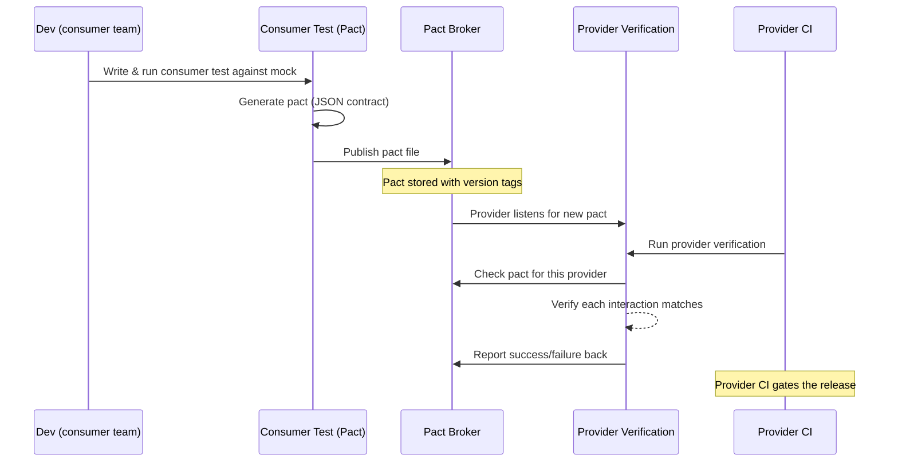

# Contract Testing Explained: Consumer-Driven Contracts for Microservices

If your team has ever shipped a new version of an API and watched the mobile app, the web frontend, or two downstream services break unexpectedly, you already know the pain this article addresses. In a microservices world, services do not live alone: each one consumes and produces HTTP payloads that other teams depend on. The gap between "the API works" and "the API works *for everyone who calls it*" is exactly where contract testing lives.

Contract testing is one of the fastest-growing practices in the tester toolbox because it attacks a very specific problem: **integration mismatches between independently deployed services** — without the cost, flakiness, and maintenance burden of full end-to-end suites. This guide walks you through the core ideas, the consumer-driven workflow, the tools you will actually use, and a complete, runnable-style real-world example.

## Table of Contents

- [The Integration Testing Problem in Microservices](#the-integration-testing-problem-in-microservices)
- [What Is Contract Testing?](#what-is-contract-testing)
- [How Consumer-Driven Contract Testing Works](#how-consumer-driven-contract-testing-works)
- [Contract Testing vs Other Test Types](#contract-testing-vs-other-test-types)
- [Core Vocabulary Every Tester Should Know](#core-vocabulary-every-tester-should-know)
- [Popular Contract Testing Tools](#popular-contract-testing-tools)
- [Real-World Example: Orders and Inventory with Pact](#real-world-example-orders-and-inventory-with-pact)
- [Provider States: Testing Realistic Scenarios](#provider-states-testing-realistic-scenarios)
- [Best Practices and Common Pitfalls](#best-practices-and-common-pitfalls)
- [Where Contract Testing Fits in the Test Pyramid](#where-contract-testing-fits-in-the-test-pyramid)
- [Key Takeaways](#key-takeaways)
- [Frequently Asked Questions](#frequently-asked-questions)
- [Related Articles](#related-articles)

## The Integration Testing Problem in Microservices

In a monolithic application, integration testing is comparatively simple. You stand up the application, point a test harness at its HTTP endpoint, and the database, and you verify the whole thing together. When your system is decomposed into dozens of small services — each with its own codebase, release cadence, and owning team — that approach collapses.

Consider the math. For `N` services, a full integration matrix has roughly `N * (N - 1)` pairwise combinations, and running them all requires every service to be deployed with every other service in the same environment at once. That brings three classic problems:

1. **Environment availability.** Someone is always deploying, breaking, or rebuilding one of the dozen services needed to run the suite.
2. **Speed.** Spinning up a full microservice topology takes minutes, so developers run the set rarely — and rarely-run tests catch nothing.
3. **Flakiness.** A test that fails because the payment service restarted has zero diagnostic value, yet it blocks the pipeline endlessly.


> **Caution:** A full end-to-end suite is not a bad thing — it is an *unaffordable* thing when used as the default verification strategy. Reserve it for a handful of critical journeys and let faster layers catch the majority of regressions.

This is the gap contract testing fills: instead of running two services together, you test that their *agreements* match.

## What Is Contract Testing?

A **contract** is a formal, machine-readable description of an interaction between two services: the request your client sends and the response it expects back. **Contract testing** is the practice of verifying that the two sides of every interaction agree on that contract — without standing up both services at the same time.

Contract testing has two important actors:

- The **consumer** is the service that *makes* the request (for example, a web frontend calling an API, or an order service calling an inventory service).
- The **provider** is the service that *serves* the request (the API server itself).

There are two flavors of contract testing, and they differ in who defines the contract:

| Approach | Who defines the contract | Mental model |
| --- | --- | --- |
| **Consumer-driven** | The consumer writes expectations first, then the provider must prove it can satisfy them | "The customer's needs win" |
| **Provider-directed** | The provider publishes a specification that consumers must conform to | "Here is the published spec" |

Consumer-driven contract testing (CDCT) is the dominant approach in practice, largely thanks to the **Pact** framework. Its philosophy is simple: the provider only needs to satisfy the contracts that its *actual consumers* depend on, not a theoretical best API. This prevents bidirectional inertia — you never over-specify endpoints nobody uses, and you never break a field somebody depends on.

## How Consumer-Driven Contract Testing Works

The consumer-driven workflow has four phases, typically automated in CI/CD:



1. **Consumer writes expectations.** The consumer team writes a normal unit test that describes an interaction ("When I POST to `/inventory/check`, I expect a JSON body with status, sku, and qty"). The test runs against a **mock provider** generated by Pact.
2. **A contract is generated.** Pact records every interaction exercised during the test into a JSON file called a **pact** — the machine-readable contract.
3. **The pact is published.** The consumer uploads the pact to a **Pact Broker** (a central store) tagged with version and environment information.
4. **The provider verifies.** The provider team fetches the pact and runs it against the *real* provider implementation. If every interaction succeeds, the contract `can-i-deploy` gate passes; if anything mismatches, CI fails with a precise, actionable diff.

The beautiful part is that the provider verification runs in the *provider's* CI pipeline, with its own environment, using a tiny slice of the real service. No shared staging environment, no coordinating deployments, no network flakiness.

## Contract Testing vs Other Test Types

Testers new to contract testing often confuse it with API testing or integration testing. They are complementary, not interchangeable:

| Dimension | Unit test | Contract test | Integration test | API testing (e.g. Postman) | End-to-end test |
| --- | --- | --- | --- | --- | --- |
| Systems involved | One class | Two, but only one runs | Two or more running | One live service | Full stack |
| Runs in | Dev machine | Consumer & provider CI | Shared env | Test env | Production-like env |
| Verifies | Logic | Message agreement | Runtime wiring | Live endpoint behavior | User journeys |
| Speed | Milliseconds | Seconds | Minutes | Seconds | Minutes to hours |
| Primary failure mode | Logic bugs | Contract drift | Config/version drift | Data/environment issues | Cascade of unrelated failures |

API testing with a tool like Postman verifies that a *live* endpoint returns the right values with the right data present. Contract testing verifies a *different* property: that the shape of the messages two services exchange will still match after one of them is redeployed. Data-dependent responses (actual prices, real inventory counts) belong to API testing; shape, type, and presence expectations belong to contracts.

## Core Vocabulary Every Tester Should Know

Mastering the vocabulary lets you read Pact documentation and talk to backend teams without ambiguity:

- **Interaction** — a single request/response pairing (a GET with expected status 200, a POST with an expected request body).
- **Pact** — the JSON file capturing one consumer's interactions with one provider.
- **Provider state** — a named precondition ("user with ID 42 exists") that tells the provider which fixture to set up before verifying a callback, so the same contract stays valid across scenarios.
- **Matching rules** — flexible expectations like `eachLike` and `like` that say "any integer" or "an array of these objects" instead of pinning exact values, keeping contracts realistic instead of brittle.
- **Pact Broker / PactFlow** — the central registry where pacts are published, verified, and gated against a version matrix.
- **can-i-deploy** — the broker's built-in tool that only lets you deploy a version if all its consumers' contracts are satisfied.
- **Verification** — the provider-side run that replays each interaction against the real implementation and reports pass/fail.

{: .note}
> **Key idea:** Matching rules are what keep a pact useful. Without them you'd assert exact UUIDs and timestamps in every test and fail on every run; with them you capture *shape* while provider state captures *scenario*.

## Popular Contract Testing Tools

Almost all modern CDCT tooling follows the same publish/verify/broker pattern. Here are the tools you are most likely to meet:

| Tool | Language support | What it is | Best for |
| --- | --- | --- | --- |
| **Pact** (Pact JS, Pact JVM, Pact .NET, Pact Python, pact-ruby) | Many | The de-facto CDCT framework | Most teams starting contract testing |
| **Pact Broker** / **PactFlow** | Any | Central pact store + CI gates | Publishing and versioning pacts |
| **Spring Cloud Contract** | JVM (Groovy/Java) | Provider-directed & CDCT with Spring Boot | Spring ecosystems |
| **Microcks** | Any (OpenAPI/AsyncAPI-based) | Mock + contract testing for REST, gRPC, Kafka, GraphQL | Teams already using OpenAPI specs |
| **JSON Schema / OpenAPI lint** | Any | Spec-driven contract checks | Lightweight spec enforcement |

The Pact ecosystem dominates the space because of its excellent language support and the maturity of the broker workflow. PactFlow is the commercial SaaS layer on top of Pact; the Pact Broker can also be self-hosted for free.

## Real-World Example: Orders and Inventory with Pact

Let's make this concrete. Imagine a retail system where the **Order service** (consumer) calls the **Inventory service** (provider) to check stock before confirming a purchase. The consumer expects to POST to `/inventory/check` and receive a body like:

```json
{
  "status": "AVAILABLE",
  "sku": "ABC-123",
  "qty": 12
}
```

### The consumer side (Pact JS)

The order service team writes a consumer test that defines the interaction:

```javascript
// orders/consumer.inventory.spec.js
const { Pact } = require('@pact-foundation/pact');
const { InventoryClient } = require('./inventoryClient');

describe('Order service → Inventory service contract', () => {
  const provider = new Pact({
    consumer: 'OrderService',
    provider: 'InventoryService',
    port: 8082,
  });

  beforeAll(() => provider.setup());
  afterAll(() => provider.finalize());

  it('checks stock availability for a sku', async () => {
    provider
      .addInteraction({
        state: 'sku ABC-123 has 12 units in stock',
        uponReceiving: 'a stock check request',
        withRequest: {
          method: 'POST',
          path: '/inventory/check',
          headers: { 'Content-Type': 'application/json' },
          body: { sku: 'ABC-123' },
        },
        willRespondWith: {
          status: 200,
          headers: { 'Content-Type': 'application/json' },
          body: {
            status: 'AVAILABLE',
            sku: 'ABC-123',
            qty: Pact.Matchers.integer(),
          },
        },
      });

    const result = await InventoryClient.checkStock('ABC-123');
    expect(result.status).toBe('AVAILABLE');
    expect(result.qty).toBeGreaterThan(0);
  });
});
```

The test runs against a mock provider generated by Pact. Every interaction the test exercises is recorded, and at the end Pact writes `pacts/order-service-inventory-service.json`. That file is the contract, and it gets published to the broker from CI:

```
$ npx pact-broker publish pacts/order-service-inventory-service.json \
    --consumer-app-version 1.4.0 \
    --broker-url https://broker.example.com
```

### The provider side (pact verification)

The inventory team does not run the order service at all. Instead, their CI fetches the latest contract and replays it against the real `/inventory/check` endpoint:

```javascript
// inventory/provider.verify.spec.js
const { Verifier } = require('@pact-foundation/pact');

describe('InventoryService provider verification', () => {
  it('satisfies every published consumer contract', async () => {
    const options = {
      provider: 'InventoryService',
      providerBaseUrl: 'http://localhost:8081',
      // provider states let the service set up fixtures per scenario
      stateHandlers: {
        'sku ABC-123 has 12 units in stock': async () => {
          await seedInventory({ sku: 'ABC-123', qty: 12 });
        },
      },
      pactBrokerUrl: 'https://broker.example.com',
    };

    await new Verifier(options).verifyProvider();
  });
});
```

If the order service's contract and the inventory service's real response ever drift — say the provider renames `qty` to `quantity` — the verification fails with a side-by-side diff of the expected shape versus what was actually returned. The inventory team sees the break in *their* pipeline, before anyone deploys anything, and can negotiate a change or add a compatibility layer.

Finally, the deployment gate uses the broker's state to answer "is it safe to release this version of InventoryService?"

```
$ npx pact-broker can-i-deploy \
    --pacticipant InventoryService --version 2.1.0 \
    --to prod \
    --broker-url https://broker.example.com
```

It returns a simple, trustworthy **yes or no** that the whole release pipeline can act on.

## Provider States: Testing Realistic Scenarios

A provider state tells the provider which setup to perform before answering a given interaction. Without states, you could only test one happy path. With states you can express real-world variety — "out of stock", "sku not found", "low stock warning" — while keeping the contract itself stable:

```javascript
stateHandlers: {
  'sku ABC-123 has 12 units in stock': async () => seedInventory({ sku: 'ABC-123', qty: 12 }),
  'sku ABC-123 is out of stock': async () => seedInventory({ sku: 'ABC-123', qty: 0 }),
  'sku ABC-123 does not exist': async () => wipeSku('ABC-123'),
},
```

This is the mechanism that makes a single pact file cover multiple scenarios without embedding volatile data into the contract itself.

## Best Practices and Common Pitfalls

Apply CDCT with discipline, or it quietly turns into yet another flaky suite:

- **Test shape, not data.** Use matching rules (`like`, `eachLike`, `term`) instead of exact values, and move data-specific expectations out of contracts.
- **Version and tag everything.** Publish pacts and provider versions with branch and environment tags so the broker can resolve the right versions.
- **Run the deploy gate.** `can-i-deploy` is the point of the whole exercise — do not publish pacts and then ignore the broker's answer.
- **Delete stale pacts.** Remove contracts from consumers that no longer exist, or the provider verifies irrelevant interactions forever.
- **Use provider states, not raw data hacks.** Setting database rows directly inside a verification is what state handlers are for.
- **Don't test data, only shape** — and **do not** fall back to full end-to-end suites to "just be safe"; that reintroduces the exact flakiness you removed.

> **Warning:** The most common failure mode is teams that write pact contracts *and* keep a complete end-to-end environment anyway. Contract testing pays for itself when it *replaces* cross-service integration runs — not when it's bolted on top of them.

## Where Contract Testing Fits in the Test Pyramid

Contract tests occupy the warm middle of the test pyramid: far cheaper and faster than end-to-end suites, yet far more meaningful than unit tests for the *integration* property. A pragmatic split looks like this:

- **Bottom:** unit tests — pure logic, no I/O.
- **Middle:** contract tests — verify every cross-service API agreement.
- **Just above:** a handful of critical user-journey end-to-end tests.
- **Top:** small, targeted testing around business-specific scenarios (performance, chaos, accessibility).

The result is a testing strategy where most bugs are caught in seconds, inside the CI of the team whose change caused them — before a single merge reaches an integration environment.

## Key Takeaways

- Contract testing verifies that two services agree on messages without running them together, removing the biggest source of integration flakiness.
- Consumer-driven contracts make the *consumer's* real needs the specification; the provider must prove it satisfies them.
- Pact generates a JSON contract from consumer tests, a broker stores it, and provider CI verifies it — then `can-i-deploy` gates releases.
- Matching rules capture shape; provider states capture scenario; keep volatile data out of contracts.
- API testing (Postman) and contract testing verify different properties and are complementary, not rivals.
- The payoff only materializes when contract tests *replace* cross-service end-to-end runs in the middle of your test pyramid.

## Frequently Asked Questions

**Can contract testing replace end-to-end tests entirely?**
No. It replaces the middle layer of integration-style suites between services. A small set of end-to-end tests for critical user journeys remains valuable; contract testing means you need far fewer of them.

**Do I need a Pact Broker to start?**
For a first spike, no — you can run consumer and provider tests and review the generated pact file manually. But the version-tagged publish/verify/`can-i-deploy` loop is where the real value lives, so adopt a broker as soon as you have more than one consumer.

**What happens to the contract when the consumer changes its expectations?**
The consumer publishes a new pact. The provider's next verification run replays it; if the provider fails to satisfy it, the provider team is alerted and the two teams coordinate a compatible change — before a breaking deployment escapes.

**Is contract testing only for HTTP APIs?**
No. The Pact ecosystem also covers Kafka and other message queues, gRPC, GraphQL, and WebSockets scenarios, so the same pattern extends far beyond REST.

**Who owns the contract — consumer or provider?**
The consumer owns the *expectations* in practice, but the contract is a shared artifact. Both teams are responsible for keeping it accurate; the broker makes ownership visible and testable.

## Related Articles

- [API Testing Masterclass: The Complete Guide to REST API Test Automation](/api-testing-masterclass)
- [Performance Testing Masterclass — Load, Stress, and Scalability with k6](/performance-testing-masterclass)
- [Playwright Core Methods & Commands: A Complete Test Automation Cheat Sheet](/playwright-core-methods-cheat-sheet)
- [4 AI Tools Every Manual and Automation Tester Should Learn in 2026](/ai-tools-for-testers-2026)
