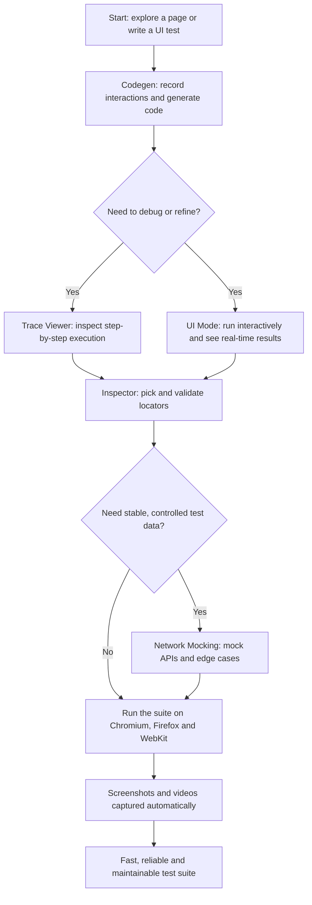

Playwright is more than just a test automation tool — it's a complete ecosystem for building, debugging and maintaining UI tests with speed and confidence. While many teams reach for a test runner and then bolt on a dozen third-party libraries, Playwright ships with a rich set of built-in UI features that cover the entire test lifecycle: recording tests, debugging them, picking locators, capturing screenshots and videos, mocking network requests, and running the same suite across multiple browsers.

This article walks through the core Playwright UI features described in the source material, explains why each one matters, and shows how they fit together into a faster, smarter, and easier test automation workflow.

## Table of Contents

- [The Feature Set at a Glance](#the-feature-set-at-a-glance)
- [Codegen: Recording Interactions into Tests](#codegen-recording-interactions-into-tests)
- [Trace Viewer: A Detailed Replay of Everything That Happened](#trace-viewer-a-detailed-replay-of-everything-that-happened)
- [UI Mode: Running and Debugging Tests Interactively](#ui-mode-running-and-debugging-tests-interactively)
- [Inspector & Locators: Precision Element Selection](#inspector--locators-precision-element-selection)
- [Screenshots & Videos: Automatic Visual Evidence](#screenshots--videos-automatic-visual-evidence)
- [Network Mocking: Controlling What the Browser Sees](#network-mocking-controlling-what-the-browser-sees)
- [Multi-Browser Support: One Suite, Three Engines](#multi-browser-support-one-suite-three-engines)
- [Why These Features Matter](#why-these-features-matter)
- [Best Practices for Playwright Tests](#best-practices-for-playwright-tests)
- [A Real-World Playwright Workflow](#a-real-world-playwright-workflow)
- [Conclusion](#conclusion)
- [Key Takeaways](#key-takeaways)
- [Frequently Asked Questions](#frequently-asked-questions)

## The Feature Set at a Glance

Playwright groups its UI capabilities around a handful of flagship tools. Each tool addresses a different pain point in the test automation workflow, from the first line of code to the final pass in the pipeline.

| Feature | What it does | Biggest win |
| --- | --- | --- |
| Codegen | Records your interactions and generates Playwright code automatically | Speeds up test creation; great for exploring new UI |
| Trace Viewer | Provides a detailed trace of everything that happened during a test | Step-by-step debugging with screenshots and DOM snapshots |
| UI Mode | Runs and debugs tests interactively | Real-time results; great for TDD workflow |
| Inspector | Picks locators and validates selectors | Auto-waits for elements; precise, reliable selectors |
| Screenshots & Videos | Captures visual evidence automatically | Configurable options, including on failure |
| Network Mocking | Intercepts, modifies and mocks network requests | Mock APIs, simulate responses, test edge cases easily |
| Multi-Browser Support | Runs the same tests on Chromium, Firefox and WebKit | Minimal configuration, parallel execution, consistent results |

The following diagram shows how these tools fit together in a typical session:



## Codegen: Recording Interactions into Tests

One of the quickest ways to start with Playwright is **Codegen**. You open a page in the recorder, interact with the application the way a real user would, and Playwright generates the corresponding test code automatically as you go. This turns the tedious task of hand-writing selectors and steps into a "record what you do, get code" loop.

Because the code is generated from your actual interactions, it reflects real user paths through the application rather than idealized assumptions. That makes Codegen especially useful in two situations highlighted by the source material:

- **Speeding up test creation** — you can scaffold a new spec in minutes instead of minutes per assertion.
- **Exploring new UI** — when a feature ships, recording a quick pass gives you working code and a working map of the selectors on the page before you invest in polish.

The result of a recording session looks roughly like this (an illustration of the kind of code Codegen produces):

```js
const { test, expect } = require('@playwright/test');

test('user can complete a valid login', async ({ page }) => {
  await page.goto('https://example.com/login');
  await page.getByLabel('Username').fill('demo_user');
  await page.getByLabel('Password').fill('correct-horse-battery-staple');
  await page.getByRole('button', { name: 'Sign in' }).click();
  await expect(page.getByText('Welcome back')).toBeVisible();
});
```

Codegen is a starting point rather than a final answer — the generated code is meant to be reviewed, renamed, and hardened, but it removes the blank-page problem that blocks many new test automation efforts.


## Trace Viewer: A Detailed Replay of Everything That Happened

Debugging a failing UI test is notoriously painful because the failure often happens long before you notice it. Playwright's **Trace Viewer** addresses this by capturing a detailed trace of everything that happened during a test run. Instead of guessing why a step failed, you open the trace and walk through the execution step by step.

The trace includes the context you need to diagnose problems without re-running the test dozens of times:

- **Step-by-step execution** — each action and assertion appears in sequence with timings.
- **Screenshots** — a visual snapshot of the page at key moments.
- **DOM snapshots** — the actual page structure at the time of the step, so you can see what the application really rendered.

This makes failures reproducible and explainable. When a test passes locally but fails in CI, the trace is the first place to look, because it shows exactly what the browser saw — not what you expected it to see.

> **Note:** The source material calls out traces as a core debugging tool, and it's worth internalizing: always leverage traces for debugging instead of sprinkling the test suite with temporary console logs. A trace gives you the full story of a single run in one artifact.

## UI Mode: Running and Debugging Tests Interactively

Where Codegen helps you *write* tests, **UI Mode** helps you *run and debug* them. UI Mode is an interactive runner that lets you execute tests while watching what the browser is doing.

The source material highlights several concrete benefits:

- **See test results in real time** — no waiting for a full suite report to understand what happened.
- **Run a single test or a single file** — target exactly the test you're working on instead of the whole suite.
- **Interactively inspect elements, locators, and actions** while the test is paused or between runs.

Because you can iterate on one test in a tight loop, UI Mode is described as great for a **TDD workflow**: you write a failing test, run it in UI Mode, watch it fail, implement the feature, and watch it pass — all without leaving the debug loop.

## Inspector & Locators: Precision Element Selection

A huge share of flaky UI tests can be traced back to brittle selectors. Playwright's **Inspector** tackles this directly by helping you pick locators, inspect elements, and validate that your selectors match the right nodes.

Three capabilities stand out in the source material:

- **Pick locator** — hover over an element in the page and Playwright suggests a stable locator for it.
- **Auto-waits for elements** — instead of hand-writing sleep calls, Playwright waits for elements to be actionable before acting, which removes one of the most common sources of intermittent failures.
- **Validate selectors** — check that a selector resolves to the expected element before you commit it to a test.

Locator suggestions help you favor resilient strategies — roles, labels, and text — over fragile CSS chains that break the moment markup changes. Combined with the Inspector's element inspection, you spend less time guessing selectors and more time verifying behavior.

## Screenshots & Videos: Automatic Visual Evidence

Debugging a failure is much easier when you can *see* it. Playwright captures **screenshots and videos** automatically, and the behavior is configurable — for example, capturing evidence on failure so that every failed run produces an artifact you can review or attach to a bug report.

These artifacts serve several purposes:

- They document what the application actually looked like when a test failed.
- They give developers and QA a shared, visual understanding of the problem.
- They help triage flaky tests without re-running them repeatedly.

Since the source material emphasizes **configurable options**, the takeaway is that capture behavior should be tuned to your workflow — capture on failure for CI, capture more aggressively while developing, and keep the artifacts organized so they stay useful.

## Network Mocking: Controlling What the Browser Sees

Real applications talk to APIs, and those APIs are not always available or deterministic during test runs. Playwright's **Network Mocking** lets you intercept, modify, and mock network requests, which gives your tests control over their own environment.

The source material calls out three practical benefits:

- **Mock APIs** — replace live backends with deterministic stubs so tests are not at the mercy of external services.
- **Simulate different responses** — return success, error, empty, or slow responses to exercise paths that are hard to trigger against a real backend.
- **Test edge cases easily** — empty states, server errors, timeouts, and malformed payloads become first-class, repeatable scenarios.

By controlling the network layer, you keep tests **independent of external dependencies** — a practice the source material explicitly recommends. This is what makes a suite fast, stable, and safe to run in parallel.

## Multi-Browser Support: One Suite, Three Engines

A UI test that only passes in one browser proves little about the real world. Playwright runs the **same tests on Chromium, Firefox, and WebKit with minimal configuration**, so you get genuine cross-browser coverage without maintaining parallel suites.

Two properties of this design deserve emphasis:

- **Parallel execution** — tests can run across browsers concurrently, keeping total run time reasonable even as coverage grows.
- **Consistent results** — because the API is the same across engines, differences surface as real browser behavior differences rather than framework quirks.

The source material's framing is that this delivers broad coverage at low cost: one suite, three engines, and confidence that what works in one browser is not an accident.


## Why These Features Matter

Taken individually, each feature saves time on a specific task. Taken together, they change the economics of the whole testing effort. The source material groups the payoff into four areas.

### Faster Test Development

Codegen lets you record, generate, and write tests in minutes. Instead of spending the first afternoon of a testing task on boilerplate, you spend it on the tests that actually matter — the ones that verify behavior worth protecting.

### Easier Debugging

Trace Viewer and UI Mode replace guesswork with evidence. When a test fails, the trace shows what happened step by step, and UI Mode lets you reproduce and inspect the flow interactively. Debugging stops being a chore and becomes a structured activity.

### More Reliable Tests

Mocking external dependencies removes the biggest source of nondeterminism in UI tests. When your tests no longer depend on a flaky backend, a rate-limited API, or a third-party widget behaving differently, the suite becomes dependable enough to trust in CI.

### Better Developer Experience

Every tool here — Codegen, UI Mode, Inspector, screenshots, traces — is an interactive tool that saves time and frustration. A good developer experience matters because it determines whether developers actually *use* the tests. Tooling that is pleasant to use gets maintained; tooling that fights the user gets abandoned.

## Best Practices for Playwright Tests

The source material closes its feature tour with a short list of best practices. They are simple to state and easy to underestimate:

1. **Keep tests independent and isolated.** A test should not depend on the state left behind by another test. Isolation makes tests reorderable, parallelizable, and debuggable.
2. **Leverage traces for debugging.** When something fails, reach for the trace before anything else — it is the fastest path from failure to root cause.
3. **Mock external dependencies.** Control the network and the environment so that tests exercise your application, not whatever the outside world happens to do at 3 a.m. in CI.
4. **Review your tests regularly.** Generated code and hurried tests accumulate cruft. Treat the suite as a codebase worth reviewing, refactoring, and pruning.

> **Pro Tip:** The source material notes that these features will not only make you more productive, but also help you build robust, scalable automation. Use the built-in tools as scaffolding for an automation architecture — a layered setup where generated code is later hardened into clean, maintainable, purpose-built tests.

## A Real-World Playwright Workflow

To see how the pieces fit together, imagine a typical sprint: a developer ships a new login flow with an email-verification step, and QA needs end-to-end coverage before release.

1. **Explore with Codegen.** Open the new flow in the recorder, log in with a valid account, complete verification, and get working test code in minutes. This also maps the page's accessible labels and roles.
2. **Refine in UI Mode.** Run the generated test in UI Mode, watch it execute step by step, and adjust the flow — for example, verifying a "Welcome back" message after login.
3. **Harden selectors with the Inspector.** Replace any fragile selectors with role- and label-based locators, and validate them against the live page before committing.
4. **Mock the email service.** The verification step depends on an external email provider, which is slow and nondeterministic. Mock that network request so verification always succeeds, and add a second mock that simulates a *failed* verification to cover the error path.
5. **Add visual evidence.** Enable screenshots and videos on failure so that any regression in the login flow arrives with an attached artifact.
6. **Run across browsers.** Execute the suite on Chromium, Firefox, and WebKit in parallel. What passes on one engine but fails on another surfaces as a genuine browser difference — and a real bug caught before release.

The entire loop — record, run, refine, mock, and verify across browsers — is powered by features that ship with Playwright itself, which is why the source material calls it a complete ecosystem rather than just a runner.

## Conclusion

Playwright's UI features form a coherent toolkit for the full test automation lifecycle. Codegen removes the blank page and speeds up test creation. Trace Viewer and UI Mode make debugging structured and evidence-based instead of speculative. The Inspector and locator tools eliminate flaky selectors. Screenshots and videos give every failure a story. Network mocking keeps the suite fast, isolated, and deterministic. And multi-browser support turns one suite into genuine cross-engine coverage.

Individually these features save minutes; together they make automation not just faster, but smarter and easier to maintain. Adopting them — and pairing them with the best practices of isolation, trace-driven debugging, mocking, and regular review — is the difference between a test suite you tolerate and an automation ecosystem you rely on.

## Key Takeaways

- Playwright is a complete ecosystem covering the whole UI test lifecycle: recording, debugging, maintaining, and executing tests.
- Codegen records interactions and generates Playwright code automatically, speeding up test creation and making it great for exploring new UI.
- Trace Viewer and UI Mode turn debugging into an evidence-based, step-by-step process, with UI Mode supporting a tight TDD workflow.
- The Inspector, auto-waiting, and locator validation help you build precise, resilient selectors instead of brittle ones.
- Network Mocking keeps tests independent of external dependencies, letting you mock APIs and exercise edge cases reliably.
- One suite runs on Chromium, Firefox, and WebKit with minimal configuration, giving you consistent, parallel cross-browser coverage.

## Frequently Asked Questions

**What does Codegen do in Playwright?**
Codegen records your interactions with the application and generates Playwright code automatically. The source material highlights it as a way to speed up test creation and explore new UI quickly.

**How does the Trace Viewer help with debugging?**
It provides a detailed trace of everything that happened during a test, including step-by-step execution, screenshots, and DOM snapshots, so you can see exactly what the browser did and rendered.

**What is UI Mode best used for?**
UI Mode runs and debugs tests interactively, showing results in real time and letting you run a single test or file. The source material specifically calls it great for a TDD workflow.

**Why should I mock network requests in tests?**
Mocking lets you intercept, modify, and stub network requests so tests are not dependent on live external services. The source material recommends mocking external dependencies for more reliable tests.

**Which browsers does Playwright support?**
Playwright runs the same tests on Chromium, Firefox, and WebKit with minimal configuration, supporting parallel execution and consistent results across engines.

## Related Articles

- Playwright Test Automation Fundamentals
- Building Reliable UI Tests with Auto-Waiting Locators
- API Mocking Strategies for End-to-End Test Suites
