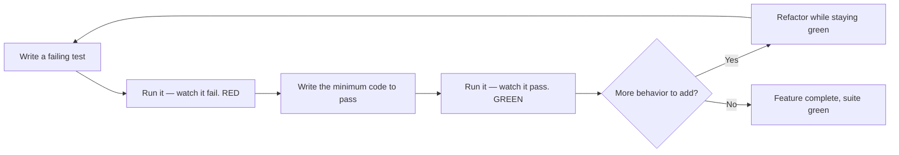
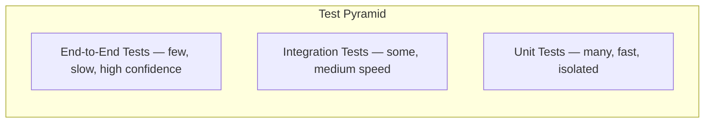

# Test-Driven Development (TDD) Explained: The Complete Guide with Real-World Examples

Every software team has lived through the same painful moment: a critical bug ships to production, the post-mortem shows it could have been caught by a test, and someone sighs, "We should really write more tests." The problem is rarely a lack of testing *effort*. It is almost always a lack of testing *discipline*. Tests written after the code has already passed its first smoke test tend to be shallow, brittle, and written to confirm whatever the developer just built — whether it is correct or not.

Test-Driven Development (TDD) flips that entire workflow on its head. Instead of writing production code first and tests later, you write a failing test *first*, watch it fail, and then write only the smallest amount of code needed to make it pass. It is a small shift in practice that produces outsized returns: better design, a safety net for refactoring, near-instant feedback, and documentation that never goes out of date. This guide walks through the TDD cycle in depth, works through a full example, and covers the best practices, trade-offs, and FAQs that every tester and developer should know.

## Table of Contents

- [What Is Test-Driven Development?](#what-is-test-driven-development)
- [The Red-Green-Refactor Cycle](#the-red-green-refactor-cycle)
- [The Three Laws of TDD](#the-three-laws-of-tdd)
- [Core TDD Concepts](#core-tdd-concepts)
- [A Complete TDD Walkthrough: The Shopping Cart Example](#a-complete-tdd-walkthrough-the-shopping-cart-example)
- [The Real World: TDD on a Production Team](#the-real-world-tdd-on-a-production-team)
- [Benefits of TDD](#benefits-of-tdd)
- [Challenges and When TDD Is a Poor Fit](#challenges-and-when-tdd-is-a-poor-fit)
- [TDD vs. Test-Last vs. BDD](#tdd-vs-test-last-vs-bdd)
- [TDD Best Practices](#tdd-best-practices)
- [Key Takeaways](#key-takeaways)
- [Frequently Asked Questions](#frequently-asked-questions)
- [Related Articles](#related-articles)

## What Is Test-Driven Development?

Test-Driven Development is a software development technique in which automated tests are written *before* the production code they are meant to validate. You begin by thinking about the smallest unit of behavior you need, encode that expectation as a failing test, then write just enough code to satisfy it. You repeat this loop dozens of times per feature, each iteration adding one small, verifiable increment of behavior.

TDD was popularized in the late 1990s by Kent Beck as part of Extreme Programming, and it has since become a cornerstone of modern agile engineering. It is frequently bundled together with pair programming, continuous integration, and refactoring as one of the practices that give teams the confidence to change code quickly and safely.


At its heart, TDD is not really "a testing technique." It is a **design technique** that happens to produce tests as a by-product. The forced discipline of writing the test first pushes you to answer three questions before you touch production code:

1. **What should this unit do?** — the expected behavior, stated precisely.
2. **How will I observe it?** — the public interface the test will call.
3. **When is it done?** — the moment the new behavior is verified.

> Note: TDD is about behavior, not implementation. A well-written TDD suite describes *what* the code should do. It should never peek into *how* it is done — no testing private methods, no asserting on internal state. The moment tests depend on implementation details, they break whenever you refactor, even when the behavior is correct.

## The Red-Green-Refactor Cycle

The core of TDD is a short, repeatable loop with three named phases. These names come from the state of the test runner's output.

1. **RED** — Write a new test that expresses the next piece of desired behavior. Run it and watch it fail. This failure is not a mistake; it is evidence that the test is actually measuring something. If the test passes before you write any code, it is a worthless test.
2. **GREEN** — Write the *minimum* amount of production code required to make the test pass. Do not add anything you do not need. Quick, ugly, brute-force solutions are fine here — you will clean them up next.
3. **REFACTOR** — Now that everything is green, improve the code's structure without changing its behavior. Remove duplication, rename variables, extract helpers. The passing test suite is your safety net, so refactor aggressively.

The cycle then repeats for the next piece of behavior until the feature is complete.



Notice that **refactoring is not an optional step**. Many teams collapse RED-GREEN into "test and code" and skip REFACTOR, which is how tests accumulate duplication and how code slowly rots. TDD's three phases exist precisely so that speed of delivery (GREEN) and quality of structure (REFACTOR) are both treated as first-class concerns.

## The Three Laws of TDD

Robert C. Martin ("Uncle Bob") distilled TDD into three strict laws that leave no room for ambiguity:

1. **You are not allowed to write any production code unless it is to make a failing unit test pass.**
2. **You are not allowed to write any more of a unit test than is sufficient to fail** — and compilation failures are failures.
3. **You are not allowed to write any more production code than is sufficient to pass the one currently failing unit test.**

Taken literally, these laws force you to work in very small increments — often just a line or two of code between test runs. Newcomers find this painfully slow at first, but the discipline is exactly what produces a well-factored system: every line of production code is justified by a test, and every test is minimal and focused on a single behavior.

## Core TDD Concepts

### The Test Pyramid

TDD focuses mostly on the bottom of the test pyramid: fast, isolated, in-process **unit tests**. Higher up the pyramid sit integration tests, end-to-end tests, and manual checks. The pyramid is a reminder that a healthy suite is broad and fast at the bottom and narrow and slow at the top — not an inverted pyramid where most coverage lives in slow UI tests.



### FIRST Principles

A memorable acronym for what makes a great unit test, which doubles as a checklist for the tests TDD produces:

- **F**ast — runs in milliseconds, so developers run them constantly.
- **I**ndependent — no shared state, no ordering dependencies, runs in isolation.
- **R**epeatable — same result every time, on any machine, in any order.
- **S**elf-validating — pass/fail is determined automatically, no human judgment.
- **T**imely — written at the right time (before the code, per TDD).

### The "Arrange, Act, Assert" Pattern

Nearly every TDD test follows the same three-part structure:

1. **Arrange** — set up inputs, mocks, and the system under test.
2. **Act** — invoke the behavior being tested.
3. **Assert** — verify the observable result.

Keeping this structure explicit in every test makes failures easy to diagnose: if the Assert line fails, the behavior is wrong; if the Arrange setup throws, the test harness is wrong.

## A Complete TDD Walkthrough: The Shopping Cart Example

Theory is easier to grasp with a concrete example. Let's build a simple `ShoppingCart` in JavaScript using the Jest test runner, driving every line of code through TDD.

**Step 0 — Set up the test environment.** A minimal `package.json` with Jest installed:

```json
{
  "name": "shopping-cart",
  "scripts": {
    "test": "jest"
  },
  "devDependencies": {
    "jest": "^29.0.0"
  }
}
```

**Step 1 — RED: write the first failing test.** The most basic behavior of any cart is that a brand-new cart totals zero.

```javascript
const ShoppingCart = require('./shoppingCart');

describe('ShoppingCart', () => {
  test('starts empty with a total of zero', () => {
    const cart = new ShoppingCart();
    expect(cart.total()).toBe(0);
  });
});
```

Running `npm test` fails because `./shoppingCart` does not even exist. That is a perfectly valid red state.

**Step 2 — GREEN: the minimum code to pass.** Create the module with the smallest implementation that satisfies the test:

```javascript
class ShoppingCart {
  total() {
    return 0;
  }
}

module.exports = ShoppingCart;
```

The test passes. **Step 3 — REFACTOR.** There is nothing to clean up yet; the class is already minimal. Move on.

**Step 4 — RED: add the next behavior.** A cart should sum the price of the products added to it.

```javascript
test('adds a product and updates the total', () => {
  const cart = new ShoppingCart();
  cart.add({ name: 'Laptop', price: 1000, quantity: 1 });
  expect(cart.total()).toBe(1000);
});
```

This fails: `total()` still returns `0`.

**Step 5 — GREEN.** Extend the class by the smallest amount needed:

```javascript
class ShoppingCart {
  constructor() {
    this.items = [];
  }

  add(item) {
    this.items.push(item);
  }

  total() {
    return this.items.reduce((sum, item) => sum + item.price * item.quantity, 0);
  }
}

module.exports = ShoppingCart;
```

**Step 6 — RED: add a business rule.** Now a real-world rule: a cart over $250 qualifies for a 10% bulk discount.

```javascript
test('applies a 10% discount when the cart exceeds $250', () => {
  const cart = new ShoppingCart();
  cart.add({ name: 'Keyboard', price: 50, quantity: 6 });
  expect(cart.total()).toBe(270);
});
```

The current code returns `300`, so the test fails — the discount rule is not implemented.

**Step 7 — GREEN.** Modify `total()` with the rule:

```javascript
total() {
  const subtotal = this.items.reduce((sum, item) => sum + item.price * item.quantity, 0);
  return subtotal > 250 ? subtotal * 0.9 : subtotal;
}
```

**Step 8 — REFACTOR.** The discount logic deserves a name. Extract it while keeping the suite green:

```javascript
class ShoppingCart {
  constructor() {
    this.items = [];
  }

  add(item) {
    this.items.push(item);
  }

  total() {
    const subtotal = this.items.reduce((sum, item) => sum + item.price * item.quantity, 0);
    return this.applyDiscount(subtotal);
  }

  applyDiscount(subtotal) {
    return subtotal > 250 ? Math.round(subtotal * 0.9) : subtotal;
  }
}

module.exports = ShoppingCart;
```

Because the refactor happened while the tests were green, we know instantly that behavior did not change. This is the whole point: **TDD makes refactoring safe by definition**, because you never restructure code without a passing test underneath you.

Notice also what did *not* happen: we never tested `applyDiscount` directly, and we never added speculative features like shipping cost or tax. TDD naturally produces **YAGNI** (You Aren't Gonna Need It) code — the system grows only to the extent the tests demand.

## The Real World: TDD on a Production Team

TDD in the abstract is clean; TDD in a working codebase involves teams, legacy code, and messy real-world constraints. Here is what a typical day looks like on a team practicing TDD properly.

**Morning — a new feature ticket arrives.** A bug report says that the checkout page double-charges customers when they click "Place Order" twice. The developer starts by writing a test that reproduces the bug: submit the order twice, assert that only one charge is created. The test fails (RED), which confirms they have actually reproduced the reported issue — not a hallucination of it. Next they write a guard against double submission, watch the test pass (GREEN), and then refactor the form's submission logic for clarity. The fix ships with a regression test that will catch the same bug forever.


**Afternoon — the CI pipeline and code review.** Every commit triggers the test suite in CI. A change that breaks a test stops the pipeline immediately, so a broken test never reaches production — and, equally important, a *missing* test on a changed code path is flagged by code coverage thresholds in the pull request. The reviewer looks for the same things TDD instills: tests that assert on behavior, not implementation; tests that are fast and independent; and code that has no untested branches.

**The legacy caveat.** Teams rarely get to practice TDD on a green field. For existing untested code, the standard approach is to first wrap the risky areas in a **characterization test** — a test written against the current (possibly buggy) behavior, created after the fact — to lock in current behavior before refactoring. Only then can you begin driving new behavior with TDD. Adding a small amount of test coverage to legacy code before touching it is the difference between confident refactoring and "deploy and pray."

## Benefits of TDD

The benefits of TDD compound over time. The first few weeks feel slow; after a few months, teams report that they move *faster* than they did without tests. Why?

- **Fewer production bugs.** Code is exercised on every keystroke, not just at release time. The bug is found seconds after it is introduced, when the surrounding context is fresh.
- **Better code design.** Writing the test first forces you to think about interfaces, dependencies, and how the code will be used — before the implementation tempts you into coupling and shortcut-taking.
- **Safe refactoring.** A comprehensive fast suite means restructuring code is a low-risk operation. Teams stop being afraid of their own codebase.
- **Living documentation.** Tests double as executable documentation. They show a new engineer exactly how each unit is meant to be used, and unlike a wiki page, they cannot go stale.
- **Regression protection.** Every bug ever fixed leaves behind a test, so regressions become rare and are caught at the unit level rather than in production.
- **Better debugging ergonomics.** When a test fails, the failure is small and specific. "The cart's discount rule is wrong" is far easier to debug than "the checkout page shows a strange total."

## Challenges and When TDD Is a Poor Fit

TDD is not free, and honest guides should say so.

- **Initial slowdown.** Writing tests first genuinely slows down early feature development. Teams under extreme deadline pressure often abandon TDD first — and then wonder why the bug rate climbs back up.
- **It takes practice to do well.** Naive TDD produces tests that assert implementation details, tests that are too big, or tests that duplicate each other. Like any craft, it improves with feedback.
- **Not every code layer benefits equally.** UI glues, configuration, and glue code are hard to test in isolation. Many teams draw a pragmatic line: strict TDD for domain and business logic, lighter testing for view layers.
- **TDD does not replace other testing.** Unit tests prove units work; they do not prove systems integrate, perform, or satisfy users. A complete strategy still needs integration, end-to-end, performance, and exploratory testing.
- **Testing frameworks cannot save bad tests.** A suite full of brittle, order-dependent, slow tests is a liability. When the suite becomes a burden, developers stop running it, and TDD collapses.


> Caution: Beware the "testing theater" trap. If tests are written to game coverage metrics — asserting trivial getters, mocking everything in sight, or throwing away meaningful assertions to keep the build green — you have all the ceremony of TDD and none of its protection. A test that never fails when the behavior breaks is worse than no test, because it creates false confidence.

## TDD vs. Test-Last vs. BDD

TDD is frequently confused with two neighboring practices. The differences matter when you are choosing an approach for your team.

| Aspect | Test-Last | TDD (Test-First) | BDD |
| --- | --- | --- | --- |
| Order of writing | Production code first, tests after | Failing test first, then production code | Behavior examples first, in plain language |
| Primary audience | Developers | Developers | Developers + product/business stakeholders |
| Test language | Code (framework-specific) | Code (framework-specific) | Gherkin-style `Given/When/Then` scenarios |
| Focus | Verifying existing code | Designing + verifying behavior | Specifying behavior collaboratively |
| Typical tooling | Jest, JUnit, pytest | Jest, JUnit, pytest | Cucumber, SpecFlow, Behave |

**Behavior-Driven Development (BDD)** extends the TDD mindset outward. Instead of tests derived by the developer, the team writes executable examples in a shared, human-readable format — `Given some state, When something happens, Then some outcome` — that product owners can read and approve. TDD and BDD are complementary: BDD frames *what* to build, while the TDD loop verifies it at the unit level.

## TDD Best Practices

- **Keep tests fast and isolated.** A unit test should run in milliseconds and touch one unit. Introduce test doubles (mocks, stubs, fakes) at boundaries so tests never hit databases, networks, or clocks.
- **Test behavior, not implementation.** Assert on the observable result of public methods. If you find yourself reaching for a private method or a mock of an internal collaborator, step back and redesign.
- **One behavior per test.** A failing test should point to exactly one behavior. Prefer several small, named tests over one large test with many assertions.
- **Commit at green, not at red.** Integrate only when the suite is green. If a test has been red for more than a few minutes, stop and fix the test — a red test left running is a half-finished thought.
- **Name tests as sentences.** `applies a 10% discount when the cart exceeds $250` reads like documentation. `test1` or `checkDiscount` does not.
- **Write the minimum code to pass — no more.** If you add behavior beyond the test, you are writing untested code, which violates the third law.
- **Treat RED as information.** A test that passes immediately on first run tells you nothing. If you cannot make it fail first, you may not have actually written a test.
- **Use TDD for bug fixes.** The most underrated habit: when a bug is reported, write a failing test that reproduces it *before* fixing it. You verify the diagnosis and prevent regression in one move.

## Key Takeaways

- TDD is a design technique that produces automated tests as a by-product: write a failing test, make it pass with minimal code, then refactor under a green suite.
- The Red-Green-Refactor cycle is the entire method; skipping the refactor step is where most teams let quality erode.
- The three laws of TDD guarantee that every line of production code is justified by a test and every test is minimal and behavior-focused.
- TDD shines for domain and business logic: better interfaces, fewer bugs, safe refactoring, and documentation that cannot go stale.
- TDD has real costs — an initial slowdown and a learning curve — and it complements, rather than replaces, integration, end-to-end, and performance testing.
- For legacy code, write characterization tests first to lock in current behavior before using TDD to drive new changes.

## Frequently Asked Questions

**What is the difference between TDD and unit testing?**
Unit testing is a category of automated testing that verifies individual units of code in isolation. TDD is a development workflow that *produces* unit tests by writing them before the production code. You can do unit testing without TDD, but TDD always produces unit tests as part of its process.

**Does TDD guarantee bug-free software?**
No. TDD dramatically reduces the class of bugs that unit tests can catch, but it cannot catch integration failures, performance regressions, UX problems, or misunderstandings about requirements. A complete quality strategy combines TDD with integration, end-to-end, and manual testing.

**Should I follow TDD for frontend and UI code?**
It depends. TDD works excellently for business logic, state management, and API clients — the parts of the frontend that compute things. For pure presentational layers and complex DOM interactions, many teams use component tests and end-to-end tests instead. The pragmatic rule: apply TDD where the logic is, not where the pixels are.

**How do I start practicing TDD on a large legacy codebase?**
Do not try to retrofit tests on everything at once. Start by adding characterization tests to the areas you are about to change, so refactoring is safe. Then, for every new feature and bug fix, follow the TDD cycle strictly. Coverage grows area by area, and your risk drops immediately around the code you actually touch.

**Do I need a special framework for TDD?**
No. TDD is a workflow, not a tool. Any testing framework — Jest, JUnit, pytest, NUnit, Mocha — works. What matters is the loop: failing test first, minimal implementation, refactor. The framework is just the harness that reports RED and GREEN.

## Related Articles

- [API Testing Masterclass: The Complete Guide to REST API Test Automation](/blog/api-testing-masterclass-complete-guide-rest-api-test-automation)
- [Playwright Core Methods & Commands: A Complete Test Automation Cheat Sheet](/blog/playwright-core-methods-commands-test-automation-cheat-sheet)
- [Performance Testing Masterclass — Load, Stress, and Scalability with k6](/blog/performance-testing-masterclass-load-stress-scalability-k6)
- [Contract Testing Explained: Consumer-Driven Contracts for Microservices](/blog/contract-testing-explained-consumer-driven-contracts-microservices)
- [4 AI Tools Every Manual and Automation Tester Should Learn in 2026](/blog/4-ai-tools-every-manual-and-automation-tester-should-learn-in-2026)
