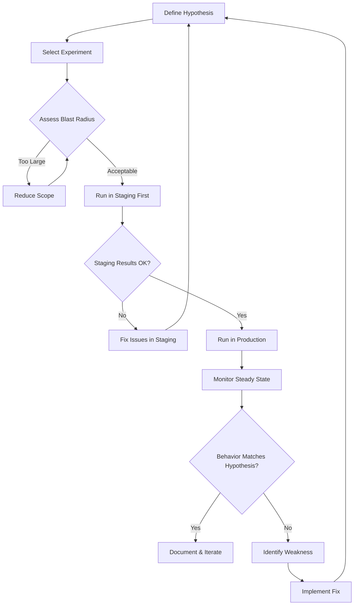

# Chaos Engineering and Resilience Testing: A Practical Guide to Breaking Your Systems Before They Break Themselves

Modern distributed systems are inherently unpredictable. Microservices communicate over networks, databases fail under load, third-party APIs go down, and cloud providers experience regional outages. Traditional testing validates that software works correctly under expected conditions, but it tells you very little about what happens when things go wrong unexpectedly. That is where chaos engineering and resilience testing come in.

Chaos engineering is the discipline of experimenting on a system to build confidence in its ability to withstand turbulent conditions in production. Rather than waiting for a catastrophic failure at 3 a.m. on a Saturday, chaos engineering lets you simulate those failures in a controlled environment, observe how your system responds, and fix the weaknesses before your users ever notice.

This guide covers the principles, tools, and practical workflows behind chaos engineering and resilience testing, giving you everything you need to start injecting faults into your systems with confidence.

## Table of Contents

- [What Is Chaos Engineering?](#what-is-chaos-engineering)
- [Chaos Engineering vs Traditional Testing](#chaos-engineering-vs-traditional-testing)
- [The Four Principles of Chaos Engineering](#the-four-principles-of-chaos-engineering)
- [Key Concepts: Steady State, Blast Radius, and Game Days](#key-concepts-steady-state-blast-radius-and-game-days)
- [Common Fault Injection Types](#common-fault-injection-types)
- [Popular Chaos Engineering Tools](#popular-chaos-engineering-tools)
- [Building a Resilience Testing Strategy](#building-a-resilience-testing-strategy)
- [Step-by-Step: Your First Chaos Experiment](#step-by-step-your-first-chaos-experiment)
- [Real-World Example: Netflix and Amazon](#real-world-example-netflix-and-amazon)
- [Common Pitfalls and How to Avoid Them](#common-pitfalls-and-how-to-avoid-them)
- [Key Takeaways](#key-takeaways)
- [Frequently Asked Questions](#frequently-asked-questions)
- [Related Articles](#related-articles)

## What Is Chaos Engineering?

Chaos engineering is a structured approach to discovering failures before they become incidents. It originated at Netflix in 2010 when the company moved its streaming infrastructure to AWS and needed a way to ensure resilience at massive scale. The result was Chaos Monkey, a tool that randomly terminates production virtual machines to verify that services could survive instance failures.

At its core, chaos engineering answers a simple question: **Can our system tolerate real-world failures?** Instead of theorizing about failure modes, you actually cause them and measure the outcome.

> Chaos engineering is not about breaking things randomly for fun. It is a disciplined practice of designing controlled experiments that reveal weaknesses in your system's resilience, then fixing those weaknesses systematically.

The discipline has evolved significantly since Netflix's early experiments. Today it encompasses network latency injection, resource exhaustion, dependency failures, certificate expirations, DNS misconfigurations, and even human-error simulation. The goal is the same as it was in 2010: find problems before your customers do.

## Chaos Engineering vs Traditional Testing

Understanding where chaos engineering fits alongside existing testing practices is crucial for any QA or SRE team. These are not competing approaches; they are complementary layers of a comprehensive quality strategy.

| Aspect | Traditional Testing | Chaos Engineering |
|---|---|---|
| **Goal** | Verify software behaves as specified | Discover how software behaves under unexpected conditions |
| **Environment** | Test and staging environments | Production and production-like environments |
| **Approach** | Predictable, deterministic tests | Controlled, unpredictable fault injection |
| **Failure model** | Known failure modes | Unknown failure modes |
| **Timing** | Before deployment | During and after deployment |
| **Scope** | Individual services or components | System-wide resilience |
| **Output** | Pass or fail results | Insights into system behavior under stress |

Traditional unit tests, integration tests, and even load tests validate that your system works correctly under normal and expected conditions. Chaos engineering asks: what happens when a downstream service becomes unreachable for 30 seconds? What happens when a database replica takes 5 seconds instead of 50 milliseconds to respond? What happens when an entire availability zone goes offline?

These are questions that a standard test suite is not designed to answer.

## The Four Principles of Chaos Engineering

The practice of chaos engineering is built on four foundational principles established by the original practitioners at Netflix and formalized in the Principles of Chaos Engineering manifesto.

### 1. Build a Hypothesis Around Steady State Behavior

Before injecting any fault, define what "normal" looks like. This means establishing a measurable steady state using metrics like request throughput, error rates, latency percentiles, and business KPIs such as transactions per minute or conversion rates.

For example, your hypothesis might be: "Under normal conditions, the checkout service maintains a p99 latency of under 200 milliseconds with a 0.1% error rate."

### 2. Introduce Real-World Events

Simulate failures that could actually happen in production. This includes server crashes, network partitions, disk failures, memory exhaustion, certificate expirations, and dependency outages. The key is realism — inject faults that your system is likely to encounter over its lifetime.

### 3. Observe the Difference Between Hypothesized and Actual Steady States

Compare the system's behavior during the experiment against your defined steady state. If the system degrades gracefully and recovers, your resilience measures are working. If it cascades into a broader failure, you have discovered a weakness.

### 4. Minimize the Blast Radius

Start small and expand gradually. Begin experiments in staging environments, then move to production with strict controls. Use feature flags, automated rollbacks, and real-time monitoring to limit the impact of any experiment that goes further than intended.

## Key Concepts: Steady State, Blast Radius, and Game Days

### Steady State

The steady state is the measurable normal behavior of your system. It is the baseline against which you compare the results of your chaos experiments. Establishing a good steady state requires selecting meaningful metrics that reflect the health and performance of your system from both a technical and business perspective.

Common steady-state metrics include:

- **Request throughput** (requests per second)
- **Error rate** (percentage of failed requests)
- **Latency percentiles** (p50, p95, p99)
- **Availability** (uptime percentage)
- **Business metrics** (orders placed, signups completed, payments processed)

### Blast Radius

The blast radius defines the scope of impact of a chaos experiment. It answers the question: "How much of our system could be affected if this experiment goes wrong?" Controlling the blast radius is essential for safe experimentation.

Techniques for limiting blast radius include:

- Running experiments during low-traffic periods
- Targeting a single service or a subset of instances
- Using feature flags to isolate experimental traffic
- Implementing automated kill switches that halt the experiment if key metrics degrade beyond a threshold
- Starting in non-production environments before progressing to production

### Game Days

A game day is a scheduled, coordinated chaos engineering exercise where the entire team participates. Unlike automated experiments that run continuously, game days simulate major failure scenarios and involve engineers responding in real time to diagnose and remediate issues. They are the chaos engineering equivalent of a fire drill.

Game days are especially valuable for testing runbooks, alerting pipelines, and incident response procedures. They reveal not only technical weaknesses but also process gaps that could delay recovery during a real incident.



## Common Fault Injection Types

Chaos experiments inject different types of faults depending on what resilience property you want to test. Here are the most common categories:

### Network Faults

Network issues are among the most common causes of production incidents in distributed systems. Injecting network faults tests whether your services handle degraded connectivity gracefully.

- **Latency injection**: Adding artificial delay to network traffic to simulate slow responses
- **Packet loss**: Dropping a percentage of packets to simulate unreliable connections
- **Network partitions**: Completely severing communication between two services or availability zones
- **DNS failures**: Simulating DNS resolution failures or delays

### Infrastructure Faults

These simulate failures at the infrastructure level, testing whether your application can survive the loss of underlying compute, storage, or memory resources.

- **Instance termination**: Killing compute instances randomly
- **CPU exhaustion**: Consuming all available CPU on a target instance
- **Memory pressure**: Filling available memory to trigger OOM kills
- **Disk pressure**: Filling disk space to test storage failure handling
- **Clock skew**: Desynchronizing system clocks to test time-dependent logic

### Application-Level Faults

These target specific application behaviors and dependencies to verify error handling and fallback mechanisms.

- **HTTP error injection**: Returning 500 or 503 responses from a dependency
- **Timeout simulation**: Making a dependency respond very slowly
- **Exception throwing**: Triggering unhandled exceptions in a service
- **State corruption**: Simulating inconsistent state in a database

### Dependency Faults

Many systems depend on external services like payment providers, authentication services, or third-party APIs. These faults test how your system behaves when those dependencies become unavailable.

- **Third-party API downtime**: Blocking calls to an external service
- **Database failover**: Simulating a primary database failure and replica promotion
- **Cache invalidation**: Clearing or poisoning cache layers
- **Message queue failures**: Simulating broker unavailability or message loss

## Popular Chaos Engineering Tools

The chaos engineering ecosystem has matured significantly, offering tools for every scale and platform.

### LitmusChaos

LitmusChaos is a CNCF-hosted, open-source chaos engineering platform built for Kubernetes. It provides a declarative approach to chaos experiments using Kubernetes Custom Resource Definitions (CRDs).

```yaml
apiVersion: litmuschaos.io/v1alpha1
kind: ChaosEngine
metadata:
  name: pod-delete-chaos
  namespace: default
spec:
  appinfo:
    appns: default
    applabel: app=nginx
    appkind: deployment
  chaosServiceAccount: litmus-admin
  experiments:
    - name: pod-delete
      spec:
        components:
          env:
            - name: TOTAL_CHAOS_DURATION
              value: "30"
            - name: CHAOS_INTERVAL
              value: "10"
```

### Gremlin

Gremlin is a commercial chaos engineering platform that provides a user-friendly interface for running controlled experiments across your infrastructure. It supports host, container, Kubernetes, and application-level attacks with built-in safety features.

### Chaos Toolkit

Chaos Toolkit is an open-source framework that takes a declarative, JSON-based approach to defining chaos experiments. It integrates with multiple platforms and provides extensible probes for validating steady-state behavior.

```json
{
  "title": "Verify checkout resilience during payment service degradation",
  "description": "Inject latency into the payment service and verify that checkout still completes for cached payment methods",
  "steady-state-hypothesis": {
    "title": "Checkout remains functional",
    "probes": [
      {
        "type": "probe",
        "name": "checkout-responds",
        "tolerance": 200,
        "provider": {
          "type": "http",
          "url": "https://api.example.com/health/checkout"
        }
      }
    ]
  },
  "method": [
    {
      "type": "action",
      "name": "inject-payment-latency",
      "provider": {
        "type": "python",
        "module": "chaosorg.actions.network",
        "func": "add_latency",
        "arguments": {
          "service": "payment-service",
          "latency_ms": 5000,
          "duration": 60
        }
      }
    }
  ],
  "rollbacks": []
}
```

### AWS Fault Injection Simulator (FIS)

AWS FIS is a managed service for running chaos experiments on AWS infrastructure. It integrates natively with EC2, RDS, ECS, EKS, and other AWS services, providing pre-built actions for common fault types.

### Toxiproxy

Toxiproxy is a TCP proxy for simulating network conditions, originally created by Shopify. It is particularly useful for testing how applications handle network latency, connection timeouts, and bandwidth limitations at the proxy level.

## Building a Resilience Testing Strategy

Adopting chaos engineering does not happen overnight. A structured approach helps teams build maturity gradually while maintaining confidence and control.

### Level 1: Observability and Baseline

Before you can break things intelligently, you need to see clearly. Ensure you have comprehensive monitoring, logging, and tracing in place. Establish baseline metrics for your critical user journeys so you know what "healthy" looks like.

- Deploy distributed tracing with OpenTelemetry
- Set up alerting on key service-level indicators (SLIs)
- Document your critical user flows and their expected performance characteristics

### Level 2: Staging Experiments

Start running chaos experiments in staging environments. Focus on simple faults like instance termination and network latency injection. Use these experiments to validate that your monitoring, alerting, and runbooks work correctly.

### Level 3: Production Experiments with Guardrails

Move to production experiments with strict blast-radius controls. Start with the least disruptive faults and expand gradually. Always have automated rollback mechanisms in place and ensure the team is online during experiments.

### Level 4: Automated and Continuous Resilience Testing

Integrate chaos experiments into your CI/CD pipeline. Run automated resilience tests on every deployment or on a scheduled basis. Use chaos engineering as a gate for promoting changes from staging to production.

### Level 5: Game Days and Cross-Team Exercises

Conduct regular game days involving multiple teams. Simulate major failure scenarios like region-wide outages and test your organization's ability to respond, communicate, and recover effectively.

## Step-by-Step: Your First Chaos Experiment

Here is a practical walkthrough for running your first chaos experiment using LitmusChaos on a Kubernetes cluster.

### Prerequisites

- A running Kubernetes cluster (any managed provider or Minikube)
- `kubectl` configured and connected to the cluster
- A sample application deployed with health check endpoints

### Step 1: Install LitmusChaos

```bash
helm repo add litmuschaos https://litmuschaos.github.io/litmus-helm
helm repo update
helm install litmus litmuschaos/litmus --namespace litmus --create-namespace
```

### Step 2: Deploy a Target Application

Deploy a simple web application that you want to test for resilience.

```yaml
apiVersion: apps/v1
kind: Deployment
metadata:
  name: web-app
spec:
  replicas: 3
  selector:
    matchLabels:
      app: web-app
  template:
    metadata:
      labels:
        app: web-app
    spec:
      containers:
        - name: nginx
          image: nginx:1.25
          ports:
            - containerPort: 80
          readinessProbe:
            httpGet:
              path: /
              port: 80
            initialDelaySeconds: 5
            periodSeconds: 5
```

### Step 3: Define a Steady-State Hypothesis

Before injecting any faults, verify that your application is healthy. Create a simple probe that checks the service endpoint:

```bash
kubectl run chaos-monitor --rm -i --tty --image=curlimages/curl -- \
  curl -s -o /dev/null -w "%{http_code}" http://web-app.default.svc.cluster.local/
# Expected output: 200
```

### Step 4: Create and Run a Pod Delete Experiment

```yaml
apiVersion: litmuschaos.io/v1alpha1
kind: ChaosEngine
metadata:
  name: web-app-resilience-test
  namespace: default
spec:
  appinfo:
    appns: default
    applabel: app=web-app
    appkind: deployment
  chaosServiceAccount: litmus-admin
  experiments:
    - name: pod-delete
      spec:
        components:
          env:
            - name: TOTAL_CHAOS_DURATION
              value: "60"
            - name: CHAOS_INTERVAL
              value: "10"
            - name: FORCE
              value: "false"
```

### Step 5: Observe and Analyze

Monitor your application during and after the experiment. Check that:

- Request latency remained within acceptable bounds
- No errors were returned to users
- The deployment automatically scaled back to the desired replica count
- Alerting triggered correctly and notifications were delivered

```bash
kubectl describe chaosresult web-app-resilience-test-pod-delete -n default
```

## Real-World Example: Netflix and Amazon

### Netflix: The Pioneer

Netflix has been practicing chaos engineering since 2010 when they built Chaos Monkey as part of their Simian Army suite. The original Chaos Monkey randomly terminated virtual machine instances in their production environment to ensure that services could tolerate instance failures without user-facing impact.

Over the years, Netflix expanded their toolkit significantly:

- **Latency Monkey**: Injects artificial delays into RESTful service responses to simulate degraded downstream dependencies
- **Chaos Gorilla**: Simulates the complete failure of an entire availability zone
- **Chaos Kong**: Simulates the failure of an entire geographic region
- **Conformity Monkey**: Identifies and terminates instances that do not adhere to best practices

Netflix's approach demonstrated that chaos engineering could be practiced safely at massive scale and that the insights gained were far more valuable than the risks involved.

### Amazon: Resilience at Scale

Amazon runs what they call "GameDay" exercises, where teams simulate major failure scenarios across their infrastructure. These exercises have revealed critical weaknesses in service dependencies, monitoring gaps, and runbook inadequacies. The lessons learned from GameDay exercises have directly contributed to improvements in AWS service reliability that benefit all AWS customers.

> The most valuable chaos experiments are not the ones that confirm your system is resilient. They are the ones that reveal unexpected failure modes you never would have discovered through traditional testing.

## Common Pitfalls and How to Avoid Them

### Starting Too Aggressively

Many teams make the mistake of running large-scale production experiments without sufficient preparation. Start with the simplest possible experiments in staging environments and expand your scope only as your team builds confidence and maturity.

### Ignoring Observability

Running chaos experiments without adequate monitoring is like driving blindfolded. Ensure you have comprehensive observability — including metrics, logs, traces, and alerts — before you inject a single fault. You need to be able to see the full picture of how your system responds.

### Treating It as a One-Time Activity

Chaos engineering is not a one-time project or a checkbox exercise. It is an ongoing practice that should be integrated into your development and operations workflows. Systems evolve, new dependencies are introduced, and failure modes change. Your resilience testing must evolve with them.

### Skipping the Hypothesis

Every chaos experiment should start with a clear hypothesis about expected behavior. Without a hypothesis, you are just breaking things and hoping to learn something. A well-defined hypothesis turns a random disruption into a structured experiment with measurable outcomes.

### Not Having Rollback Plans

Always have a clear plan for halting an experiment and restoring normal operations if something goes wrong. Automated kill switches, circuit breakers, and manual intervention procedures should all be tested and ready before you begin.

## Key Takeaways

- Chaos engineering is the disciplined practice of conducting controlled experiments to discover weaknesses in system resilience before they cause real production incidents
- Always define a steady-state hypothesis before injecting faults, and compare actual behavior against expected behavior
- Control the blast radius by starting small in staging environments and expanding gradually to production with strict guardrails
- Integrate chaos engineering into your CI/CD pipeline and organization culture rather than treating it as a one-time exercise
- Comprehensive observability (metrics, logs, traces, and alerts) is a prerequisite, not an afterthought — you cannot learn from experiments you cannot observe
- Game days and cross-team exercises reveal both technical weaknesses and process gaps that automated experiments alone cannot uncover

## Frequently Asked Questions

### Is chaos engineering safe to run in production?

Chaos engineering is safe when practiced with proper controls. Start with staging environments, use strict blast-radius limitations, implement automated rollback mechanisms, and always have a kill switch available. The risk of not practicing chaos engineering — discovering your failure modes during an uncontrolled real incident — is typically far greater than the risk of controlled experimentation.

### Do I need a Kubernetes cluster to practice chaos engineering?

No. While many modern chaos engineering tools like LitmusChaos and Chaos Mesh are Kubernetes-native, chaos engineering can be practiced on any infrastructure. Tools like Gremlin work on bare metal servers, virtual machines, and containers. You can also use simple scripts to simulate faults like network latency or process termination on traditional infrastructure.

### How often should we run chaos experiments?

The frequency depends on your maturity level and organizational goals. Teams just starting out might run experiments monthly during dedicated game days. Mature organizations run automated resilience tests continuously as part of their CI/CD pipeline, with more comprehensive game day exercises conducted quarterly.

### What is the difference between chaos engineering and load testing?

Load testing measures system performance under increased traffic volumes to identify bottlenecks and capacity limits. Chaos engineering tests how systems behave when individual components fail or degrade. A system might handle high load perfectly but fail catastrophically when a single dependency becomes slow. Both practices are valuable, but they address fundamentally different questions about your system.

### Can chaos engineering be applied to monolithic applications?

Yes. While chaos engineering is most commonly associated with distributed systems and microservices, the principles apply to monolithic applications as well. You can inject faults at the infrastructure level (disk full, CPU spike, network latency) or at the application level (database connection pool exhaustion, file system errors) to discover how your monolith handles unexpected conditions.

## Related Articles

- Performance Testing Masterclass — Load, Stress, and Scalability with k6
- Contract Testing Explained: Consumer-Driven Contracts for Microservices
- Mastering Observability with Prometheus and Grafana: From Metrics to Actionable Insights
- OpenTelemetry in DevOps: Unified Traces, Metrics, and Logs for Modern Observability
- Kubernetes Pod Troubleshooting in Production: 25 Real-World Interview Scenarios
