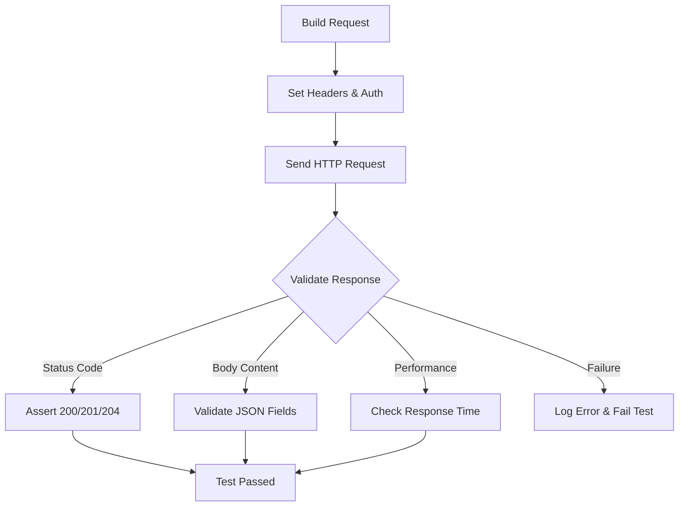

# Hands-On Selenium and API Automation: A Practical Guide to Common Interview Questions

Test automation is no longer optional in modern software development. Teams ship faster, and manual testing alone cannot keep pace. Two of the most in-demand skills in any QA engineer's toolkit are **Selenium WebDriver** for browser automation and **RestAssured** for API testing. This guide walks through 30+ practical, hands-on questions and answers that cover both domains — exactly the kind of material that shows up in interviews and real-world projects alike.

Whether you are preparing for a QA automation interview or looking to sharpen your day-to-day scripting skills, this article covers dropdown handling, window management, screenshots, drag-and-drop, API requests, response validation, authentication, and much more.

## Table of Contents

- [Selenium Automation Questions](#selenium-automation-questions)
  - [Handling Dropdowns](#1-how-to-handle-a-dropdown-in-selenium)
  - [Multiple Windows](#2-how-to-handle-multiple-windows-in-selenium)
  - [Capturing Screenshots](#3-write-code-to-capture-a-screenshot-in-selenium)
  - [Handling Alerts](#4-how-to-handle-alerts-in-selenium)
  - [Drag and Drop](#5-how-do-you-perform-drag-and-drop-in-selenium)
  - [Handling Frames](#6-write-code-to-handle-frames-in-selenium)
  - [Managing Cookies](#7-how-to-handle-cookies-in-selenium)
  - [Exception Handling](#8-how-do-you-handle-exceptions-in-selenium)
  - [Verifying Element Visibility](#9-how-to-verify-if-an-element-is-displayed)
  - [Executing JavaScript](#10-how-to-execute-javascript-in-selenium)
  - [Checking Broken Links](#11-how-to-check-for-broken-links-on-a-webpage)
  - [Explicit Waits](#12-how-do-you-wait-for-an-element-to-be-visible-in-selenium)
  - [Mouse Hover](#13-how-to-perform-mouse-hover-action-in-selenium)
  - [File Upload](#14-how-to-handle-a-file-upload-in-selenium)
  - [Page Scrolling](#15-how-to-scroll-to-the-bottom-of-the-page-in-selenium)
  - [Right-Click Context Menu](#16-how-do-you-handle-right-click-context-click-in-selenium)
  - [Capturing All Links](#17-how-to-capture-and-print-all-links-on-a-webpage)
- [API Automation Questions](#api-automation-questions)
  - [GET Requests and Status Validation](#1-how-to-send-a-get-request-and-validate-status-code)
  - [POST Requests](#2-write-a-post-request-to-create-a-new-user)
  - [JSON Response Validation](#3-how-to-validate-a-json-response-field)
  - [Adding Headers](#4-write-code-to-add-headers-in-a-request)
  - [Response Time Validation](#5-how-to-validate-response-time)
  - [Checking JSON Fields](#6-write-code-to-verify-a-json-field-exists)
  - [PUT Requests](#7-how-to-send-a-put-request)
  - [Pagination Handling](#8-how-to-handle-pagination-in-an-api-request)
  - [JSON Array Validation](#9-how-to-verify-json-array-size)
  - [Extracting Data from JSON](#10-extract-specific-data-from-a-json-response)
  - [DELETE Requests](#11-how-to-send-a-delete-request)
  - [Header Validation](#12-how-to-validate-a-specific-header)
  - [Query Parameters](#13-how-to-handle-query-parameters)
  - [Basic Authentication](#14-how-to-handle-basic-authentication)
  - [PATCH Requests](#15-how-to-send-a-patch-request)
  - [Multiple Query Parameters](#16-how-to-add-multiple-query-parameters)
  - [Non-null Value Checks](#17-how-to-check-if-a-json-path-returns-non-null)
  - [Form Parameters](#18-how-to-send-form-parameters)
- [Key Takeaways](#key-takeaways)
- [Frequently Asked Questions](#frequently-asked-questions)

## Selenium Automation Questions

Selenium WebDriver provides programmatic control over a real browser. It supports multiple languages (Java, Python, C#, JavaScript) and is the backbone of most web UI automation frameworks. The questions below cover the most commonly encountered scenarios.

### 1. How to Handle a Dropdown in Selenium?

The `Select` class in Selenium is purpose-built for interacting with `<select>` HTML elements. It provides three primary selection strategies:

- **`selectByVisibleText`** — selects an option by the text the user sees in the dropdown.
- **`selectByIndex`** — selects by the zero-based position of the option.
- **`selectByValue`** — selects by the `value` attribute of the `<option>` tag.

```java
Select dropdown = new Select(driver.findElement(By.id("country")));
dropdown.selectByVisibleText("India");
```

### 2. How to Handle Multiple Windows in Selenium?

When a new window or tab opens, Selenium tracks it through a window handle. You switch to the new window, perform your actions, and then switch back to the original.

```java
String mainWindow = driver.getWindowHandle();
for (String handle : driver.getWindowHandles()) {
    if (!handle.equals(mainWindow)) {
        driver.switchTo().window(handle);
    }
}
// perform actions in the new window
driver.switchTo().window(mainWindow);
```

### 3. Write Code to Capture a Screenshot in Selenium

The `TakesScreenshot` interface lets you capture the current browser viewport and save it to a file. This is invaluable for debugging failed tests and generating visual reports.

```java
File screenshot = ((TakesScreenshot) driver).getScreenshotAs(OutputType.FILE);
FileUtils.copyFile(screenshot, new File("screenshot.png"));
```

### 4. How to Handle Alerts in Selenium

JavaScript alerts, confirmation dialogs, and prompt boxes are all handled via the `switchTo().alert()` method. Use `accept()` to click OK and `dismiss()` to click Cancel.

```java
Alert alert = driver.switchTo().alert();
String alertText = alert.getText();
alert.accept();
```

> **Note:** Always handle alerts immediately. If an alert is present and you try to interact with the page, Selenium will throw an `UnhandledAlertException`.

### 5. How Do You Perform Drag and Drop in Selenium?

The `Actions` class provides a fluent API for complex user interactions, including drag and drop.

```java
WebElement source = driver.findElement(By.id("draggable"));
WebElement target = driver.findElement(By.id("droppable"));
new Actions(driver).dragAndDrop(source, target).perform();
```

### 6. Write Code to Handle Frames in Selenium

Frames embed one HTML document inside another. You must explicitly switch into a frame before interacting with its elements, and switch back to the default content afterward.

```java
driver.switchTo().frame("frameName");
// perform actions inside the frame
driver.switchTo().defaultContent();
```

### 7. How to Handle Cookies in Selenium

Cookies are essential for session management during test automation. Selenium lets you add, retrieve, and delete cookies from the browser session.

```java
Cookie cookie = new Cookie("sessionId", "abc123");
driver.manage().addCookie(cookie);
Cookie retrieved = driver.manage().getCookieNamed("sessionId");
```

### 8. How Do You Handle Exceptions in Selenium?

Proper exception handling keeps test suites robust. The most common Selenium exception is `NoSuchElementException`, which occurs when a locator fails to find an element.

```java
try {
    WebElement element = driver.findElement(By.id("nonExistent"));
} catch (NoSuchElementException e) {
    System.out.println("Element not found: " + e.getMessage());
}
```

### 9. How to Verify if an Element Is Displayed?

The `isDisplayed()` method returns a boolean indicating whether the element is visible on the page. It is commonly used in assertions to confirm that UI components render correctly.

```java
boolean isVisible = driver.findElement(By.id("submitBtn")).isDisplayed();
assertTrue(isVisible);
```

### 10. How to Execute JavaScript in Selenium?

The `JavascriptExecutor` interface lets you run arbitrary JavaScript in the browser context. This is particularly useful for scrolling, clicking hidden elements, or manipulating the DOM directly.

```java
JavascriptExecutor js = (JavascriptExecutor) driver;
js.executeScript("window.scrollBy(0, 1000)");
```

### 11. How to Check for Broken Links on a Webpage?

Broken link detection involves finding every `<a>` tag on the page, extracting its `href`, and making an HTTP request to verify the response code.

```java
List<WebElement> links = driver.findElements(By.tagName("a"));
for (WebElement link : links) {
    HttpURLConnection conn = (HttpURLConnection)
        new URL(link.getAttribute("href")).openConnection();
    conn.setRequestMethod("HEAD");
    int code = conn.getResponseCode();
    if (code != 200) {
        System.out.println("Broken link: " + link.getAttribute("href"));
    }
}
```

### 12. How Do You Wait for an Element to Be Visible in Selenium?

Explicit waits are the recommended approach for synchronizing with dynamic web pages. `WebDriverWait` combined with `ExpectedConditions` waits for a specific condition before proceeding.

```java
WebDriverWait wait = new WebDriverWait(driver, Duration.ofSeconds(10));
WebElement element = wait.until(
    ExpectedConditions.visibilityOfElementLocated(By.id("elementId"))
);
```

> **Important:** Avoid using `Thread.sleep()` for waits. It adds unnecessary delays when elements load quickly and is insufficient when pages load slowly. Explicit waits are both faster and more reliable.

### 13. How to Perform Mouse Hover Action in Selenium?

The `Actions` class provides the `moveToElement()` method to simulate a mouse hover, which is useful for triggering dropdown menus and tooltips.

```java
WebElement menuItem = driver.findElement(By.id("menu"));
new Actions(driver).moveToElement(menuItem).perform();
```

### 14. How to Handle a File Upload in Selenium?

File uploads in Selenium are handled by sending the file path directly to the `<input type="file">` element using `sendKeys()`. No need to interact with the OS file dialog.

```java
WebElement uploadField = driver.findElement(By.id("fileUpload"));
uploadField.sendKeys("/path/to/file.pdf");
```

### 15. How to Scroll to the Bottom of the Page in Selenium?

JavaScript execution is the most reliable way to scroll the page, especially on dynamically loaded pages with infinite scroll.

```java
JavascriptExecutor js = (JavascriptExecutor) driver;
js.executeScript("window.scrollTo(0, document.body.scrollHeight)");
```

### 16. How Do You Handle Right-Click (Context Click) in Selenium?

The `Actions` class's `contextClick()` method simulates a right-click on a target element, revealing the browser's context menu.

```java
WebElement element = driver.findElement(By.id("targetElement"));
new Actions(driver).contextClick(element).perform();
```

### 17. How to Capture and Print All Links on a Webpage?

Finding all anchor tags and iterating through them gives you a complete inventory of every link on a page. This is the foundation for link validation and site auditing.

```java
List<WebElement> allLinks = driver.findElements(By.tagName("a"));
for (WebElement link : allLinks) {
    System.out.println(link.getAttribute("href"));
}
```

## API Automation Questions

API testing validates the backend logic, data integrity, and contract adherence of an application without relying on the UI. RestAssured is a Java library that makes REST API testing expressive and concise.

The following diagram illustrates the typical lifecycle of an API test request:



### 1. How to Send a GET Request and Validate Status Code

RestAssured lets you send a GET request and validate the response in a single, readable chain of method calls.

```java
given()
    .baseUri("https://api.example.com")
.when()
    .get("/users")
.then()
    .statusCode(200);
```

### 2. Write a POST Request to Create a New User

POST requests send data to the server to create a new resource. The JSON body is typically defined as a Map or a POJO.

```java
Map<String, String> user = new HashMap<>();
user.put("name", "John Doe");
user.put("email", "john@example.com");

given()
    .contentType(ContentType.JSON)
    .body(user)
.when()
    .post("/users")
.then()
    .statusCode(201);
```

### 3. How to Validate a JSON Response Field

RestAssured's `jsonPath()` lets you extract and assert specific fields from the response body.

```java
String email = given()
    .when()
    .get("/users/1")
    .jsonPath()
    .getString("data.email");

assertEquals("john@example.com", email);
```

### 4. Write Code to Add Headers in a Request

Headers are added using the `header()` method. Common headers include `Content-Type` and `Authorization`.

```java
given()
    .header("Content-Type", "application/json")
    .header("Authorization", "Bearer token123")
.when()
    .get("/protected-resource")
.then()
    .statusCode(200);
```

### 5. How to Validate Response Time

Asserting that a response returns within a specific time threshold ensures your API meets performance requirements.

```java
given()
.when()
    .get("/users")
.then()
    .time(lessThan(2000L)); // less than 2 seconds
```

### 6. Write Code to Verify a JSON Field Exists

You can check if a specific key exists in the response JSON to ensure the API contract is honored.

```java
given()
.when()
    .get("/users/1")
.then()
    .body("data", hasKey("email"));
```

### 7. How to Send a PUT Request

PUT requests update an entire resource. The request body should contain the complete updated representation.

```java
Map<String, String> updatedUser = new HashMap<>();
updatedUser.put("name", "Jane Doe");
updatedUser.put("email", "jane@example.com");

given()
    .contentType(ContentType.JSON)
    .body(updatedUser)
.when()
    .put("/users/1")
.then()
    .statusCode(200);
```

### 8. How to Handle Pagination in an API Request

When an API returns paginated results, you need to loop through pages until all records have been retrieved.

```java
int page = 1;
boolean hasMore = true;
while (hasMore) {
    Response response = given()
        .queryParam("page", page)
    .when()
        .get("/users");

    List<Map<String, String>> users = response.jsonPath().getList("data");
    if (users.isEmpty()) {
        hasMore = false;
    } else {
        users.forEach(u -> System.out.println(u.get("name")));
        page++;
    }
}
```

### 9. How to Verify JSON Array Size

Asserting the size of a JSON array ensures that the correct number of items is returned.

```java
given()
.when()
    .get("/users")
.then()
    .body("data.size()", equalTo(6));
```

### 10. Extract Specific Data from a JSON Response

The `jsonPath()` method provides powerful extraction capabilities for navigating nested JSON structures.

```java
Response response = given().when().get("/users/1");
String name = response.jsonPath().getString("data.name");
int id = response.jsonPath().getInt("data.id");
```

> **Tip:** RestAssured's JsonPath uses Groovy-style expressions, which support dot notation, bracket notation, and even filtering (e.g., `data.find { it.age > 25 }`).

### 11. How to Send a DELETE Request

DELETE requests remove a resource. A successful deletion typically returns a `204 No Content` status.

```java
given()
.when()
    .delete("/users/1")
.then()
    .statusCode(204);
```

### 12. How to Validate a Specific Header

Response headers carry metadata about the response. Validating them ensures correctness of content types, caching policies, and more.

```java
given()
.when()
    .get("/users")
.then()
    .header("Content-Type", "application/json");
```

### 13. How to Handle Query Parameters

The `queryParam()` method appends key-value pairs to the request URL as query parameters.

```java
given()
    .queryParam("page", 2)
.when()
    .get("/users")
.then()
    .statusCode(200);
```

### 14. How to Handle Basic Authentication

Basic authentication sends a Base64-encoded `username:password` string in the `Authorization` header. RestAssured provides a helper method for this.

```java
given()
    .auth().basic("username", "password")
.when()
    .get("/protected-resource")
.then()
    .statusCode(200);
```

### 15. How to Send a PATCH Request

PATCH requests update only specific fields of an existing resource, leaving the rest unchanged. This is more efficient than PUT for partial updates.

```java
Map<String, String> patchData = new HashMap<>();
patchData.put("email", "newemail@example.com");

given()
    .contentType(ContentType.JSON)
    .body(patchData)
.when()
    .patch("/users/1")
.then()
    .statusCode(200);
```

### 16. How to Add Multiple Query Parameters

Multiple `queryParam()` calls chain together to build the full query string.

```java
given()
    .queryParam("page", 2)
    .queryParam("limit", 20)
    .queryParam("sort", "name")
.when()
    .get("/users")
.then()
    .statusCode(200);
```

### 17. How to Check if a JSON Path Returns a Non-null Value

The `notNullValue()` matcher from Hamcrest ensures that a field is present and not null.

```java
given()
.when()
    .get("/users/1")
.then()
    .body("data.email", notNullValue());
```

### 18. How to Send Form Parameters

Form parameters are sent in `application/x-www-form-urlencoded` format, commonly used for login forms and traditional web submissions.

```java
given()
    .formParam("username", "testuser")
    .formParam("password", "secret")
.when()
    .post("/login")
.then()
    .statusCode(200);
```

## Real-World Example: Combining Selenium and API Testing

In practice, Selenium and API tests are often used together in a single test strategy. A common pattern is:

1. **API tests** validate the backend logic, data integrity, and performance of each endpoint.
2. **Selenium tests** validate that the UI correctly renders data from the API and handles user interactions.

For example, when testing an e-commerce checkout flow:

- API tests verify that the `POST /orders` endpoint correctly creates an order, processes payment, and updates inventory.
- Selenium tests verify that the checkout form renders correctly, the order confirmation page displays the right information, and the user receives the correct email notification in the UI.

This layered approach ensures both the data layer and the presentation layer are thoroughly validated.

## Key Takeaways

- **Selenium's `Select` class** is the standard way to interact with HTML dropdowns — use `selectByVisibleText`, `selectByIndex`, or `selectByValue`.
- **Explicit waits with `WebDriverWait`** are always preferred over `Thread.sleep()` for handling dynamic content.
- **The `Actions` class** is your go-to for complex mouse interactions: drag-and-drop, hover, and right-click.
- **RestAssured** provides a clean, chainable API for sending HTTP requests and validating responses in Java.
- **Always validate response status codes, JSON fields, and headers** in API tests to ensure contract compliance.
- **Never hardcode waits** — use explicit conditions tied to element state for reliable, maintainable tests.

## Frequently Asked Questions

**Q: Can Selenium handle file uploads without interacting with the OS file dialog?**

Yes. By using `sendKeys()` on the `<input type="file">` element, you can pass the file path directly. The browser handles the rest without opening an OS dialog.

**Q: What is the difference between PUT and PATCH requests in RestAssured?**

PUT replaces the entire resource with the new data you send. PATCH updates only the specific fields included in the request body, leaving the rest of the resource unchanged.

**Q: How do I handle authentication tokens that expire during a long test session?**

You can re-authenticate and refresh the token within your test setup or use a `@BeforeMethod` hook to ensure a fresh token is obtained before each test.

**Q: Should I use implicit or explicit waits in Selenium?**

Explicit waits are recommended. Implicit waits apply a global timeout to every `findElement` call, which can lead to unexpected delays and flaky behavior. Explicit waits let you target specific conditions on specific elements.

**Q: How can I run Selenium and API tests together in a CI pipeline?**

Most CI tools (Jenkins, GitHub Actions, GitLab CI) can run both test suites sequentially or in parallel using standard build tools like Maven or Gradle. Group API tests and Selenium tests into separate test suites for independent execution.

## Related Articles

- Getting Started with Selenium WebDriver in Java
- Introduction to REST API Testing with RestAssured
- Building a Robust Test Automation Framework from Scratch
- Understanding Implicit vs Explicit Waits in Selenium
