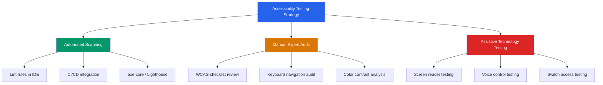
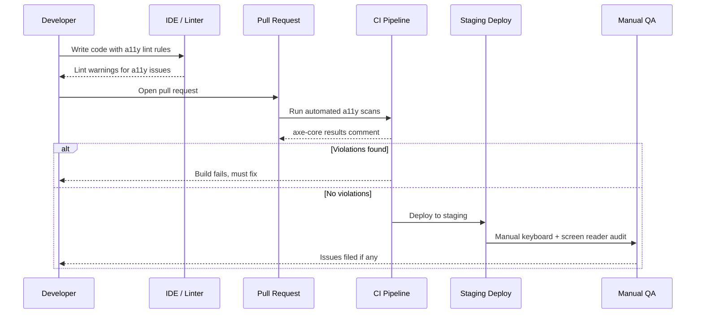

# Accessibility Testing in 2026: A Complete Guide to Building Inclusive Software

Accessibility is no longer a nice-to-have — it is a legal requirement in many jurisdictions, a moral imperative, and a business differentiator. With the European Accessibility Act (EAA) now fully enforced and WCAG 2.2 establishing the latest compliance standard, testers who can validate accessible interfaces are in higher demand than ever. Yet accessibility remains one of the most under-tested quality dimensions in modern software teams.

This guide covers everything you need to know to implement accessibility testing in your organization: the standards, the tools, the automation strategies, the manual audit techniques, and how to integrate it all into your CI/CD pipeline.

## Table of Contents

- [Why Accessibility Testing Matters](#why-accessibility-testing-matters)
- [Understanding WCAG 2.2](#understanding-wcag-22)
- [The Three Pillars of Accessibility Testing](#the-three-pillars-of-accessibility-testing)
- [Automated Accessibility Testing Tools](#automated-accessibility-testing-tools)
- [Manual Accessibility Auditing](#manual-accessibility-auditing)
- [Keyboard Navigation and Screen Reader Testing](#keyboard-navigation-and-screen-reader-testing)
- [Integrating Accessibility into Your CI/CD Pipeline](#integrating-accessibility-into-your-cicd-pipeline)
- [Testing Accessibility in Component Libraries and Design Systems](#testing-accessibility-in-component-libraries-and-design-systems)
- [Common Accessibility Anti-Patterns](#common-accessibility-anti-patterns)
- [Real-World Example: Auditing a React Application](#real-world-example-auditing-a-react-application)
- [Key Takeaways](#key-takeaways)
- [Frequently Asked Questions](#frequently-asked-questions)
- [Related Articles](#related-articles)

## Why Accessibility Testing Matters

Over **1.3 billion people** worldwide — roughly 16% of the global population — live with some form of disability. These include visual, auditory, motor, and cognitive impairments. When software is not designed and tested with accessibility in mind, it effectively excludes a significant portion of potential users.

Beyond the human impact, the business case is compelling:

- **Legal compliance**: The Americans with Disabilities Act (ADA), the European Accessibility Act (EAA), the Accessibility for Ontarians with Disabilities Act (AODA), and similar legislation in dozens of countries impose enforceable requirements on digital products. Non-compliance can result in lawsuits and fines.
- **Market expansion**: Accessible products serve a broader audience, including aging populations and users with temporary or situational impairments.
- **SEO benefits**: Many accessibility practices — semantic HTML, alt text, proper heading structure — directly improve search engine rankings.
- **Brand reputation**: Organizations that demonstrate commitment to inclusion build trust and loyalty.

> **Key Insight**: Automated tools catch only 30-40% of accessibility issues. A mature testing strategy combines automation with manual audits, keyboard testing, and assistive technology validation.

## Understanding WCAG 2.2

The Web Content Accessibility Guidelines (WCAG) are the international standard for web accessibility. WCAG 2.2, published in October 2023, introduced nine new success criteria that address real-world gaps in the previous version.

### WCAG Principles (POUR)

WCAG is organized around four core principles, often remembered by the acronym **POUR**:

| Principle | Description | Example |
|-----------|-------------|---------|
| **Perceivable** | Information must be presentable in ways users can perceive | Alt text for images, captions for video |
| **Operable** | Interface components must be operable by all users | Keyboard navigation, no time traps |
| **Understandable** | Information and UI operation must be understandable | Clear labels, predictable behavior |
| **Robust** | Content must be interpreted reliably by assistive technologies | Valid HTML, ARIA attributes used correctly |

### Conformance Levels

Each success criterion is assigned a conformance level:

- **A** — Minimum level; the most basic accessibility requirements
- **AA** — The target for most organizations and legal requirements
- **AAA** — Highest level; aspirational for most sites but essential for government and critical services

### New in WCAG 2.2

WCAG 2.2 added several criteria particularly relevant to testers:

- **2.4.11 Focus Not Obscured (Minimum)** — Focused elements must not be entirely hidden by sticky content
- **2.4.13 Focus Appearance** — Focus indicators must have sufficient size and contrast
- **2.5.7 Dragging Movements** — Functionality achievable without dragging
- **2.5.8 Target Size (Minimum)** — Interactive targets must be at least 24x24 CSS pixels
- **3.2.6 Consistent Help** — Help mechanisms must appear in a consistent location
- **3.3.7 Redundant Entry** — Users should not need to re-enter previously provided information

## The Three Pillars of Accessibility Testing

A robust accessibility testing strategy rests on three complementary approaches:



No single pillar is sufficient on its own. Automated tools are fast and consistent but limited in scope. Manual audits catch nuanced issues but are time-consuming. Assistive technology testing reveals the actual user experience but requires specialized skills and tools.

## Automated Accessibility Testing Tools

### axe-core by Deque Systems

axe-core is the most widely adopted accessibility testing engine. It powers tools like axe DevTools, axe-linter, and integrations for Playwright, Cypress, Selenium, and Jest.

```javascript
// Example: Using axe-core with Playwright
import { test, expect } from '@playwright/test';
import AxeBuilder from '@axe-core/playwright';

test('homepage has no accessibility violations', async ({ page }) => {
  await page.goto('https://example.com');

  const accessibilityScanResults = await new AxeBuilder({ page })
    .withTags(['wcag2a', 'wcag2aa', 'wcag22aa'])
    .analyze();

  expect(accessibilityScanResults.violations).toEqual([]);
});
```

### Google Lighthouse

Lighthouse provides an accessibility score as part of its auditing suite. It is built into Chrome DevTools and can be run via the CLI:

```bash
lighthouse https://example.com --only-categories=accessibility --output=json --output-path=./report.json
```

### Pa11y

Pa11y is an open-source automated accessibility testing tool that can run against URLs or HTML files:

```bash
pa11y --standard WCAG2AA https://example.com
```

### jest-axe for Unit Tests

For component-level testing, jest-axe integrates with your existing Jest setup:

```javascript
import { render } from '@testing-library/react';
import { axe, toHaveNoViolations } from 'jest-axe';
import Button from './Button';

expect.extend(toHaveNoViolations);

test('Button component has no accessibility violations', async () => {
  const { container } = render(<Button>Click me</Button>);
  const results = await axe(container);
  expect(results).toHaveNoViolations();
});
```

### Tool Comparison

| Tool | Best For | Speed | Accuracy | Integrations |
|------|----------|-------|----------|--------------|
| axe-core | CI/CD pipelines, comprehensive scans | Fast | High | Playwright, Cypress, Selenium, Jest |
| Lighthouse | Quick audits, Chrome-based | Fast | Medium | Chrome DevTools, CLI, CI |
| Pa11y | CLI-based testing, CI pipelines | Fast | High | Jenkins, GitHub Actions |
| jest-axe | Unit-level component testing | Very Fast | Medium | Jest, Vitest |
| WAVE | Visual overlay analysis | Slow | High | Browser extension |

> **Important**: Never rely solely on automated tools. They excel at detecting missing alt text, low contrast ratios, and missing ARIA attributes — but they cannot determine if alt text is meaningful, if focus order is logical, or if content is understandable to screen reader users.

## Manual Accessibility Auditing

Manual testing is where skilled testers uncover the issues that automation misses. Here is a systematic checklist for manual audits:

### Semantic HTML Audit

- Verify heading hierarchy (h1 through h6) is logical and not skipped
- Check that landmarks (`<header>`, `<nav>`, `<main>`, `<footer>`, `<aside>`) are used correctly
- Ensure lists use `<ul>` or `<ol>` rather than styled `<div>` elements
- Verify tables include `<th>`, `<caption>`, and `scope` attributes where appropriate

### Content Audit

- All images have descriptive alt text (or `alt=""` for decorative images)
- Videos include captions and transcripts
- Error messages are specific and programmatically associated with form fields
- Language is declared in the HTML (`<html lang="en">`)

### Interaction Audit

- All interactive elements are reachable via keyboard
- Focus order follows a logical reading sequence
- Focus indicators are visible and have sufficient contrast
- No keyboard traps exist (users can tab away from any element)
- Custom widgets follow WAI-ARIA Authoring Practices

## Keyboard Navigation and Screen Reader Testing

Keyboard accessibility is the foundation of assistive technology support. If a user cannot operate your interface with a keyboard alone, no amount of ARIA markup will make it usable.

### Keyboard Testing Protocol

1. **Tab forward** through every interactive element on the page
2. **Shift+Tab** backward through the same elements
3. Use **Enter** and **Space** to activate buttons and links
4. Use **arrow keys** to navigate within composite widgets (tabs, menus, listboxes)
5. Use **Escape** to dismiss modals and popups
6. Verify that focus is never lost or trapped

### Screen Reader Testing Matrix

At minimum, test with one screen reader on each major platform:

| Platform | Screen Reader | Browser |
|----------|--------------|---------|
| Windows | NVDA | Chrome, Firefox |
| Windows | JAWS | Chrome, Edge |
| macOS | VoiceOver | Safari |
| iOS | VoiceOver | Safari |
| Android | TalkBack | Chrome |

Screen reader testing is the most effective way to understand the experience of blind and low-vision users. Common issues include:

- Elements that are visually present but hidden from the accessibility tree
- Custom widgets that lack proper ARIA roles and states
- Dynamic content changes that are not announced
- Focus management failures after route changes or modal openings

## Integrating Accessibility into Your CI/CD Pipeline

Accessibility testing should not be an afterthought or a quarterly audit. It must be integrated into your development workflow just like any other quality gate.



### GitHub Actions Example

```yaml
name: Accessibility Tests
on: [pull_request, push]

jobs:
  a11y:
    runs-on: ubuntu-latest
    steps:
      - uses: actions/checkout@v4
      - uses: actions/setup-node@v4
        with:
          node-version: 20
      - run: npm ci
      - run: npm run build
      - name: Start server
        run: npm run preview &
      - name: Run accessibility tests
        run: |
          npx pa11y-ci --config .pa11yci.json
      - name: Run Playwright accessibility tests
        run: npx playwright test --grep "a11y"
```

### The 80/20 Rule of Automated Accessibility

A realistic expectation for automated scanning is that it will catch approximately **30-40% of WCAG violations** in a typical web application. The remaining issues require human judgment. This is why a layered approach is essential:

1. **IDE linting** — Catch issues as you write code (pre-commit)
2. **Unit tests with jest-axe** — Validate individual components
3. **End-to-end scans with axe-core** — Catch integration-level issues
4. **Lighthouse audits** — Get a quick accessibility score
5. **Manual audits** — Catch everything else

## Testing Accessibility in Component Libraries and Design Systems

If you build or consume a component library, accessibility testing at this level provides the highest return on investment. Fixing an accessibility issue in a shared component fixes it everywhere that component is used.

### Strategies

- **Storybook + a11y addon**: The `@storybook/addon-a11y` addon adds an accessibility panel to Storybook, providing real-time feedback as you develop components
- **Automated regression tests**: Run axe-core against every component's rendered output in your test suite
- **Documentation requirements**: Include accessibility guidance in your component documentation — expected keyboard behavior, ARIA roles, and screen reader announcements
- **Design review**: Include accessibility criteria in your design token system (color contrast ratios, minimum touch target sizes, focus ring specifications)

## Common Accessibility Anti-Patterns

Here are some of the most frequent accessibility failures that testers encounter, along with their correct implementations:

### Missing Form Labels

**Bad:**
```html
<input type="email" placeholder="Enter your email">
```

**Good:**
```html
<label for="email">Email address</label>
<input type="email" id="email" placeholder="Enter your email">
```

### Inaccessible Custom Dropdowns

Many JavaScript dropdown components do not implement the expected keyboard interactions. Users expect to navigate options with arrow keys and dismiss with Escape. The WAI-ARIA Authoring Practices Guide provides the correct pattern for a listbox.

### Empty Links and Buttons

```html
<!-- Bad: Screen reader announces "link" with no context -->
<a href="/dashboard"><svg>...</svg></a>

<!-- Good: Screen reader announces "Go to dashboard" -->
<a href="/dashboard" aria-label="Go to dashboard"><svg aria-hidden="true">...</svg></a>
```

### Auto-playing Content

Media that plays automatically can be disorienting for screen reader users and distracting for users with cognitive disabilities. Ensure all auto-playing media can be paused, stopped, or muted within the first three seconds.

### Low Contrast Text

The minimum contrast ratio for normal text under WCAG 2.2 AA is **4.5:1**. For large text (18pt or 14pt bold), the minimum is **3:1**. Use tools like the [WebAIM Contrast Checker](https://webaim.org/resources/contrastchecker/) to verify your color combinations.

## Real-World Example: Auditing a React Application

Let's walk through a realistic accessibility audit of a typical React application — an e-commerce product page.

### Step 1: Automated Baseline Scan

Run axe-core against the page and identify quick wins:

```javascript
// playwright-a11y.spec.ts
import { test } from '@playwright/test';
import AxeBuilder from '@axe-core/playwright';

test('product page - accessibility baseline', async ({ page }) => {
  await page.goto('https://shop.example.com/product/123');

  const results = await new AxeBuilder({ page })
    .withTags(['wcag2a', 'wcag2aa', 'wcag22aa', 'best-practice'])
    .analyze();

  console.log(`Found ${results.violations.length} violations`);
  results.violations.forEach(v => {
    console.log(`[${v.impact}] ${v.id}: ${v.description}`);
    v.nodes.forEach(n => console.log(`  Element: ${n.html}`));
  });
});
```

### Step 2: Common Findings

A typical e-commerce page audit reveals patterns like:

- Product images missing alt text or with generic text like "image"
- Color-only sale indicators (e.g., red price for discounted items) without text alternatives
- Add-to-cart button implemented as a `<div>` instead of a `<button>`
- Filter dropdowns that are not keyboard accessible
- Price changes after selecting options not announced to screen readers

### Step 3: Remediation Prioritization

Not all violations are equal. Prioritize based on impact:

| Priority | Issue | Impact | Effort |
|----------|-------|--------|--------|
| P0 | Add-to-cart not a button | High | Low |
| P0 | Missing product image alt text | High | Low |
| P1 | Filter dropdowns not keyboard accessible | High | Medium |
| P1 | Price changes not announced | Medium | Medium |
| P2 | Color-only sale indicators | Medium | Low |
| P2 | Heading hierarchy issues | Low | Low |

### Step 4: Verification

After remediation, re-run the automated tests and perform manual keyboard and screen reader validation to confirm the fixes work in practice.

## Key Takeaways

- **Accessibility is a testing discipline**, not just a design consideration — it requires dedicated tools, processes, and expertise.
- **Automated tools catch 30-40%** of accessibility issues; always pair automation with manual audits and assistive technology testing.
- **WCAG 2.2 AA** is the current compliance target for most organizations; familiarize yourself with the nine new success criteria.
- **Test at the component level** for the highest return on investment — shared components multiply the impact of fixes.
- **Integrate accessibility into CI/CD** as a quality gate, not an afterthought.
- **Screen reader testing** is the gold standard for understanding the actual user experience of blind and low-vision users.

## Frequently Asked Questions

### What is the difference between accessibility testing and usability testing?

Accessibility testing specifically validates that people with disabilities can perceive, understand, navigate, and interact with your software. Usability testing evaluates how easy and efficient the software is for all users. They overlap — inaccessible software is generally unusable for some populations — but accessibility testing focuses on compliance with standards like WCAG and compatibility with assistive technologies.

### How much of accessibility can be automated?

Industry consensus suggests that automated testing catches roughly 30-40% of WCAG violations. It is excellent at detecting missing alt text, insufficient color contrast, missing form labels, and invalid ARIA attributes. It cannot evaluate whether alt text is meaningful, whether focus order is logical, whether content is understandable, or whether custom widgets behave correctly with assistive technologies.

### Do I need to test with every screen reader?

No. It is practical to test with one major screen reader per platform: NVDA on Windows, VoiceOver on macOS/iOS, and TalkBack on Android. If your user data indicates significant usage of a specific combination (e.g., JAWS with Chrome), prioritize that. Consistency testing across screen readers is valuable for critical workflows.

### What is the European Accessibility Act and does it affect my software?

The European Accessibility Act (EAA) requires a wide range of products and services — including e-commerce, banking, telecommunications, and e-books — to meet accessibility standards. It came into full enforcement on June 28, 2025. If your software serves users in the EU, you likely need to comply with EN 301 549, which references WCAG 2.1 AA.

### How do I convince my team to invest in accessibility testing?

Start with the legal risk — accessibility lawsuits have increased dramatically in recent years. Then highlight the market opportunity (1.3 billion potential users), the SEO benefits, and the engineering quality improvements. A practical approach is to introduce automated accessibility testing in CI/CD with warnings (not failures) first, then gradually tighten the thresholds as the team builds familiarity.

## Related Articles

- Playwright UI Features: Automating Tests Faster, Smarter, and Easier
- Test-Driven Development (TDD) Explained: The Complete Guide with Real-World Examples
- Performance Testing Masterclass — Load, Stress, and Scalability with k6
- 4 AI Tools Every Manual and Automation Tester Should Learn in 2026
