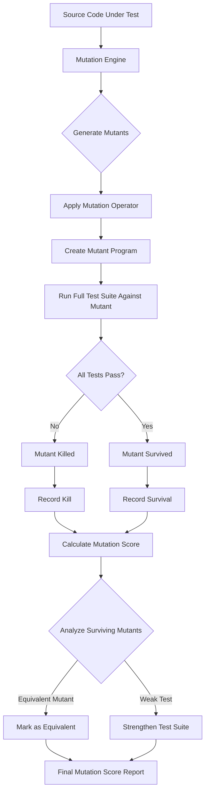
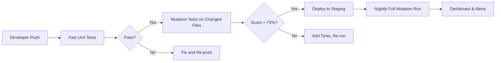

# Mutation Testing Explained: How Breaking Your Code Proves Your Tests Actually Work

Every team believes its tests are solid — until a bug slips into production and the coverage report proudly shows 90% green. Code coverage tells you *where* your tests run, but it says nothing about whether those tests actually *verify* anything meaningful. You can execute every line of code with a test that asserts nothing useful and still call it "covered."

Mutation testing closes that gap. By deliberately injecting small faults into your source code and running your test suite against each mutated version, you get a concrete, quantifiable measure of your tests' ability to detect real bugs. If your tests still pass after a mutant is introduced, those tests are too weak.

## Table of Contents

- [Why Code Coverage Is Not Enough](#why-code-coverage-is-not-enough)
- [What Is Mutation Testing?](#what-is-mutation-testing)
- [The Mutation Testing Workflow](#the-mutation-testing-workflow)
- [Mutant Types and Operators](#mutant-types-and-operators)
- [Interpreting the Mutation Score](#interpreting-the-mutation-score)
- [Mutation Testing in Practice with Stryker](#mutation-testing-in-practice-with-stryker)
- [Real-World Example: Testing a Discount Calculator](#real-world-example-testing-a-discount-calculator)
- [Common Challenges and How to Overcome Them](#common-challenges-and-how-to-overcome-them)
- [Mutation Testing vs. Other Test Quality Metrics](#mutation-testing-vs-other-test-quality-metrics)
- [When to Use Mutation Testing in Your Pipeline](#when-to-use-mutation-testing-in-your-pipeline)
- [Key Takeaways](#key-takeaways)
- [Frequently Asked Questions](#frequently-asked-questions)
- [Related Articles](#related-articles)

## Why Code Coverage Is Not Enough

Consider a function that calculates a shipping cost:

```python
def shipping_cost(weight: float, express: bool) -> float:
    base = weight * 2.5
    if express:
        base *= 1.5
    return base
```

A developer writes the following test:

```python
def test_shipping_cost():
    assert shipping_cost(10, False) == 25.0
```

This test executes every line — the `base` assignment, the `if` branch, and the `return`. Coverage tools report 100%. Yet the test never checks the express path. A bug could hide in that branch indefinitely.

This is the **coverage paradox**: high line coverage does not guarantee high test effectiveness. Studies from academic research have repeatedly shown that line and branch coverage are weak predictors of fault detection. Mutation testing was designed to address exactly this problem.

> **Important:** Code coverage measures *execution*. Mutation testing measures *assertion quality*. The two are fundamentally different dimensions of test suite health.

## What Is Mutation Testing?

Mutation testing, first proposed by Richard Lipton in 1971 and later popularized by the Mothra tool in the 1990s, works on a deceptively simple principle:

1. Take your source code.
2. Apply a small syntactic change (a **mutation**) to create a slightly modified version called a **mutant**.
3. Run your existing test suite against the mutant.
4. If any test fails, the mutant is **killed** — your tests caught the change.
5. If all tests pass, the mutant **survived** — your tests failed to detect the fault.

Each mutation represents a hypothetical real-world bug. A mutant that survives reveals a gap in your test suite: a change to the code that your tests cannot distinguish from the original.

The ratio of killed mutants to total mutants is called the **mutation score**, and it is the single most statistically validated metric for test suite quality.

## The Mutation Testing Workflow

The process follows a well-defined pipeline:



Every step is automated. You do not manually create mutants — the tooling generates thousands of them from your codebase.

## Mutant Types and Operators

Mutation operators define *how* the source code is modified. Different languages and tools support different operator sets, but most include these common categories:

| Operator Category | Description | Example Mutation |
|---|---|---|
| **Arithmetic** | Change arithmetic operators | `+` → `-`, `*` → `/` |
| **Relational** | Flip comparison operators | `>` → `>=`, `==` → `!=` |
| **Conditional** | Negate or remove conditions | `if (x > 5)` → `if (x <= 5)` |
| **Statement** | Delete or comment out a statement | Remove an entire `return` |
| **Boolean** | Flip boolean literals | `true` → `false` |
| **Return Value** | Replace return values | `return a + b` → `return 0` |
| **Method Call** | Remove a method call | Delete `validate()` |

A single function can produce dozens or hundreds of mutants depending on its complexity. Most tools let you configure which operators are active to control execution time.

## Interpreting the Mutation Score

The mutation score is expressed as a percentage:

```
Mutation Score = (Killed Mutants / (Total Mutants - Equivalent Mutants)) × 100%
```

### Score Benchmarks

- **90-100%**: Excellent. Your test suite detects nearly every meaningful code change.
- **70-89%**: Good. Some gaps exist but most critical paths are well-tested.
- **50-69%**: Moderate. Significant portions of code have weak assertions.
- **Below 50%**: Weak. Many mutations survive, meaning your tests rarely verify behavior.

### Equivalent Mutants

Some mutations produce code that is functionally identical to the original. For example, mutating `x + 0` to `x - 0` in a language where both evaluate identically. These are called **equivalent mutants** and cannot be killed by any test. Most tools allow you to manually mark them as equivalent so they do not penalize your score.

> **Caution:** Do not chase a 100% mutation score blindly. Equivalent mutants and performance-sensitive code paths may justify lower scores in specific modules. Focus on meaningful survival patterns rather than an absolute number.

## Mutation Testing in Practice with Stryker

[Stryker](https://stryker-mutator.io/) is the leading open-source mutation testing framework for JavaScript and TypeScript. It supports JavaScript, TypeScript, C#, and Scala, and integrates cleanly into modern CI/CD pipelines.

### Installation and Configuration

```bash
# Install Stryker globally
npm install -g @stryker-mutator/core

# Initialize in your project
npx stryker init
```

The init command creates a `stryker.config.json` file:

```json
{
  "$schema": "https://raw.githubusercontent.com/stryker-mutator/stryker/master/packages/core/schema/stryker-core.schema.json",
  "packageManager": "npm",
  "reporters": ["html", "clear-text", "progress"],
  "testRunner": "vitest",
  "coverageAnalysis": "perTest",
  "mutate": ["src/**/*.ts", "!src/**/*.test.ts", "!src/**/*.spec.ts"],
  "thresholds": {
    "high": 80,
    "low": 60,
    "break": 50
  }
}
```

### Running Mutation Tests

```bash
npx stryker run
```

Stryker will:
1. Copy your source files into a sandbox.
2. Generate mutants using all enabled operators.
3. Run your test suite against each mutant in parallel.
4. Generate an HTML report showing every mutant's status.

### Reading the Report

The HTML report provides:

- **Dashboard view**: Overall mutation score with thresholds.
- **Mutant grid**: Each mutant listed with its status (killed, survived, no coverage, or equivalent).
- **Diff view**: Side-by-side comparison of the original code vs. the mutated code for each surviving mutant.

## Real-World Example: Testing a Discount Calculator

Consider this code:

```python
def calculate_discount(price: float, quantity: int, is_member: bool) -> float:
    discount = 0.0
    if quantity >= 10:
        discount += 0.1
    if is_member:
        discount += 0.05
    final_price = price * quantity * (1 - discount)
    return round(final_price, 2)
```

A weak test suite:

```python
def test_calculate_discount_basic():
    result = calculate_discount(100.0, 5, False)
    assert result == 500.0
```

Running mutation testing reveals several surviving mutants:

```python
# Mutant 1: quantity >= 10 changed to quantity > 10
# Still passes because quantity=5 doesn't trigger the branch either way.

# Mutant 2: discount += 0.05 changed to discount -= 0.05
# Survives because is_member is never tested as True.

# Mutant 3: (1 - discount) changed to (1 + discount)
# Survives because the quantity=5 path was never validated
# with expected output for a discount scenario.
```

After identifying these gaps, the improved test suite becomes:

```python
def test_calculate_discount_no_discounts():
    assert calculate_discount(100.0, 5, False) == 500.0

def test_calculate_discount_bulk_only():
    assert calculate_discount(100.0, 10, False) == 900.0

def test_calculate_discount_member_only():
    assert calculate_discount(100.0, 5, True) == 475.0

def test_calculate_discount_both():
    assert calculate_discount(100.0, 10, True) == 850.0

def test_calculate_discount_rounding():
    assert calculate_discount(99.99, 3, True) == 284.97
```

Now every mutant is killed because the tests assert specific outcomes across all branches and combinations.

## Common Challenges and How to Overcome Them

### 1. Execution Time

Mutation testing is inherently slow because it runs your test suite hundreds or thousands of times. Mitigation strategies include:

- **Selective mutation**: Enable only high-value operators (e.g., relational and conditional) rather than all operators.
- **Parallel execution**: Use Stryker's built-in `--concurrency` flag to run mutants in parallel.
- **Incremental testing**: Only mutate files changed in the current branch using `--incremental`.

```bash
# Run with 4 parallel workers
npx stryker run --concurrency 4

# Run only on changed files in a Git branch
npx stryker run --incremental --incremental.file stryker-baseline.json
```

### 2. Equivalent Mutants

Equivalent mutants are the most tedious challenge. There is no fully automated solution, but tools use heuristics to flag likely equivalents:

- **Compiler-based equivalence checking**: Some tools compile both versions and compare assembly output.
- **Developer annotation**: Mark mutants as equivalent in the baseline file.
- **Static analysis patterns**: Recognize common equivalent patterns like mutating constants in unreachable branches.

### 3. Large Mutant Counts

Large codebases can produce tens of thousands of mutants. Prioritize by:

- Focusing on business-critical modules first.
- Excluding auto-generated code.
- Setting thresholds that trigger pipeline failure only for critical paths.

## Mutation Testing vs. Other Test Quality Metrics

| Metric | What It Measures | Limitations |
|---|---|---|
| **Line Coverage** | Percentage of lines executed | Executes lines but does not verify assertions |
| **Branch Coverage** | Percentage of branches taken | Same execution-only limitation |
| **Mutation Score** | Ability to detect injected faults | Computationally expensive |
| **Property-Based Testing** | Invariant satisfaction across inputs | Requires writing property definitions |
| **Code Review** | Human judgment of test quality | Inconsistent, does not scale |

Mutation testing is complementary to coverage. Use coverage as a fast first pass, then mutation testing as the deep validation layer.

## When to Use Mutation Testing in Your Pipeline

Mutation testing is most effective at specific integration points:

1. **Pull request checks**: Run mutation tests only on changed files to validate that new code has strong tests.
2. **Nightly builds**: Full mutation suite against the entire codebase to track regression in test quality over time.
3. **Pre-release gates**: Block releases if the mutation score drops below a defined threshold.
4. **Refactoring safety**: Ensure refactored code maintains equivalent test strength.



Running mutation tests on every push against the entire codebase is impractical for large projects. The incremental approach — full runs nightly, selective runs per PR — gives you the best balance of speed and coverage.

> **Key Insight:** Mutation testing should be treated as a CI quality gate, not a one-time audit. Teams that adopt it as a continuous practice see steady improvement in both mutation scores and overall test design.

## Key Takeaways

- **Code coverage measures execution, not quality.** A test can hit every line without verifying anything meaningful.
- **Mutation testing injects realistic faults** to measure whether your test suite can actually detect them.
- **The mutation score** — the percentage of mutants killed — is the most statistically validated metric for test effectiveness.
- **Equivalent mutants** exist and should be marked rather than forcing artificial test additions.
- **Integrate incrementally.** Run mutation tests on changed files in PRs and full suites nightly for the best cost-performance ratio.
- **Focus on surviving mutants**, not just the score number. Each surviving mutant is a specific, actionable improvement for your test suite.

## Frequently Asked Questions

### Is mutation testing the same as fuzz testing?

No. Fuzz testing feeds random or malformed inputs to a program to find crashes and security vulnerabilities. Mutation testing modifies the source code itself and then runs your existing tests to check if those tests can detect the changes. They address different quality dimensions.

### Which programming languages support mutation testing?

Mutation testing frameworks exist for most mainstream languages. Popular options include Stryker (JavaScript/TypeScript/C#/Scala), Pitest (Java/Kotlin), mutmut (Python), Cargo-mutants (Rust), and cosmic-ray (Python). The underlying principles are language-agnostic.

### How much slower is mutation testing compared to normal test suites?

Mutation testing typically runs 10-100x slower than a normal test suite because it executes your tests against every generated mutant. For a project with 1,000 tests and 500 mutants, the tool runs approximately 500,000 test executions. Parallel execution and selective mutation reduce this significantly.

### Can mutation testing replace code coverage entirely?

It can, but it should not. Coverage is fast and useful as a baseline gate. Mutation testing is thorough but slow. The best practice is to use both: coverage as a quick check, mutation testing as the deeper validation.

### What is a good mutation score to aim for?

There is no universal threshold. Research suggests that mutation scores above 75-80% correspond to test suites that detect most real-world faults. However, the absolute score matters less than the trend over time and the patterns of surviving mutants.

## Related Articles

- [Test-Driven Development (TDD) Explained: The Complete Guide with Real-World Examples](/tdd-explained-complete-guide)
- [Chaos Engineering and Resilience Testing: A Practical Guide](/chaos-engineering-resilience-testing)
- [Performance Testing Masterclass — Load, Stress, and Scalability with k6](/performance-testing-masterclass-load-stress-k6)
- [Contract Testing Explained: Consumer-Driven Contracts for Microservices](/contract-testing-consumer-driven-contracts)
- [4 AI Tools Every Manual and Automation Tester Should Learn in 2026](/ai-tools-manual-automation-tester-2026)
