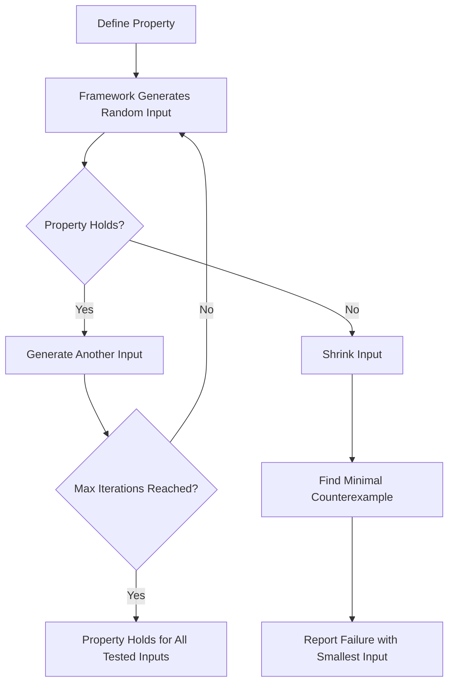

# Property-Based Testing Explained: Finding Bugs Your Example-Based Tests Will Never Catch

Every QA engineer knows the sinking feeling of a bug report that reads: *"Works fine with normal inputs, but crashes when the user enters an empty string, a negative number, or a string longer than 10,000 characters."* Your carefully hand-crafted unit tests passed. Your integration tests passed. Yet production found the flaw.

The root cause is simple: example-based testing only checks the cases you thought of. Property-based testing (PBT) flips the script entirely. Instead of writing specific inputs and expected outputs, you describe **properties** — invariants that should hold true for *every possible input* — and a framework generates hundreds or thousands of random inputs to prove you wrong.

This approach, pioneered by QuickCheck in Haskell over 25 years ago, has experienced a renaissance in 2026 thanks to mature libraries in JavaScript, Python, Rust, and Java. If you are not using property-based testing yet, you are leaving an entire class of bugs on the table.

## Table of Contents

- [What Is Property-Based Testing?](#what-is-property-based-testing)
- [Example-Based vs. Property-Based: A Side-by-Side Comparison](#example-based-vs-property-based-a-side-by-side-comparison)
- [Core Concepts You Need to Know](#core-concepts-you-need-to-know)
- [How Property-Based Testing Works Under the Hood](#how-property-based-testing-works-under-the-hood)
- [Popular Frameworks and Libraries](#popular-frameworks-and-libraries)
- [Practical Examples in Python and JavaScript](#practical-examples-in-python-and-javascript)
- [Real-World Use Cases](#real-world-use-cases)
- [Common Pitfalls and How to Avoid Them](#common-pitfalls-and-how-to-avoid-them)
- [Property-Based Testing in CI/CD Pipelines](#property-based-testing-in-cicd-pipelines)
- [When NOT to Use Property-Based Testing](#when-not-to-use-property-based-testing)
- [Key Takeaways](#key-takeaways)
- [Frequently Asked Questions](#frequently-asked-questions)

## What Is Property-Based Testing?

Property-based testing is a testing methodology where you define **properties** (universal rules or invariants) that your code must satisfy, and a framework automatically generates a large number of random inputs to verify that those properties hold for all of them.

A property is not a single assertion about a specific input. It is a statement like:

> "For every list I sort, the result must contain the same elements as the input, in non-decreasing order."

```python
from hypothesis import given, strategies as st

@given(st.lists(st.integers()))
def test_sort_returns_same_elements_in_order(lst):
    result = sorted(lst)
    assert result == sorted(lst)
    assert all(result[i] <= result[i + 1] for i in range(len(result) - 1))
```

The framework generates 100 random lists of random integers and checks the property every time. If any input violates the property, the framework **shrinks** the input down to the smallest possible counterexample and reports it.

> **Important:** Property-based testing does not replace example-based testing. They are complementary. Use PBT to explore the input space broadly, and use example-based tests to pin down specific known edge cases and regression scenarios.

## Example-Based vs. Property-Based: A Side-by-Side Comparison

| Aspect | Example-Based Testing | Property-Based Testing |
|---|---|---|
| **What you define** | Specific input-output pairs | Universal invariants |
| **Input selection** | Manual, deterministic | Automatic, random |
| **Edge case discovery** | Depends on developer intuition | Systematic via generation |
| **Readability** | Easy to understand | Requires thinking abstractly |
| **Best for** | Known regressions, business rules | Boundary conditions, data transformations |
| **Failure output** | "Expected X, got Y" | Smallest counterexample + shrinking |

Consider a function that reverses a string. An example-based test might check `reverse("hello") == "olleh"`. A property-based test asserts that **for any string**, `reverse(reverse(s)) == s` — and it will test hundreds of strings you never considered, including the empty string, unicode characters, and strings with surrogate pairs.

## Core Concepts You Need to Know

### Properties

A property is a predicate function that returns `True` for valid behavior and `False` (or raises an exception) for invalid behavior. Common property patterns include:

- **Round-trip properties:** `decode(encode(x)) == x`
- **Idempotency:** `sort(sort(x)) == sort(x)`
- **Algebraic properties:** `reverse(a + b) == reverse(b) + reverse(a)` for list concatenation
- **Post-condition properties:** "The output must always be between 0 and 100"
- **Model-based properties:** Comparing a new implementation against a reference implementation

### Generators and Shrinking

Generators (called "strategies" in Hypothesis) produce random values of a given type. Most frameworks provide built-in generators for primitives and composition tools for building complex ones.

Shrinking is the process of taking a failing input and iteratively reducing it to the **minimal counterexample** — the smallest, simplest input that still triggers the failure. This is what makes PBT debuggable; you get a concrete, reproducible example rather than a random blob.



### Test Data Strategies

Most frameworks offer composable strategies for building test data:

- **Primitives:** `integers()`, `floats()`, `text()`, `booleans()`
- **Collections:** `lists()`, `tuples()`, `dictionaries()`
- **Composites:** `fixed_dictionaries()`, `recursive()`, `from_type()`
- **Filtered:** `.filter(lambda x: x > 0)` for constrained values
- **Mapped:** `.map(lambda x: x * 2)` for transformations

## How Property-Based Testing Works Under the Hood

Under the covers, most PBT frameworks follow a consistent cycle:

1. **Generation:** A strategy produces a random input value.
2. **Execution:** The test function runs with that input.
3. **Evaluation:** If the property returns `True` (or does not raise), the input passes.
4. **Shrinking:** If the property fails, the framework tries to find a smaller input that also fails.
5. **Reporting:** The minimal counterexample is printed with a seed for reproducibility.

Modern frameworks use **example databases** to cache interesting test cases. Once a failing input is found and fixed, the example is stored so it is always re-tested in future runs. This gives you the broad exploration of randomness with the deterministic safety of known edge cases.

### Seed-Based Reproducibility

A common misconception is that property-based tests are non-deterministic. They are not. Every framework uses a **seed** to initialize its random number generator. If a test fails, the same seed produces the same sequence of inputs. Most frameworks print the seed or the minimal failing example so you can reproduce the failure exactly.

```python
# Hypothesis stores failing examples in its database
# Running the test again will automatically re-test known failures
@given(st.text(min_size=1))
def test_parse_never_crashes(text):
    parse(text)  # Should never raise
```

## Popular Frameworks and Libraries

| Language | Library | Key Feature |
|---|---|---|
| Python | [Hypothesis](https://hypothesis.readthedocs.io/) | Mature, excellent shrinking, database caching |
| JavaScript | [fast-check](https://github.com/dubzzz/fast-check) | TypeScript support, property-based + unit testing |
| Java | [JUnit-Quickcheck](https://github.com/pholser/junit-quickcheck) | Integrates with JUnit 5 |
| Rust | [proptest](https://docs.rs/proptest) | Composable strategies, automatic shrinking |
| Go | [rapid](https://github.com/flyingmutant/rapid) | Simple API, good shrinking |
| Elixir | [StreamData](https://github.com/whatyouhide/stream_data) | Built-in, generator-based |
| Kotlin | [Kotest](https://kotest.io/) | Property testing built into test framework |

## Practical Examples in Python and JavaScript

### Python with Hypothesis

```python
from hypothesis import given, strategies as st, assume, settings

# Property: palindrome reversal should return the same string
@given(st.text())
def test_palindrome_reverse_roundtrip(s):
    reversed_s = s[::-1]
    assert reversed_s[::-1] == s

# Property: encode/decode round-trip for a custom serializer
@given(st.dictionaries(st.text(min_size=1), st.integers()))
def test_json_roundtrip(data):
    import json
    encoded = json.dumps(data)
    decoded = json.loads(encoded)
    assert decoded == data

# Property: filtering and sorting
@given(st.lists(st.integers()), st.integers())
def test_filter_preserves_sorted_order(lst, threshold):
    filtered = [x for x in lst if x > threshold]
    sorted_result = sorted(filtered)
    assert sorted_result == sorted(filtered)
    # Every element should be greater than the threshold
    assert all(x > threshold for x in sorted_result)
```

### JavaScript with fast-check

```javascript
import * as fc from 'fast-check';

// Property: reversing an array twice gives the original
fc.assert(
  fc.property(
    fc.array(fc.integer()),
    (arr) => {
      const reversed = [...arr].reverse();
      const doubleReversed = [...reversed].reverse();
      return JSON.stringify(doubleReversed) === JSON.stringify(arr);
    }
  )
);

// Property: string length is always non-negative after trim
fc.assert(
  fc.property(
    fc.fullUnicodeString(),
    (s) => s.trim().length >= 0
  )
);

// Property: sorting idempotency
fc.assert(
  fc.property(
    fc.array(fc.integer()),
    (arr) => {
      const once = [...arr].sort((a, b) => a - b);
      const twice = [...once].sort((a, b) => a - b);
      return JSON.stringify(once) === JSON.stringify(twice);
    }
  )
);
```

## Real-World Use Cases

### 1. API Input Validation

Property-based testing excels at finding boundary violations in API handlers. Define the property *"any request that passes validation must not return a 500 error"* and let the framework generate thousands of request payloads, including malformed JSON, missing fields, extreme numeric values, and unexpected Unicode.

### 2. Data Transformation Pipelines

When building ETL pipelines or data mappers, use round-trip properties to verify that transformations are lossless. For example, in a serialization library:

```python
@given(st.binary())
def test_protobuf_roundtrip(data):
    message = MyProto()
    message.ParseFromString(data)
    serialized = message.SerializeToString()
    # Property: valid protobuf messages survive round-trip
    assert serialized == data or len(serialized) > 0
```

### 3. Cryptographic and Encoding Functions

Encoding functions (Base64, URL encoding, hex) are natural candidates for PBT. The property `decode(encode(s)) == s` will catch bugs in character set handling, padding logic, and unicode normalization that example-based tests miss.

### 4. Database Query Builders

If you build SQL queries programmatically, use PBT to verify that generated queries are syntactically valid and return results matching a reference implementation (like an ORM).

> **Caution:** When testing properties that depend on external systems (databases, APIs), use mocks or in-memory implementations. Property-based tests should be fast — testing 1,000 inputs against a real database will be painfully slow and may create flaky tests due to network issues.

## Common Pitfalls and How to Avoid Them

### Overly Broad Properties

Defining a property too loosely generates noise. For example, *"the function should not crash"* is a property, but it does not verify correctness. Combine with **post-conditions** that assert on output quality.

### Slow Tests

Property-based tests run hundreds of iterations by default. If your property involves expensive computation, use `@settings(max_examples=50)` to reduce iterations during development, and run the full suite in CI.

### Non-Deterministic Properties

If your property depends on randomness (e.g., testing a dice roller), pin the random seed or use the framework's `@seed` decorator to ensure reproducibility.

### Ignoring Shrinking

When a property fails, always look at the **shrunk** counterexample. It is the most informative part of the failure report. If shrinking produces something unexpected, your property may be too broad.

### Not Using Assume for Pre-conditions

Use `assume()` (Hypothesis) or `fc.pre()` (fast-check) to filter out invalid inputs during generation. For example, when testing division, assume the denominator is not zero. Without this, the framework will waste most iterations on inputs you do not care about.

```python
@given(st.integers(), st.integers())
def test_division(a, b):
    assume(b != 0)  # Skip zero denominators
    result = a / b
    assert isinstance(result, float)
```

## Property-Based Testing in CI/CD Pipelines

Integrating PBT into your pipeline is straightforward:

```yaml
# Example GitHub Actions step
- name: Run property-based tests
  run: |
    # Hypothesis caches examples in .hypothesis/
    pytest tests/properties/ -v --hypothesis-seed=0
  env:
    HYPOTHESIS_DATABASE: .hypothesis/examples
```

**Best practices for CI:**

1. **Commit the example database.** The `.hypothesis/` directory (or equivalent) stores previously found counterexamples. Commit it so CI always re-tests known edge cases.
2. **Use a fixed seed for reproducibility.** Set `HYPOTHESIS_SEED=0` (or similar) in CI to get deterministic results across runs.
3. **Separate PBT from unit tests.** Run property-based tests in a dedicated job with a longer timeout, since they are CPU-bound.
4. **Set budget limits.** Use timeout settings to prevent runaway test suites from blocking your pipeline.

## When NOT to Use Property-Based Testing

PBT is powerful but not universal. Avoid it when:

- **The property itself is trivial.** If the only property you can define is "it does not crash," you are better off with fuzzing or example-based boundary tests.
- **The codebase is callback-heavy.** Properties work best with pure functions. Side-effectful code requires careful setup to isolate.
- **Generation is extremely complex.** If generating valid inputs requires reproducing most of your production logic, you are writing two implementations instead of one.
- **The domain is highly constrained.** If only 3 specific inputs are valid (like an enum with 3 values), just test all three explicitly.

## Key Takeaways

- **Property-based testing describes invariants**, not specific inputs, and lets a framework generate hundreds of random test cases automatically.
- **Shrinking is what makes PBT debuggable** — it reduces failures to the smallest possible counterexample.
- **Round-trip properties** (`encode(decode(x)) == x`) are the easiest entry point and catch a surprising number of real bugs.
- **Commit your test database** to version control so CI re-tests known edge cases on every run.
- **PBT complements, never replaces**, example-based testing — use both for maximum coverage.
- **Start with one property** on a pure function. You do not need to convert your entire test suite at once.

## Frequently Asked Questions

### How is property-based testing different from fuzzing?

Fuzzing provides random or mutated inputs and typically checks for crashes, hangs, or memory errors. Property-based testing lets you define **what correct behavior looks like** and verifies it systematically. Fuzzing asks "does it break?" while PBT asks "does it satisfy this specific contract?" Many teams use both: fuzzing for security-sensitive parsers and PBT for business logic.

### Do I need to rewrite all my existing tests?

No. Start by adding property-based tests for **new features** or **bug-prone areas**. Over time, you can supplement existing example-based tests with properties where they add value. Most teams maintain both styles side by side.

### How many generated examples should I use?

The default in Hypothesis is 100, and in fast-check it is 100 as well. For CI, this is usually sufficient. For security-critical code, increase to 1,000 or more. You can configure this per-test or globally.

### Can property-based testing work with databases or external services?

Technically yes, but it is slow and fragile. Use in-memory mocks or sandboxed test databases. If you must test against a real database, wrap properties in transactions and limit examples to 10–20.

### What makes a good property?

A good property is (1) **always true** for correct code, (2) **falsifiable** for incorrect code, and (3) **composable** from simple building blocks. Start with these patterns: round-trip, idempotency, algebraic laws, post-conditions, and model-based comparisons against a reference implementation.

## Related Articles

- [Mutation Testing Explained: How Breaking Your Code Proves Your Tests Actually Work](/mutation-testing-explained)
- [TDD Explained: The Complete Guide with Real-World Examples](/tdd-explained)
- [Performance Testing Masterclass: Load, Stress, and Scalability with k6](/performance-testing-masterclass)
- [Contract Testing Explained: Consumer-Driven Contracts for Microservices](/contract-testing-explained)
